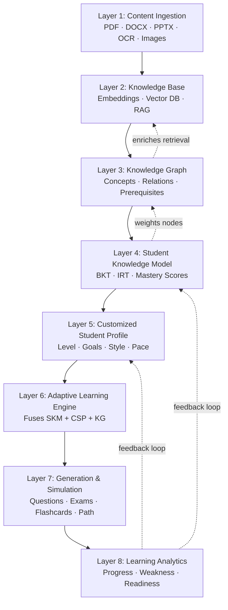
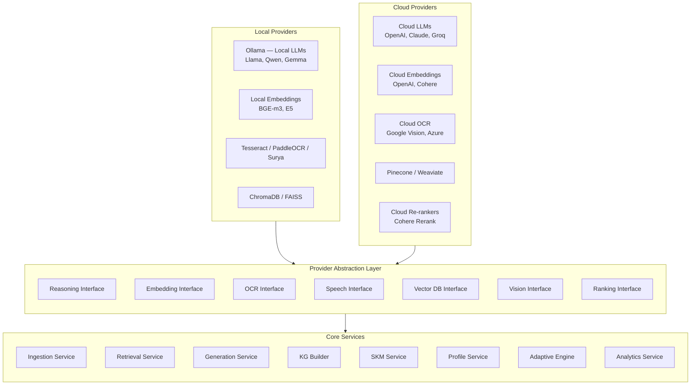
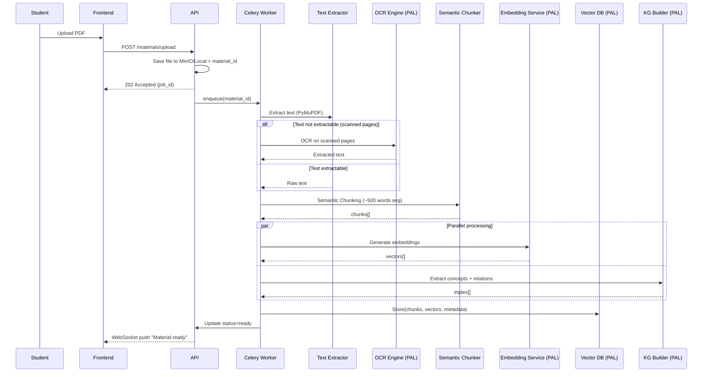
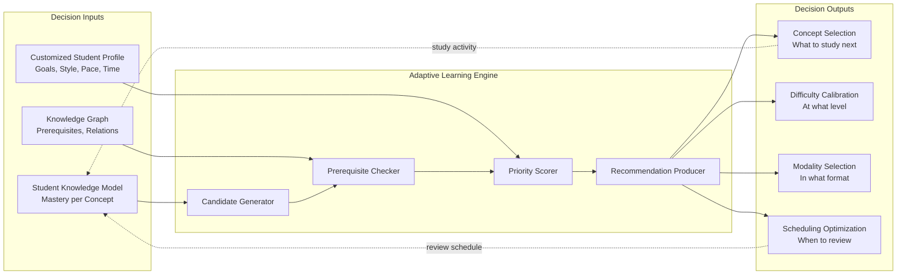
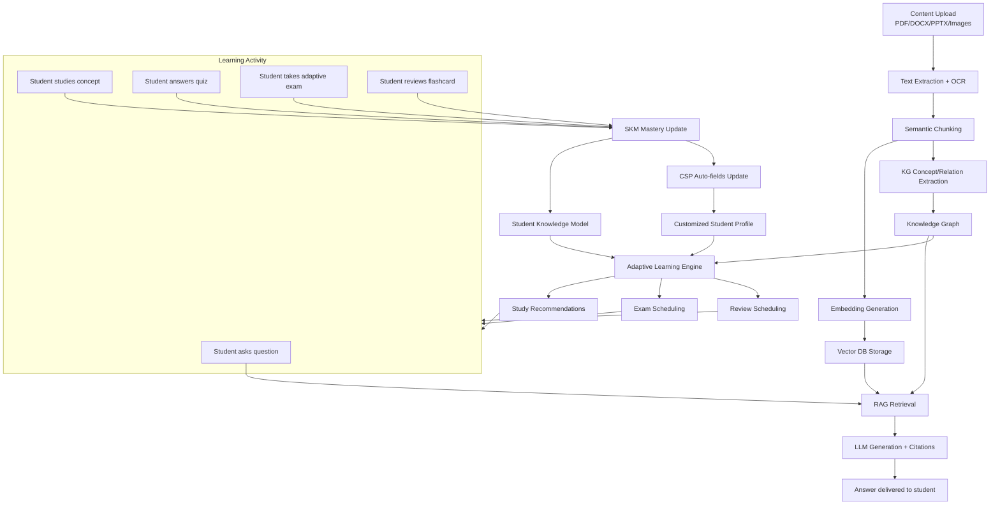
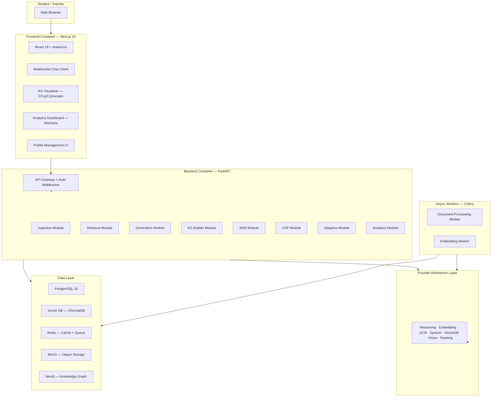
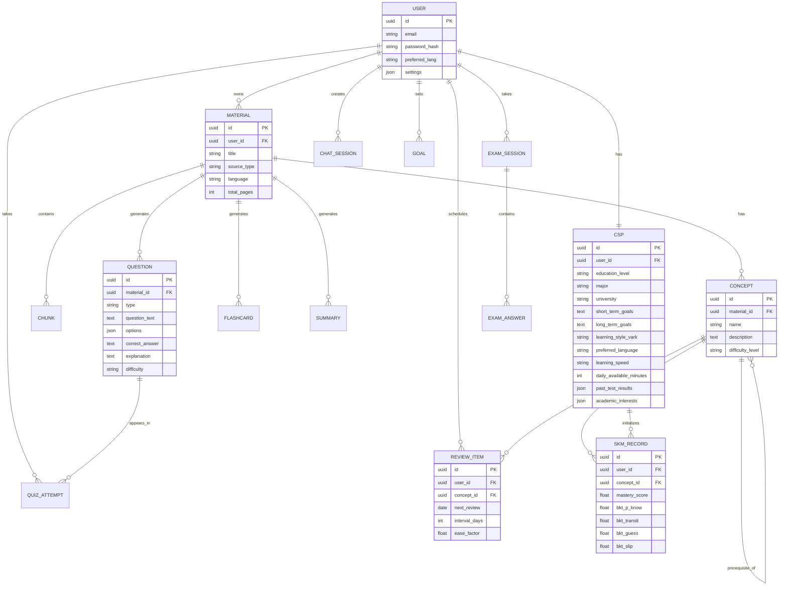

# OpenLearn AI — Technical Specification v4.0

**Open-Source Adaptive Educational Intelligence Platform**

**Hybrid AI Architecture — Provider-Agnostic Design**

---

| Field | Value |
|-------|-------|
| **Version** | 4.0 |
| **Status** | Official Technical Specification |
| **Architecture** | Hybrid AI — Provider-Agnostic |
| **License** | AGPL-3.0 |
| **Document Type** | Software Design Document (SDD) + Architecture Document + AI System Design + Product Specification |
| **Primary Audience** | Graduation Committees, Software Engineers, AI Engineers, Researchers |

---

## Table of Contents

- [1. Executive Summary](#1-executive-summary)
- [2. Project Vision](#2-project-vision)
- [3. Problem Statement](#3-problem-statement)
- [4. Educational Philosophy & Design Principles](#4-educational-philosophy--design-principles)
- [5. Competitive Positioning](#5-competitive-positioning)
- [6. System Overview](#6-system-overview)
- [7. Hybrid AI Architecture](#7-hybrid-ai-architecture)
- [8. Provider Abstraction Layer](#8-provider-abstraction-layer)
- [9. Local vs Cloud Execution Model](#9-local-vs-cloud-execution-model)
- [10. AI Model Selection Strategy](#10-ai-model-selection-strategy)
- [11. Document Processing Pipeline](#11-document-processing-pipeline)
- [12. Knowledge Pipeline](#12-knowledge-pipeline)
- [13. Knowledge Graph Architecture](#13-knowledge-graph-architecture)
- [14. Student Knowledge Model](#14-student-knowledge-model)
- [15. Customized Student Profile](#15-customized-student-profile)
- [16. Adaptive Learning Engine](#16-adaptive-learning-engine)
- [17. Learning Workflow & End-to-End Data Flow](#17-learning-workflow--end-to-end-data-flow)
- [18. Software Architecture](#18-software-architecture)
- [19. Backend Architecture](#19-backend-architecture)
- [20. Frontend Architecture](#20-frontend-architecture)
- [21. Database Design](#21-database-design)
- [22. API Design](#22-api-design)
- [23. Infrastructure & Deployment Modes](#23-infrastructure--deployment-modes)
- [24. Security & Privacy](#24-security--privacy)
- [25. Performance & Scalability](#25-performance--scalability)
- [26. Technology Stack](#26-technology-stack)
- [27. Research Components](#27-research-components)
- [28. Risk Management](#28-risk-management)
- [29. Future Vision](#29-future-vision)
- [30. Graduation Project Value](#30-graduation-project-value)
- [31. Conclusion](#31-conclusion)

---

## Part I: Vision & Philosophy

---

## 1. Executive Summary

OpenLearn AI is an open-source Adaptive Educational Intelligence Platform designed to transform educational content into adaptive learning experiences. Unlike conventional tools that merely enable question-and-answer interactions with uploaded documents, OpenLearn AI constructs a comprehensive educational intelligence layer that understands the subject matter, understands the student, and makes informed pedagogical decisions about what to study, when to review, at what difficulty level, and through which learning modality.

The defining architectural innovation of Version 4.0 is the **Hybrid AI Architecture** — a provider-agnostic design philosophy that ensures every AI component in the system is replaceable through abstraction. There is only one product, not two separate local and cloud versions. The system supports any combination of local and cloud providers: a local LLM with cloud embeddings, a cloud LLM with local vector storage, entirely local operation for privacy-sensitive environments, entirely cloud operation for resource-constrained deployments, or any hybrid configuration the user chooses. The architecture never depends on a single AI provider, and no component is hard-coded to a specific model or service.

The platform integrates eight interdependent layers: Content Ingestion, Knowledge Base (RAG), Knowledge Graph, Student Knowledge Model (BKT/IRT), Customized Student Profile, Adaptive Learning Engine, Generation & Simulation, and Learning Analytics. These layers form a closed feedback loop where each component feeds the others, creating genuine educational intelligence rather than a superficial chat interface. The Student Knowledge Model tracks mastery per concept using Bayesian Knowledge Tracing, while the Customized Student Profile captures learning preferences, goals, available time, and pace — together they enable the Adaptive Learning Engine to make contextually informed recommendations grounded in both cognitive science and individual learner characteristics.

This document serves as the official technical specification for OpenLearn AI Version 4.0. It is structured as a Software Design Document combined with an Architecture Document, AI System Design, and Product Specification. Every architectural decision is justified, every tradeoff is explained, and every alternative is considered. The document is written for dual audiences: graduation committee members who evaluate theoretical depth and research rigor, and technical reviewers who assess engineering quality and design patterns.

---

## 2. Project Vision

### 2.1 What OpenLearn AI Is

OpenLearn AI is an open-source Adaptive Educational Intelligence Platform — a system that transforms any educational content (PDF, DOCX, PPTX, images, notes) into a personalized, adaptive learning experience. The platform does not simply answer questions about uploaded documents. Instead, it builds a knowledge base for the subject, constructs a cognitive model of the student, maintains a dynamic educational profile, and then produces study plans, review schedules, and adaptive exam simulations tailored to each individual learner.

The fundamental distinction between OpenLearn AI and conventional document-chat tools lies in the depth of intelligence. A chat-with-PDF tool establishes a monadic relationship: the student asks, the tool answers. There is no memory of the student, no tracking of conceptual understanding, no adaptation of difficulty, and no scientific scheduling of review sessions. OpenLearn AI, by contrast, builds a Student Knowledge Model that tracks mastery per concept using Bayesian Knowledge Tracing, maintains a Customized Student Profile that captures learning preferences and constraints, constructs a Knowledge Graph that maps prerequisite relationships between concepts, and employs an Adaptive Learning Engine that fuses all three to make pedagogically informed decisions.

The vision is to enable any student — particularly those in under-served linguistic communities such as Arabic-speaking students — to access learning experiences comparable to premium global platforms, at no cost, with complete data privacy, through an open-source platform that builds a genuine cognitive model of the learner rather than a superficial page-read counter.

### 2.2 Strategic Vision Statement

To empower any student worldwide with adaptive learning experiences at the quality level of premium commercial platforms, free of charge and with complete data privacy, through an open-source platform that constructs a genuine cognitive model of the learner — not merely a count of pages read.

### 2.3 The Eight System Layers

The system is organized into eight interdependent layers, each building upon the outputs of the layers below it. This hierarchical structure ensures that intelligence accumulates progressively: raw content becomes searchable knowledge, searchable knowledge becomes structured understanding, structured understanding becomes measurable mastery, measurable mastery becomes personalized adaptation, and personalized adaptation becomes actionable learning paths.



The feedback loops are critical: Learning Analytics updates the Student Knowledge Model and Customized Student Profile, the Knowledge Graph enriches Knowledge Base retrieval by expanding queries through prerequisite chains, and the Student Knowledge Model annotates Knowledge Graph nodes with mastery colors to guide visual navigation and path planning.

---

## 3. Problem Statement

Educational technology has advanced significantly in recent years, yet students continue to face fundamental problems that existing tools fail to address comprehensively. OpenLearn AI was designed to solve seven interconnected problems that collectively undermine effective learning.

### 3.1 Content Overload

Students routinely face hundreds of pages of educational material without clear guidance on priorities. A textbook of 400 pages contains perhaps 50 core concepts, yet the student has no tool to identify which concepts matter most, which are prerequisites for others, and which can be deferred. The result is indiscriminate reading — covering all content equally rather than focusing on areas of weakest understanding. OpenLearn AI addresses this through Knowledge Graph construction, which extracts concepts and their prerequisite relationships, enabling the system to prioritize study based on structural dependencies rather than arbitrary page order.

### 3.2 Absence of Feedback

In traditional study, a student does not discover what they misunderstood until the exam reveals it. This is a catastrophic feedback delay — weeks or months of study may be built on foundational misconceptions that propagate through prerequisite chains. OpenLearn AI provides immediate, granular feedback through the Student Knowledge Model, which updates mastery estimates after every learning activity (answering a question, reviewing a flashcard, completing an exam simulation), ensuring that misconceptions are detected and corrected before they compound.

### 3.3 Random Review

Most students review material in arbitrary order — re-reading chapters sequentially or reviewing whatever feels most urgent at the moment. This approach ignores decades of cognitive science research on spaced repetition and forgetting curves. The probability of remembering a concept decays exponentially over time unless review is scheduled at optimal intervals. OpenLearn AI implements the SM-2 spaced repetition algorithm, which schedules review sessions based on measured mastery and elapsed time since last study, ensuring that concepts approaching the forgetting threshold are reviewed before they are lost.

### 3.4 Rapid Forgetting

Without structured repetition, forgetting follows Ebbinghaus's curve — approximately 60% of newly learned material is lost within 24 hours, and 80% within a week. Students who study without spaced repetition systematically lose the gains they make, creating a treadmill effect where the same material must be re-learned repeatedly. OpenLearn AI implements Half-Life Regression to predict forgetting rates per concept, combined with SM-2 scheduling to ensure reviews occur before the predicted forgetting threshold.

### 3.5 Paid and Closed Tools

The existing tools that offer adaptive features — platforms like Quizgecko, RemNote, and Adapt — are commercial products with closed source code and subscription fees. Students who cannot afford these subscriptions have no access to adaptive learning technology. Furthermore, closed-source tools cannot be inspected, modified, or extended by the community, creating a dependency on single vendors whose priorities may diverge from educational needs. OpenLearn AI is fully open-source under AGPL-3.0, ensuring that the platform is free to use, free to modify, and free to extend by any individual or institution.

### 3.6 Poor Linguistic Support

Most educational AI tools are designed for English-speaking users and perform poorly with Arabic content — OCR quality is lower, embedding models capture less semantic nuance, and LLM generation produces less coherent output. Arabic-speaking students, who represent over 400 million potential users, are systematically underserved. OpenLearn AI prioritizes multilingual support from the architecture level, with explicit support for Arabic and English, automatic language detection, bilingual content processing, and selection of AI models that demonstrate strong performance across target languages.

### 3.7 Data Privacy

Current commercial educational platforms require students to upload sensitive academic content — personal notes, exam preparations, course materials — to cloud servers operated by third-party companies. This creates significant privacy risks: educational data reveals learning difficulties, academic performance, intellectual interests, and study habits, all of which are personally sensitive. OpenLearn AI's Local First architecture ensures that all processing can occur entirely on the student's own machine, with no data transmitted to any external service unless the student explicitly configures cloud providers. Even when cloud providers are used, the architecture processes only the minimum necessary data and never stores student content on remote servers persistently.

---

## 4. Educational Philosophy & Design Principles

### 4.1 Educational Intelligence, Not Chatbots

The foundational philosophy of OpenLearn AI is that educational technology should exhibit intelligence, not merely conversational capability. A chatbot answers questions — it provides information when prompted. An intelligent tutor, by contrast, understands what the student knows, understands what the student needs to know, understands the structural relationships between concepts, and makes active decisions about the optimal next learning step, the appropriate difficulty level, and the most effective review schedule.

This distinction is not incremental — it is qualitative. A chatbot is a passive information retrieval system. An intelligent tutor is an active pedagogical agent. The difference is analogous to the difference between a search engine and a personal teacher: the search engine returns relevant documents when queried, while the teacher identifies misconceptions, recommends study strategies, adjusts difficulty based on performance, and schedules review to prevent forgetting.

OpenLearn AI implements this philosophy through the integration of three modeling components: the Knowledge Graph (what concepts exist and how they relate), the Student Knowledge Model (what the student currently understands and where gaps exist), and the Customized Student Profile (who the student is, what their goals are, and how they prefer to learn). The Adaptive Learning Engine fuses these three models to produce decisions that are simultaneously knowledge-structured, cognition-aware, and learner-personalized.

### 4.2 Eight Design Principles

The architecture of OpenLearn AI is governed by eight design principles that are not merely aspirational guidelines but hard constraints on every architectural decision. When a design choice violates any of these principles, it is rejected regardless of its technical advantages.

| # | Principle | Definition | Architectural Implication |
|---|-----------|------------|--------------------------|
| 1 | **Open Source First** | All core components must be open-source software with permissive or copyleft licenses. Proprietary dependencies are only acceptable as optional plugins, never as requirements. | No proprietary database, no proprietary LLM runtime, no proprietary cloud service as a hard dependency. Every component must have an open-source alternative. |
| 2 | **Privacy First** | Student data must never leave the user's machine without explicit, informed consent. All processing must be possible entirely locally. | All AI providers accessed via abstraction — cloud calls are opt-in, never default. No telemetry, no tracking, no analytics that transmit data externally. |
| 3 | **Local First** | The default deployment mode assumes no internet connectivity. All core features must work offline with locally available models and data. | Local LLM runtime (Ollama), local vector database, local object storage. Cloud providers enhance but never replace local capability. |
| 4 | **Cloud Optional** | Cloud AI providers are optional enhancements, not requirements. The system must degrade gracefully when cloud services are unavailable. | Provider abstraction ensures cloud is a configuration choice, not a dependency. Feature parity between local and cloud modes for all core capabilities. |
| 5 | **Modular Design** | Each system component must be an independent module with well-defined interfaces. Modules communicate through contracts, not through shared internals. | Every service (ingestion, embedding, retrieval, generation, KG, SKM, CSP, adaptive, analytics) is a separate module with its own API contract. |
| 6 | **Provider Agnostic** | No AI component is hard-coded to a specific provider. All providers implement standardized interfaces and can be freely substituted. | Provider Abstraction Layer with interfaces for Reasoning, Embedding, OCR, Speech, Vector DB, Vision, and Ranking. Any implementation of any interface can be used. |
| 7 | **Offline Friendly** | The system must maintain full functionality when disconnected from the internet. Offline mode is the baseline, not an edge case. | Local model caching, local database storage, local file processing. Cloud provider failures must not cascade to local components. |
| 8 | **Research Driven** | All pedagogical algorithms must be grounded in published research. No heuristic is accepted without a theoretical basis or empirical validation. | BKT (Corbett & Anderson, 1995), IRT (Wainer et al.), SM-2 (Wozniak), Half-Life Regression (Settles & Meeder), VARK (Fleming). Every algorithm has a citation. |

### 4.3 Principle Conflicts and Resolution

These principles sometimes conflict, and the architecture must resolve such conflicts with clear precedence rules. When Privacy First and Cloud Optional conflict — for instance, when a cloud provider offers significantly better model quality — Privacy First wins: the system must always offer a local alternative, even if it is slower or less accurate. When Local First and Modular Design conflict — for instance, when bundling all components into a single process would simplify local deployment — Modular Design wins: the system maintains module boundaries even in local mode, using intra-process communication instead of network calls.

The precedence hierarchy is: Privacy First > Local First > Provider Agnostic > Modular Design > Open Source First > Cloud Optional > Offline Friendly > Research Driven. This ordering ensures that privacy and local capability are never compromised, while research-driven improvements are always welcomed but never at the cost of the higher principles.

---

## 5. Competitive Positioning

### 5.1 Feature Comparison Matrix

The following table compares OpenLearn AI against four representative competitors in the educational AI space. Each competitor addresses a subset of the capabilities that OpenLearn AI provides, but none integrates all eight layers into a cohesive educational intelligence system.

| Capability | ChatPDF | Quizgecko | RemNote | Adapt | OpenLearn AI |
|------------|---------|-----------|---------|-------|--------------|
| Document Upload & OCR | Basic | Basic | Basic | Limited | Full (PDF, DOCX, PPTX, Images, OCR) |
| Knowledge Base (RAG) | Core feature | No | Limited | No | Full (Hybrid Search, Re-ranking, Citations) |
| Knowledge Graph | No | No | Basic (manual) | No | Full (auto-extracted concepts, prerequisites, visual) |
| Student Knowledge Model | No | No | No | Basic | Full (BKT + IRT + Mastery Scores + Weak Areas) |
| Customized Student Profile | No | No | Basic | Basic | Full (13 fields, VARK, goals, pace) |
| Adaptive Learning Engine | No | No | No | Core feature | Full (SKM + CSP + KG fusion) |
| Spaced Repetition | No | No | SM-2 | No | SM-2 + Forgetting Prediction |
| Adaptive Exam Simulator | No | Fixed quizzes | No | Limited | Full (CAT, adaptive difficulty) |
| Learning Analytics | No | Basic | Basic | Basic | Full (Dashboard, Heatmap, Readiness) |
| Open Source | No | No | Partial | No | Full (AGPL-3.0) |
| Privacy / Local Operation | Cloud only | Cloud only | Cloud only | Cloud only | Local First, Cloud Optional |
| Provider Agnostic | No | No | No | No | Full (Hybrid AI Architecture) |
| Multilingual (Arabic) | Poor | Poor | Poor | No | Explicit support |

### 5.2 Differentiation Analysis

The key differentiators of OpenLearn AI are not individual features but the **integration** of features into a closed-loop intelligence system. In isolation, a Knowledge Graph is a visualization tool. In isolation, a Student Knowledge Model is a progress tracker. In isolation, Spaced Repetition is a scheduling algorithm. But when these components feed each other — when the Knowledge Graph determines which concepts are prerequisites for the concepts where the Student Knowledge Model detects weakness, and the Customized Student Profile adjusts the pacing and format of the recommended review — the system produces genuinely intelligent educational decisions that no single component could generate alone.

The Hybrid AI Architecture adds a further dimension of differentiation that no competitor offers. Existing platforms are either entirely cloud-based (ChatPDF, Quizgecko) or entirely local (some niche tools). None offer the flexibility to freely combine local and cloud providers based on the user's hardware capabilities, privacy requirements, and budget constraints. This architecture makes OpenLearn AI accessible to students with powerful GPU-equipped machines who want full local operation, students with modest hardware who want selective cloud augmentation, and institutions that require complete offline capability for regulatory compliance.

---

## Part II: Architecture

---

## 6. System Overview

### 6.1 Eight-Layer Architecture

The OpenLearn AI system is structured as eight progressive layers, each building upon the outputs of the layers below and contributing to the layers above. This layered architecture ensures that intelligence accumulates incrementally: raw content becomes searchable knowledge, searchable knowledge becomes structured understanding, structured understanding becomes measurable mastery, measurable mastery becomes personalized adaptation, and personalized adaptation becomes actionable learning paths.

The layers are not independent modules that happen to be stacked — they are interdependent components that form a closed feedback loop. Learning Analytics feeds back into the Student Knowledge Model and Customized Student Profile, the Knowledge Graph enriches Knowledge Base retrieval, and the Student Knowledge Model annotates Knowledge Graph nodes with mastery information. This circular dependency is intentional and essential: it is what transforms the system from a pipeline into an intelligent agent.

### 6.2 Layer Descriptions

**Layer 1 — Content Ingestion:** Accepts educational content in multiple formats (PDF, DOCX, PPTX, TXT, images), extracts text through format-specific parsers and OCR, performs language detection, and applies semantic chunking to produce coherent text segments with metadata.

**Layer 2 — Knowledge Base:** Generates vector embeddings for each chunk using the configured embedding provider, stores embeddings in the configured vector database, and provides hybrid search (semantic + keyword) with optional re-ranking for retrieval augmentation.

**Layer 3 — Knowledge Graph:** Extracts concepts and relationships from chunked text using LLM-based extraction, stores the resulting graph (concepts, is-a relations, prerequisite-of relations, part-of relations) in the configured graph database, and provides visual navigation and prerequisite-aware query expansion.

**Layer 4 — Student Knowledge Model:** Tracks per-concept mastery using Bayesian Knowledge Tracing (four parameters: initial knowledge probability, learning transition probability, guess probability, slip probability), optionally augments with Item Response Theory for question difficulty estimation, and detects weak areas requiring attention.

**Layer 5 — Customized Student Profile:** Maintains 13 profile fields capturing the student's educational level, major, goals, learning style (VARK), preferred language, learning speed, available study time, past test results, and academic interests. Feeds into every adaptive decision.

**Layer 6 — Adaptive Learning Engine:** The central decision-maker. Fuses Student Knowledge Model (what the student knows), Customized Student Profile (who the student is and what constraints they have), and Knowledge Graph (what concepts exist and how they relate) to determine what to study next, at what difficulty, in what format, and when to review.

**Layer 7 — Generation & Simulation:** Produces concrete learning artifacts — adaptive questions (MCQ, True/False, Fill-in-Blank, Short Answer), flashcards, four types of summaries (quick, detailed, exam-focused, one-page), exam simulations with adaptive difficulty (CAT), and personalized learning paths.

**Layer 8 — Learning Analytics:** Aggregates and visualizes all learning data — progress over time, concept mastery heatmap, study time distribution, exam readiness scores, weak area alerts, and goal tracking. Feeds back into Layers 4 and 5 to update models.

---

## 7. Hybrid AI Architecture

### 7.1 Core Philosophy

The Hybrid AI Architecture is the central architectural innovation of OpenLearn AI Version 4.0. It is founded on a single principle: **there is only one product, not two**. The platform does not ship a "local edition" and a "cloud edition" as separate products. Instead, it ships a single unified system where every AI component is replaceable through abstraction, and the user configures which provider to use for each component based on their own requirements.

This philosophy directly addresses the fundamental tension in AI application design: local models offer privacy and offline capability but may lack quality or speed, while cloud models offer superior quality and speed but require internet connectivity and transmit data to external services. Rather than forcing the user to choose one side of this tradeoff permanently, the Hybrid AI Architecture allows the user to make per-component tradeoffs based on their context.

A student with a powerful GPU-equipped workstation might configure local LLM reasoning with cloud embedding generation, achieving high-quality semantic search without sacrificing local generation privacy. A student with a modest laptop might configure cloud LLM reasoning with local vector storage, achieving good generation quality while keeping their document corpus locally stored. An institution with regulatory privacy requirements might configure everything local, accepting slower performance in exchange for guaranteed data isolation. A student in a well-connected environment might configure everything cloud, maximizing quality and speed. All of these configurations use the same product, the same codebase, and the same deployment — only the configuration differs.

### 7.2 Architecture Diagram



### 7.3 Design Rationale

The decision to implement a Hybrid AI Architecture rather than two separate products (a local-only edition and a cloud-only edition) is driven by three considerations.

First, **maintenance burden**: two separate products would require maintaining two codebases, two testing pipelines, two deployment configurations, and two documentation sets. The divergence between local and cloud codepaths would compound over time, making it increasingly difficult to keep both editions at feature parity. A single codebase with provider abstraction eliminates this divergence entirely.

Second, **user flexibility**: a student's hardware capabilities, connectivity, and privacy requirements change over time. A student who starts with cloud providers during development may switch to local providers before a privacy-sensitive exam period. A student who upgrades their GPU may switch from cloud reasoning to local reasoning. With two separate products, such transitions would require migrating data, reconfiguring workflows, and potentially losing model-specific optimizations. With a single product and provider abstraction, the transition is a configuration change — no data migration, no workflow disruption.

Third, **architectural purity**: the provider abstraction layer ensures that no core service ever directly depends on a specific provider implementation. This enforced separation prevents the creeping dependency that occurs when developers optimize for a specific provider's quirks — a common failure mode in systems that nominally support multiple providers but practically depend on one. The abstraction layer is not a convenience wrapper; it is an architectural boundary that the codebase enforces through interface contracts and dependency injection.

---

## 8. Provider Abstraction Layer

### 8.1 Interface Definitions

The Provider Abstraction Layer (PAL) defines seven core interfaces that every AI component must implement. Each interface specifies a contract that includes input types, output types, error handling behavior, and capability metadata. Any provider — local or cloud, open-source or commercial — that implements an interface can be used by the system without modifying any core service code.

| Interface | Purpose | Core Methods | Configuration Key |
|-----------|---------|-------------|-------------------|
| **ReasoningInterface** | Text generation, question answering, concept extraction | `generate(prompt, context)`, `extract_concepts(text)`, `generate_questions(text, params)` | `provider.reasoning` |
| **EmbeddingInterface** | Vector embedding generation for text chunks | `embed(text)`, `embed_batch(texts)` | `provider.embedding` |
| **OCRInterface** | Optical character recognition for scanned documents and images | `extract_text(image)`, `extract_text_batch(images)` | `provider.ocr` |
| **SpeechInterface** | Text-to-speech and speech-to-text for audio learning modalities | `synthesize(text)`, `transcribe(audio)` | `provider.speech` |
| **VectorDBInterface** | Vector storage, similarity search, and metadata filtering | `store(vectors, metadata)`, `search(query_vector, top_k, filters)`, `delete(ids)` | `provider.vector_db` |
| **VisionInterface** | Image understanding for visual content processing | `analyze(image, prompt)` | `provider.vision` |
| **RankingInterface** | Re-ranking retrieved documents for improved relevance | `rank(query, documents, top_k)` | `provider.ranking` |

### 8.2 Provider Configuration

Each interface is bound to a specific provider implementation through configuration, not through code. The configuration file ( YAML or environment variables) specifies which provider class to instantiate for each interface, along with provider-specific parameters such as model names, API endpoints, and authentication tokens.

```yaml
# Example: Hybrid configuration — Local LLM + Cloud Embeddings
provider:
  reasoning:
    class: ollama
    model: qwen2.5:7b
    base_url: http://localhost:11434
  embedding:
    class: openai
    model: text-embedding-3-large
    api_key: ${OPENAI_API_KEY}
  ocr:
    class: paddleocr
    language: ar+en
  vector_db:
    class: chromadb
    path: ./data/chromadb
  ranking:
    class: bge_reranker
    model: bge-reranker-v2-m3
```

```yaml
# Example: Full local configuration — Everything runs on the user's machine
provider:
  reasoning:
    class: ollama
    model: qwen2.5:7b
    base_url: http://localhost:11434
  embedding:
    class: sentence_transformers
    model: BAAI/bge-m3
  ocr:
    class: paddleocr
    language: ar+en
  vector_db:
    class: chromadb
    path: ./data/chromadb
  ranking:
    class: sentence_transformers
    model: BAAI/bge-reranker-v2-m3
```

### 8.3 Provider Swapping at Runtime

The provider configuration is read at service startup, but the architecture also supports runtime provider switching for scenarios where connectivity changes during operation. When a cloud provider becomes unreachable — due to network interruption, API rate limits, or service outages — the system gracefully degrades to the configured fallback provider rather than failing the entire operation.

The degradation strategy follows a configurable priority chain per interface. For example, the reasoning interface might be configured with `ollama` as primary and `openai` as fallback, meaning that if the local Ollama service is unavailable (perhaps because the model is still loading), the system routes reasoning requests to the OpenAI API. Conversely, if the configuration specifies `openai` as primary and `ollama` as fallback, cloud connectivity loss routes requests to the local model, accepting potential quality reduction in exchange for continued operation.

Each provider implementation also exposes a `health_check()` method that the Provider Abstraction Layer calls periodically to verify availability. When a provider fails its health check, the PAL automatically routes subsequent requests to the next provider in the priority chain and logs the transition for observability. When the failed provider recovers, the PAL resumes routing to it, ensuring that the system always uses the highest-quality available provider.

---

## 9. Local vs Cloud Execution Model

### 9.1 Three Execution Modes

The system supports three execution modes that correspond to common deployment scenarios. Each mode is a configuration preset that sets all provider interfaces to appropriate defaults, while still allowing individual overrides for specific components.

**Local Mode (Default):** All providers are local. The system requires no internet connectivity. The student's machine hosts the LLM runtime (Ollama), embedding model (Sentence Transformers), OCR engine (PaddleOCR or Surya), vector database (ChromaDB), and all other components. This mode prioritizes privacy and offline capability at the cost of higher hardware requirements (minimum 8GB RAM, recommended 16GB with GPU for LLM inference).

**Hybrid Mode (Recommended for most users):** Core reasoning and data storage remain local, while computationally intensive or quality-sensitive components optionally use cloud providers. The typical hybrid configuration uses a local LLM for generation (privacy-preserving), cloud embeddings for superior semantic search quality, local vector database for data sovereignty, and local OCR for document processing. This mode balances privacy, quality, and hardware requirements.

**Cloud Mode (For constrained environments):** All providers are cloud-based. The system requires persistent internet connectivity but can run on minimal hardware (a browser-capable device). This mode sacrifices privacy and offline capability in exchange for minimal hardware requirements and access to the highest-quality models. It is appropriate for students with older hardware, shared computer lab environments, or situations where local deployment is impractical.

### 9.2 Graceful Degradation Strategy

When a configured cloud provider becomes unavailable, the system does not fail the request. Instead, it follows a degradation strategy defined per interface in the configuration. The strategy has three levels:

1. **Primary provider** — the configured first-choice provider for the interface.
2. **Fallback provider** — the configured second-choice provider, used when the primary is unavailable.
3. **Safe fallback** — a minimal local implementation that always works but may produce lower-quality results. For the reasoning interface, this might be a simple template-based generator. For the embedding interface, this might be a hash-based pseudo-embedding that enables approximate search. Safe fallbacks are never desirable but ensure that the system never completely fails.

The degradation strategy is explicitly configured rather than implicit. The system administrator defines the priority chain for each interface, and the Provider Abstraction Layer enforces it. This explicit configuration ensures that degradation behavior is predictable, testable, and auditable — critical requirements for an educational platform where unexpected failures during exam simulations or review sessions could undermine student trust.

### 9.3 Data Flow Considerations

The choice between local and cloud providers affects data flow in ways that the architecture must address explicitly. When a cloud reasoning provider is used, the student's prompt and retrieved context passages are transmitted to the cloud API. When a cloud embedding provider is used, the text chunks from the student's documents are transmitted for embedding generation. When a cloud OCR provider is used, the document images are transmitted for text extraction.

The architecture addresses these data flow implications through two mechanisms. First, a **data sensitivity classifier** tags each piece of data with a sensitivity level (public, personal, sensitive) based on its source and content. When a cloud provider is configured for an interface that will process sensitive data, the system warns the user and offers to route the request to a local provider instead, even if the local provider is slower or less accurate. Second, a **minimum data principle** ensures that only the minimum necessary data is transmitted to cloud providers — for example, when using a cloud reasoning provider for question generation, the system sends only the relevant context chunks rather than the entire document corpus.

---

## 10. AI Model Selection Strategy

### 10.1 Model Categories

OpenLearn AI does not hard-code specific AI models into the architecture. Instead, it defines recommended model categories with selection criteria, and the Provider Abstraction Layer allows any model that satisfies the criteria for its category to be used. This approach ensures that the system remains current as models evolve — when a new LLM demonstrates superior Arabic language performance, it can be adopted by changing the configuration, not by modifying the code.

| Category | Purpose | Selection Criteria | Key Alternatives |
|----------|---------|--------------------|-----------------|
| **Reasoning Models** | Text generation, concept extraction, question generation, summary generation | Language quality (especially Arabic/English), JSON structured output support, instruction-following accuracy, context window length, latency, VRAM requirements | Local: Qwen 2.5 (7B/14B), Llama 3.1 (8B), Gemma 2 (9B), Phi-3.5 Mini. Cloud: GPT-4o, Claude 3.5 Sonnet, Groq (Llama/Qwen). |
| **Embedding Models** | Vector embedding generation for semantic search | Multilingual support (Arabic + English), embedding dimension, retrieval accuracy (MTEB benchmark), batch processing speed | Local: BGE-m3, multilingual-e5-large, sentence-transformers models. Cloud: OpenAI text-embedding-3-large, Cohere embed-v3. |
| **OCR Models** | Optical character recognition for scanned documents and images | Arabic character accuracy, layout preservation, speed, language detection capability | Local: PaddleOCR, Surya, Tesseract (with Arabic training data). Cloud: Google Vision API, Azure Computer Vision. |
| **Vision Models** | Image understanding, diagram interpretation, visual content analysis | Multimodal reasoning quality, Arabic text-in-image recognition, diagram structure extraction | Local: LLaVA, Qwen-VL. Cloud: GPT-4o Vision, Claude Vision. |
| **Speech Models** | Text-to-speech synthesis, speech-to-text transcription | Arabic voice quality, naturalness, speed, accent options | Local: Whisper (transcription), Piper TTS (synthesis). Cloud: OpenAI TTS, Google Speech-to-Text. |
| **Ranking Models** | Re-ranking retrieved documents for improved relevance | Cross-encoder accuracy, multilingual support, latency | Local: bge-reranker-v2-m3. Cloud: Cohere Rerank. |

### 10.2 Selection Decision Framework

When choosing a model for a specific category, the architect evaluates four dimensions:

**Quality:** How well does the model perform on the target task? For reasoning models, this includes Arabic generation quality, instruction following, and structured output accuracy. For embedding models, this includes MTEB benchmark scores and multilingual retrieval performance. Quality is measured through standardized benchmarks and task-specific evaluation sets.

**Resource Requirements:** What hardware does the model require? Local models have VRAM and RAM requirements that must match the target deployment environment. A 7B parameter model requires approximately 6GB VRAM for inference, while a 14B model requires approximately 12GB. The selection must account for the minimum hardware configuration targeted by the deployment mode.

**Privacy Impact:** Does using the model transmit data externally? Cloud models always transmit data, while local models never do. The privacy impact is evaluated against the data sensitivity classifier — sensitive data should not be processed by cloud providers unless the student explicitly consents.

**Latency:** How quickly does the model respond? For reasoning models, local inference on consumer hardware typically produces 5-20 tokens per second, while cloud APIs produce 50-100+ tokens per second. For embedding models, local generation is typically faster per-query but slower for batch processing. Latency requirements are defined by the non-functional requirements (NFR-1: RAG response under 3 seconds).

### 10.3 Recommended Default Configuration

The following configuration represents the recommended defaults for a student with a machine meeting the minimum hardware requirements (16GB RAM, NVIDIA GPU with 8GB+ VRAM). These defaults prioritize local operation for privacy, with cloud options available for quality augmentation.

| Component | Default Provider | Default Model | Rationale |
|-----------|-----------------|---------------|-----------|
| Reasoning | Ollama (local) | Qwen 2.5 (7B) | Excellent Arabic quality, reasonable size, supports JSON mode, freely available via Ollama |
| Embedding | Sentence Transformers (local) | BAAI/bge-m3 | Strong multilingual performance, supports Arabic, 1024-dim vectors, open-source |
| OCR | PaddleOCR (local) | PaddleOCR v4 | Superior Arabic OCR quality, open-source, supports mixed Arabic-English text |
| Vector DB | ChromaDB (local) | ChromaDB | Lightweight, embedded mode, no external dependencies, open-source |
| Ranking | Sentence Transformers (local) | BAAI/bge-reranker-v2-m3 | Matches embedding model, open-source, good cross-encoder performance |
| Speech (TTS) | Piper (local) | Piper Arabic voice | Lightweight, local, adequate quality |
| Speech (STT) | Whisper (local) | Whisper medium | Good Arabic transcription, local, open-source |

These defaults are not hard-coded — they are configuration presets that the user can override. The architecture makes no assumptions about which specific models are available, and all model references in the codebase go through the Provider Abstraction Layer rather than directly importing model-specific libraries.

---

## Part III: Core Capabilities

---

## 11. Document Processing Pipeline

### 11.1 Pipeline Overview

The Document Processing Pipeline is the first layer of the system — it transforms raw educational content (PDFs, DOCX files, PPTX presentations, images, plain text) into structured, searchable, and analytically useful chunks of text with associated metadata. This pipeline is the foundation upon which all subsequent layers operate: without properly extracted, segmented, and annotated text, the Knowledge Base cannot generate meaningful embeddings, the Knowledge Graph cannot extract coherent concepts, and the Student Knowledge Model cannot track mastery of identifiable learning objectives.

The pipeline is designed as a sequential process with parallel branches where computationally independent steps can execute concurrently. The overall flow proceeds through six stages: file upload and validation, text extraction, OCR processing, semantic chunking, metadata enrichment, and storage. Each stage is implemented as an independent service module that communicates through the Provider Abstraction Layer, ensuring that the specific extraction engine, OCR engine, and storage backend can all be configured independently.

### 11.2 Sequence Diagram — PDF Upload Flow



### 11.3 Text Extraction

Text extraction is format-specific and implemented through dedicated libraries for each supported format. PDF files use PyMuPDF (fitz) for native text extraction, which preserves page structure, font information, and positional metadata. DOCX files use python-docx to extract paragraph-level text with heading hierarchy. PPTX files use python-pptx to extract slide content with speaker notes. Plain text files are read directly with encoding detection.

The extraction process produces raw text per page or per section, along with positional metadata (page number, section title, paragraph index) that enables the chunking stage to produce semantically coherent segments rather than arbitrarily splitting text at character boundaries.

### 11.4 OCR Processing

When native text extraction fails — typically because the PDF contains scanned images rather than embedded text — the pipeline activates OCR processing through the configured OCR provider (via the Provider Abstraction Layer). The OCR stage processes each page image through the OCR engine, which produces text with positional bounding boxes. The OCR results are merged with any native text extraction results, and the combined text is passed to the chunking stage.

The choice of OCR provider significantly affects quality, particularly for Arabic text. PaddleOCR has demonstrated substantially better Arabic character recognition than Tesseract with Arabic training data, producing cleaner text with fewer character substitutions and better layout preservation. Surya OCR offers an intermediate option with modern deep learning models that handle mixed-language content effectively. The Provider Abstraction Layer allows the user to configure the OCR engine that best matches their content language and quality requirements without modifying the pipeline code.

### 11.5 Semantic Chunking

Semantic chunking is the process of dividing extracted text into coherent segments that preserve semantic completeness. The chunking strategy avoids arbitrary character-count splitting, which frequently breaks text mid-sentence, mid-paragraph, or mid-concept. Instead, it uses a hierarchical splitting approach that first divides by structural boundaries (chapters, sections, paragraphs), then by semantic boundaries (topic shifts, concept transitions), and finally by size constraints (chunks that exceed the target size of approximately 500 words are split at the nearest semantic boundary).

The chunker produces a list of Chunk objects, each containing: the text content, the chunk index within the material, the source page range, the source section title, an automatically detected language tag, and a difficulty hint (estimated from vocabulary complexity and sentence structure). These metadata fields are stored alongside the text in the database and used by the Knowledge Base, Knowledge Graph, and Adaptive Engine for filtering, navigation, and difficulty adjustment.

### 11.6 Metadata Enrichment

After chunking, each chunk is enriched with additional metadata that supports downstream processing. Language detection identifies whether the chunk contains primarily Arabic, English, or mixed content, enabling the embedding provider to select appropriate models and the generation provider to match output language. Difficulty estimation uses vocabulary frequency analysis and sentence complexity metrics to assign a preliminary difficulty level, which is later refined by the Knowledge Graph and Student Knowledge Model. Content type classification identifies whether the chunk contains definitions, explanations, examples, proofs, or problem descriptions, enabling the generation service to produce appropriate question types for each content category.

---

## 12. Knowledge Pipeline

### 12.1 RAG Architecture

The Knowledge Pipeline implements a Retrieval-Augmented Generation (RAG) architecture that combines semantic search, keyword search, optional re-ranking, and LLM-grounded generation to produce accurate, citation-backed responses to student queries. The pipeline is designed to minimize hallucination — a critical concern in educational contexts where factual accuracy is paramount — through three mechanisms: citation grounding (every generated response includes references to specific source chunks), structured output enforcement (the LLM is instructed to produce responses in a structured format with explicit claim-source mappings), and confidence scoring (the retrieval stage estimates how well the retrieved context covers the query, and low-confidence retrievals trigger a clarification prompt rather than a potentially inaccurate answer).

### 12.2 Retrieval Process

The retrieval process follows a four-stage pipeline: query embedding, hybrid search, re-ranking, and context assembly.

**Query Embedding:** The student's question is embedded using the configured embedding provider, producing a vector that captures the semantic intent of the query. The embedding dimension and model must match those used for document chunk embedding — mismatches produce meaningless similarity scores. The Provider Abstraction Layer ensures that the same embedding configuration is used for both indexing and querying.

**Hybrid Search:** The query vector is used for semantic search in the configured vector database, while the raw query text is used for keyword search (BM25) against the chunk text. The results from both searches are merged using a configurable weighting factor (default: 70% semantic, 30% keyword). Semantic search captures conceptual similarity — a query about "logistic regression prerequisites" retrieves chunks about "linear regression" even if the exact phrase "logistic regression prerequisites" never appears. Keyword search captures exact terminology — a query about "Bayes' theorem" retrieves chunks that contain the exact term, which semantic search might miss if the embedding model under-represents mathematical notation.

**Re-ranking:** The merged results are optionally re-ranked using the configured ranking provider, which applies a cross-encoder model to jointly process the query and each candidate chunk, producing a relevance score that is more accurate than the bi-encoder similarity score used in the initial search. Re-ranking is computationally expensive (each query-chunk pair requires a separate model inference), so it is applied only to the top-K candidates (default K=20) from the hybrid search stage.

**Context Assembly:** The re-ranked results are assembled into a context window that respects the LLM's maximum context length. If the total retrieved text exceeds the context window, the assembly process truncates the lowest-ranked chunks while preserving a minimum number of chunks (default: 3) to ensure that the generation always has some grounding material.

### 12.3 Provider Abstraction in the Knowledge Pipeline

The Knowledge Pipeline is one of the primary beneficiaries of the Provider Abstraction Layer. The embedding stage uses the Embedding Interface (local Sentence Transformers or cloud OpenAI/Cohere), the vector storage stage uses the Vector DB Interface (local ChromaDB/FAISS or cloud Pinecone/Weaviate), and the ranking stage uses the Ranking Interface (local BGE reranker or cloud Cohere Rerank). The student can freely combine these providers based on their requirements — a configuration with local embeddings, local vector DB, and cloud ranking is perfectly valid, as is any other combination.

---

## 13. Knowledge Graph Architecture

### 13.1 Concept and Relation Extraction

The Knowledge Graph is constructed by extracting concepts and their relationships from the chunked text produced by the Document Processing Pipeline. Concept extraction uses the configured reasoning provider (via the Reasoning Interface) to identify named concepts, technical terms, and key ideas in the educational material. The extraction process is prompt-driven: each chunk is processed through an LLM prompt that instructs the model to identify concepts as named entities and to classify their relationships into three categories: `is-a` (hierarchical classification, e.g., "Logistic Regression is-a Classification Algorithm"), `prerequisite-of` (learning dependency, e.g., "Linear Algebra prerequisite-of Principal Component Analysis"), and `part-of` (structural composition, e.g., "Backpropagation part-of Neural Network Training").

The extraction quality depends heavily on the reasoning provider's instruction-following capability and structured output support. LLMs that support JSON mode produce more consistently structured triples, reducing post-processing errors. Few-shot prompting with example triples from the same domain improves extraction accuracy by demonstrating the expected format and granularity.

### 13.2 Storage Architecture

The Knowledge Graph storage is configurable through the Provider Abstraction Layer, supporting three storage backends with different tradeoffs:

| Backend | Type | Strengths | Weaknesses | Recommended For |
|---------|------|-----------|------------|-----------------|
| Neo4j | Dedicated graph database | Native Cypher queries, efficient graph traversal, visual exploration, scalable to large graphs | Requires separate server, higher memory overhead, learning curve for Cypher | Production deployments with complex graphs and interactive visualization |
| NetworkX | In-memory Python library | Zero external dependencies, fast for small graphs, easy programmatic access, Python-native | Not persistent (must serialize), limited scalability, no native visualization | Development, testing, small-scale deployments, offline environments |
| PostgreSQL JSONB | Relational database with graph storage | No additional infrastructure, persistent, leverages existing PostgreSQL, query via SQL with JSON functions | Less efficient for complex graph traversals, no native visualization, manual query construction | Minimal deployments, resource-constrained environments, when Neo4j overhead is unacceptable |

The default configuration uses NetworkX for development and testing, with Neo4j recommended for production deployments that require interactive graph visualization and complex prerequisite-chain queries. The Provider Abstraction Layer allows the user to switch between these backends through configuration without modifying the Knowledge Graph service code.

### 13.3 Knowledge Graph Enrichment of RAG

The Knowledge Graph enriches RAG retrieval through prerequisite-aware query expansion. When a student asks about "Principal Component Analysis," the retrieval service first queries the Knowledge Graph for all concepts that are prerequisites of PCA (Linear Algebra, Variance, Eigenvalues, Covariance). It then expands the semantic search to include chunks related to these prerequisite concepts, ensuring that the retrieved context provides not only direct information about PCA but also foundational knowledge that the student may need if their mastery of prerequisites is weak.

This enrichment is controlled by the Adaptive Learning Engine, which determines whether prerequisite expansion is beneficial based on the student's current mastery profile. If the Student Knowledge Model indicates strong mastery of Linear Algebra and Variance, the Adaptive Engine instructs the retrieval service to skip prerequisite expansion and focus only on PCA-related chunks. If the Student Knowledge Model indicates weak mastery of prerequisites, the Adaptive Engine instructs the retrieval service to expand the query broadly, ensuring comprehensive foundational context.

---

## 14. Student Knowledge Model

### 14.1 Purpose and Philosophy

The Student Knowledge Model (SKM) is the cognitive component of the system — it tracks what the student knows, how well they know it, and where their understanding is incomplete. The SKM answers the question "What does the student understand?" which is distinct from the Customized Student Profile's question "Who is the student?" Both questions are necessary for adaptive learning: knowing that a student struggles with a concept is insufficient if you do not also know whether they have the prerequisite knowledge to benefit from remediation, whether they prefer visual explanations, and whether they have 15 minutes or 2 hours available for study.

The SKM is implemented through an incremental evolution strategy that starts with simple heuristics and progressively incorporates more sophisticated models as data accumulates. This strategy avoids the cold-start problem that afflicts complex models deployed before sufficient student interaction data is available.

### 14.2 Evolution Strategy

| Stage | Formula | When Used | Justification |
|-------|---------|-----------|---------------|
| v0.5.0 — Heuristic | `Mastery = Correct / Total` | Initial deployment, first few interactions | Simple, interpretable, requires minimal data. Provides a coarse mastery estimate that enables basic adaptive behavior. |
| v0.5.1 — Weighted Moving Average | `Mastery = weighted_avg(recent_answers, decay=0.9)` | After 10+ interactions per concept | Incorporates recency bias — recent answers are more indicative of current mastery than older answers. More responsive to learning and forgetting. |
| v0.5.2 — Bayesian Knowledge Tracing | `Mastery = BKT.update(P(L), answer)` | After sufficient data for parameter estimation | Research-grounded model (Corbett & Anderson, 1995) that estimates four knowledge parameters per concept. Provides principled mastery estimation with explicit handling of guess and slip probabilities. |

This evolution strategy ensures that the SKM produces useful mastery estimates from the very first student interaction, rather than requiring hundreds of data points before producing its first recommendation. The initial heuristic is crude but functional, enabling the Adaptive Engine to make preliminary decisions. As the student interacts more, the model upgrades automatically, producing increasingly accurate estimates.

### 14.3 Bayesian Knowledge Tracing (BKT)

Bayesian Knowledge Tracing is the recommended model for the SKM's final stage. BKT models student knowledge as a binary latent variable (the student either knows the concept or does not) that transitions from unknown to known through learning. The model estimates four parameters per concept:

| Parameter | Symbol | Meaning | Typical Range |
|-----------|--------|---------|---------------|
| Initial Knowledge Probability | P(L0) | Probability that the student already knows the concept before any instruction | 0.1–0.3 (novice) to 0.5–0.7 (advanced) |
| Learning Transition Probability | P(T) | Probability that the student transitions from unknown to known after a learning opportunity | 0.05–0.3 |
| Guess Probability | P(G) | Probability that the student answers correctly without actually knowing the concept | 0.1–0.25 (for MCQ) |
| Slip Probability | P(S) | Probability that the student answers incorrectly despite actually knowing the concept | 0.05–0.15 |

BKT updates the mastery estimate after each student interaction using Bayesian inference: if the student answers correctly, the probability of knowledge increases (but accounts for the possibility of a guess). If the student answers incorrectly, the probability of knowledge decreases (but accounts for the possibility of a slip). The resulting mastery estimate is a probability between 0 and 1 that can be thresholded (e.g., mastery > 0.85 indicates the concept is sufficiently learned) to produce binary mastery decisions.

The initial knowledge probability P(L0) is set by the Customized Student Profile — a student with advanced background in a domain receives higher P(L0) values for domain concepts, reducing the number of interactions needed to confirm existing knowledge. This integration between CSP and SKM is one of the key feedback loops that makes the system adaptive: the profile informs the model's initial assumptions, and the model's subsequent updates refine the profile's auto-estimated fields (learning speed, overall mastery level).

### 14.4 Item Response Theory (IRT)

Item Response Theory complements BKT by estimating question difficulty rather than student knowledge. IRT models the probability of a correct answer as a function of student ability and question difficulty. The one-parameter logistic model (1PL, also known as the Rasch model) uses only a difficulty parameter per question, while the two-parameter logistic model (2PL) adds a discrimination parameter that captures how sharply the question distinguishes between students of different ability levels.

IRT is particularly valuable for the Adaptive Exam Simulator (CAT), where question selection depends on accurate difficulty estimates. BKT tells the system whether a student knows a concept; IRT tells the system whether a specific question is appropriate for a student at that knowledge level. The combination of BKT (concept-level mastery) and IRT (question-level difficulty) enables the exam simulator to select questions that are neither too easy (uninformative) nor too hard (frustrating), optimizing the information gained per question and minimizing exam duration.

---

## 15. Customized Student Profile

### 15.1 Profile Fields

The Customized Student Profile (CSP) captures thirteen fields that represent the "personal" side of the adaptive equation. While the SKM answers "what does the student know?", the CSP answers "who is the student?" — their goals, preferences, constraints, and context. Without the CSP, the system would be able to identify weak concepts but unable to determine the appropriate remediation format, pacing, or scheduling.

| # | Field | Type | Collection Method | Used By |
|---|-------|------|-------------------|---------|
| 1 | Education Level | Enum | Manual (onboarding) | Learning Path, Exam difficulty, Question Generation |
| 2 | Major / Field of Study | String | Manual | Learning Path recommendations, Concept prioritization |
| 3 | University / Institution | String | Manual | Analytics, Community features |
| 4 | Current Courses | Array | Auto (when creating materials) | Learning Path, Dashboard |
| 5 | Short-term Goals | Text | Manual + editable | Learning Path, Analytics goal tracking |
| 6 | Long-term Goals | Text | Manual | Learning Path, Analytics |
| 7 | Learning Style (VARK) | Enum | Short quiz onboarding | Content format selection, Question Generation format |
| 8 | Preferred Language | Enum | Manual + auto-detect | All output generation |
| 9 | Learning Speed | Enum | Auto (from answer timing) | Spaced Repetition scheduling, Exam pacing, Path duration |
| 10 | Daily Available Minutes | Integer | Manual + periodic update | Spaced Repetition, Learning Path scheduling |
| 11 | Past Test Results | JSON | Manual / import | SKM initialization, Analytics, Difficulty calibration |
| 12 | Per-Concept Mastery | Float[0-1] | Auto (from SKM) | Learning Path, Analytics heatmap |
| 13 | Academic Interests | Array of Tags | Manual + auto-suggest | Learning Path recommendations, Content suggestions |

### 15.2 CSP Integration Points

The CSP feeds into six system components, each using different subsets of the profile fields to make contextually appropriate decisions:

**Personalized Learning Path:** Uses education level, major, goals, available time, and learning speed to construct a study plan that covers prerequisite concepts first, prioritizes weak areas, respects time constraints, and targets the student's stated goals. A student with 30 minutes daily and a short-term goal of exam preparation receives a compressed, exam-focused path; a student with 2 hours daily and a long-term goal of comprehensive understanding receives a broader, deeper path.

**Adaptive Exam Simulator:** Uses education level, learning speed, and learning style to adjust exam difficulty, pacing, and question format. Visual learners receive more diagram-based questions; fast learners receive more time-pressured sections.

**Spaced Repetition Scheduling:** Uses daily available minutes and learning speed to determine review frequency and session length. A student with 15 minutes available receives short, focused review sessions on the most critical concepts; a student with 60 minutes available receives longer sessions that cover more concepts at lower intensity.

**Difficulty Adjustment:** Uses education level and past test results to calibrate the initial difficulty of generated questions and to set the starting difficulty for adaptive exams. An advanced student receives harder initial questions; a struggling student receives easier ones, with difficulty adjusting dynamically based on subsequent performance.

**Content Personalization:** Uses learning style and preferred language to select content format and language. Visual learners receive explanations with diagrams and charts; auditory learners receive TTS narration; kinesthetic learners receive interactive problem-solving exercises.

**Analytics & Goal Tracking:** Uses stated goals and per-concept mastery to visualize progress toward goals, showing how much of each goal's prerequisite knowledge has been mastered and what remains.

### 15.3 Bidirectional SKM-CSP Integration

The SKM and CSP are not independent — they form a bidirectional feedback loop that continuously enriches both models. The SKM updates the CSP's auto-estimated fields: learning speed is calculated from average answer timing across all concepts, overall mastery level is derived from the mean mastery score across all tracked concepts, and academic interest tags are auto-suggested based on the concepts where the student demonstrates highest engagement (most questions asked, longest study sessions, highest accuracy).

Conversely, the CSP initializes the SKM's parameters. When a new student registers, their education level and past test results determine the initial P(L0) values for all concepts in the student's materials. An advanced student receives higher initial knowledge probabilities, reducing the number of confirmation interactions needed. A student with poor past results receives lower initial probabilities, ensuring that the system does not prematurely assume mastery where it likely does not exist.

---

## 16. Adaptive Learning Engine

### 16.1 Fusion Architecture

The Adaptive Learning Engine is the central decision-making component of the system — it is the component that transforms raw data (knowledge states, preferences, structural relationships) into actionable pedagogical recommendations. The engine fuses three information sources:

- **SKM — Cognitive State:** Where is the student cognitively? What concepts have they mastered, what concepts are they struggling with, and what concepts have they never encountered?
- **CSP — Personal Context:** Who is the student and what constraints shape their learning? What are their goals, how much time do they have, what format do they prefer, and what pace suits them?
- **KG — Knowledge Structure:** What concepts exist and how are they related? What are the prerequisite chains that must be followed, and what are the parallel branches that can be studied independently?

The engine produces four types of decisions: what to study next (concept selection), at what difficulty (content calibration), in what format (modality selection), and when to review (scheduling optimization). Each decision is made by combining inputs from all three sources rather than relying on any single source.

### 16.2 Decision Process

The decision process follows a structured algorithm that evaluates candidate concepts through multiple filters before producing a final recommendation:

**Step 1 — Candidate Generation:** The engine generates a list of candidate concepts from the student's active materials, filtering out concepts where mastery exceeds the mastery threshold (default: 0.85, indicating the concept is sufficiently learned and does not require immediate study).

**Step 2 — Prerequisite Check:** For each candidate concept, the engine queries the Knowledge Graph to verify that the student has mastered (or at least partially mastered, threshold > 0.5) the prerequisite concepts. Concepts whose prerequisites are unmet are deprioritized — studying PCA without understanding Variance is inefficient regardless of the student's interest.

**Step 3 — Priority Scoring:** Each remaining candidate is scored using a weighted formula that combines: mastery deficit (higher deficit = higher priority), prerequisite readiness (more prerequisites mastered = higher priority), goal alignment (concepts directly related to stated goals = higher priority), and time efficiency (concepts that can be meaningfully studied in the available time = higher priority).

**Step 4 — Recommendation Production:** The top-scored candidates are formatted into a recommendation that includes: the concept name, a brief rationale (why this concept now), prerequisite status, suggested study duration, recommended format (based on CSP learning style), and review scheduling (based on SM-2 and forgetting predictions).

### 16.3 Component Diagram



### 16.4 Spaced Repetition (SM-2)

The Spaced Repetition component implements the SM-2 algorithm, which schedules review sessions based on the student's demonstrated recall performance. Each concept has a review record that tracks: the date of the last review, the interval in days until the next scheduled review, and an ease factor that determines how the interval grows after successful recall.

The algorithm operates as follows: when a student reviews a concept and recalls it successfully (quality rating >= 4 on a 0-5 scale), the interval is multiplied by the ease factor (default: 2.5), increasing the spacing between reviews. When recall fails (quality rating < 3), the interval is reset to 1 day, and the ease factor is decreased by 0.2, ensuring that difficult concepts are reviewed more frequently. This mechanism produces a review schedule that automatically focuses attention on concepts approaching the forgetting threshold while spacing out reviews of well-learned concepts to maximize study efficiency.

### 16.5 Adaptive Exam Simulator (CAT)

The Computerized Adaptive Testing (CAT) simulator constructs exam sessions that adapt question difficulty based on the student's real-time performance. The simulator starts with a question at medium difficulty (estimated from the student's current mastery and IRT difficulty parameters). After each answer, the simulator updates the student's estimated ability and selects the next question at a difficulty level that maximizes information gain — a question that the student has approximately 50% probability of answering correctly provides the most information about their true ability level.

The CAT simulator terminates when the ability estimate stabilizes within a confidence interval (indicating that further questions would not significantly change the estimate) or when a maximum question count is reached (preventing excessively long exams). After termination, the simulator produces an exam report that includes: estimated ability level, per-concept mastery updates (from BKT), identified weak areas, and recommended follow-up study activities.

---

## 17. Learning Workflow & End-to-End Data Flow

### 17.1 Complete Data Flow

The following diagram illustrates the complete end-to-end data flow from content upload through learning activity to feedback-driven model updates. The closed feedback loop is the system's most important architectural feature — it ensures that every learning activity updates the cognitive models (SKM and CSP), which in turn update the adaptive decisions, which produce new learning activities, which again update the models. This continuous cycle is what distinguishes an intelligent tutor from a static tool.



### 17.2 Feedback Loop Dynamics

The feedback loop operates at two time scales: immediate (within a single learning session) and cumulative (across multiple sessions over days and weeks).

**Immediate feedback:** When a student answers a quiz question incorrectly, the SKM immediately decreases the mastery estimate for the relevant concept, the Adaptive Engine immediately adjusts the next recommendation (perhaps suggesting a prerequisite review instead of advancing to a new concept), and the review schedule immediately prioritizes the concept for the next study session. This immediate responsiveness ensures that the system reacts to misconceptions before they compound.

**Cumulative feedback:** Over days and weeks, the accumulated interaction data enables the SKM to upgrade from heuristics to BKT, the CSP to refine auto-estimated fields (learning speed, academic interests), and the Adaptive Engine to identify long-term patterns (which concepts consistently require multiple review cycles, which study formats consistently produce better outcomes for this student). This cumulative intelligence is what makes the system increasingly personalized over time — a student who has used OpenLearn AI for a month receives recommendations that are substantially more tailored than those received on the first day.

---

## Part IV: Engineering

---

## 18. Software Architecture

### 18.1 Modular Monolith

The system follows a Modular Monolith architecture — a single unified application that is internally divided into independent modules with well-defined boundaries and interface contracts. Each module encapsulates a specific domain (ingestion, embedding, retrieval, generation, knowledge graph, student knowledge model, profile, adaptive engine, analytics) and communicates with other modules through service interfaces rather than shared database tables or direct code calls.

The Modular Monolith architecture is chosen over a microservices architecture for three reasons. First, a graduation project must be deployable on a single machine without orchestrating multiple services across a cluster — microservices introduce deployment complexity that exceeds the project's operational scope. Second, the modules in OpenLearn AI have high data coupling (SKM reads from KG, Adaptive Engine reads from SKM and CSP), which would require extensive inter-service communication in a microservices architecture, increasing latency and reducing reliability. Third, a Modular Monolith preserves the option to extract any module into an independent service in the future — the module boundaries and interface contracts are identical to what microservices would require, making future extraction a deployment change rather than an architectural rewrite.

### 18.2 C4 Container Diagram



### 18.3 Module Boundaries

Each module is defined by three artifacts: a service interface (Python abstract class defining the module's public API), a repository interface (abstract class defining data access operations), and a domain model (Pydantic models defining the module's data structures). Modules never import each other's internal implementations — they interact only through the published service interfaces, which are registered in a dependency injection container and resolved at runtime.

The Provider Abstraction Layer is itself a module that sits between the core service modules and the external AI providers. Core modules call PAL interfaces (e.g., `ReasoningInterface.generate()`), and the PAL routes the call to the configured provider implementation. This architectural boundary ensures that no core module ever contains a direct reference to an AI provider library — all provider-specific code lives in the PAL module's provider implementations, isolated from the core business logic.

---

## 19. Backend Architecture

### 19.1 Technology and Structure

The backend is implemented in Python 3.12 using FastAPI as the web framework, Pydantic v2 for data validation and serialization, SQLAlchemy 2 for database ORM, and Celery with Redis for asynchronous task processing. The choice of FastAPI is justified by its native async support, automatic OpenAPI documentation generation, type-safe request/response validation through Pydantic, and WebSocket support for streaming chat responses — all of which are critical requirements for an educational platform that handles file uploads, long-running AI generation tasks, and real-time chat interactions.

The backend follows a layered architecture within each module: controller layer (FastAPI route handlers), service layer (business logic implementing the module's service interface), repository layer (database access through SQLAlchemy), and domain model layer (Pydantic models). This layering ensures that route handlers never contain business logic, business logic never contains SQL queries, and database operations never contain application logic — violations of this separation are detected through code review and linting rules.

### 19.2 Async Processing

Long-running operations — document processing (OCR, chunking, embedding), knowledge graph construction, and batch question generation — are handled asynchronously through Celery workers that consume tasks from Redis queues. When the API receives a file upload request, it immediately returns a 202 Accepted response with a job ID, enqueues the processing task, and the Celery worker processes the task in the background. The frontend receives progress updates through WebSocket messages pushed by the API when the worker reports status changes.

This async pattern is essential for maintaining responsive user interactions. OCR processing on a 100-page PDF can take 30-60 seconds, and embedding generation for hundreds of chunks can take additional time. If these operations were handled synchronously, the API would block for minutes, making the platform unusable during processing. The async pattern decouples user-facing response time from background processing time, ensuring that the frontend remains interactive while heavy computation proceeds in the background.

---

## 20. Frontend Architecture

### 20.1 Technology and Structure

The frontend is implemented using Next.js 16 with the App Router pattern, React 19 for component rendering, TypeScript 5 for type safety, Tailwind CSS 4 with shadcn/ui for styling and component library, Zustand for client-side state management, and TanStack Query for server state management (API data fetching, caching, and synchronization).

The choice of Next.js is justified by its server-side rendering capability (which improves initial page load performance and SEO), its App Router pattern (which provides clean route organization with nested layouts), its built-in API route support (which enables the frontend to proxy backend requests, avoiding CORS issues), and its native WebSocket support (which enables real-time chat and progress updates without additional libraries).

### 20.2 Key Frontend Modules

The frontend contains five primary modules that correspond to the five main user-facing features:

**Material Management UI:** Handles file upload, processing progress display, material listing, and document viewing. Uses TanStack Query for material state management and WebSocket listeners for real-time processing progress.

**RAG Chat Interface:** Implements the conversational interface where students ask questions and receive citation-backed answers. Uses WebSocket for streaming token generation and TanStack Query for chat history management. Includes multiple explanation modes (Socratic, direct, exam-focused) selectable from the CSP's preferred learning approach.

**Knowledge Graph Visualizer:** Renders the concept-relation graph interactively using Cytoscape.js or D3.js. Nodes are color-coded by mastery level (green = mastered, yellow = partial, red = weak), and edges display relationship types. The visualizer supports zoom, filter, and navigation to concept-related content.

**Analytics Dashboard:** Displays learning progress, concept mastery heatmap, study time distribution, exam readiness scores, and goal tracking. Uses Recharts for data visualization and TanStack Query for analytics data fetching. Includes both overview views (all materials) and detail views (single material/concept).

**Profile Management UI:** Implements the onboarding wizard (VARK quiz, goals setting, time preferences), profile editing, and auto-updated field display. Uses Zustand for local profile state and TanStack Query for server synchronization.

---

## 21. Database Design

### 21.1 Multi-Store Architecture

The system uses a multi-store database architecture where different data types are stored in databases optimized for their access patterns. This architecture is a direct consequence of the Hybrid AI philosophy: each data store is accessed through the Provider Abstraction Layer, enabling the user to choose local or cloud implementations based on their requirements.

| Store | Purpose | Default Provider | Cloud Alternative | Access Pattern |
|-------|---------|-----------------|-------------------|---------------|
| PostgreSQL | Relational data (users, materials, CSP, SKM records, quiz attempts, exam sessions, review items) | PostgreSQL 16 (local) | Supabase / managed PostgreSQL | CRUD with complex joins |
| Vector DB | Embedding vectors and similarity search | ChromaDB (embedded mode) | Pinecone / Weaviate | Vector similarity + metadata filter |
| Redis | Task queue, cache, session data | Redis (local) | Redis Cloud | Key-value, pub/sub |
| Object Storage | Original files, extracted text, generated artifacts | MinIO (local) | AWS S3 / Azure Blob | Large binary objects |
| Knowledge Graph | Concepts, relations, prerequisites | NetworkX (serialized) / Neo4j | Neo4j Aura | Graph traversal, pattern matching |

### 21.2 Entity-Relationship Diagram



---

## 22. API Design

### 22.1 REST + WebSocket Architecture

The API follows a REST architecture for CRUD operations (resource creation, retrieval, update, deletion) and a WebSocket architecture for streaming operations (real-time chat, progress updates, exam session interactions). This dual architecture ensures that standard operations benefit from REST's simplicity, caching support, and HTTP infrastructure, while interactive operations benefit from WebSocket's bidirectional, low-latency communication.

### 22.2 Authentication

Authentication uses JWT (JSON Web Tokens) with bcrypt password hashing and optional OAuth integration for institutional deployments. JWT tokens carry the user ID, role, and session metadata, and are validated by the API Gateway middleware on every request. Token expiration is configurable (default: 24 hours), and refresh tokens are issued for longer sessions.

The authentication system supports five user roles with distinct permission scopes: Student (manage own materials and learning data), Teacher (manage virtual classrooms and shared materials), Admin (manage users and global resources), Guest (limited trial access), and Contributor (read code access through GitHub, not through the API).

### 22.3 Key Endpoints

| Method | Path | Purpose | Auth Required |
|--------|------|---------|---------------|
| POST | `/materials/upload` | Upload educational content | Student+ |
| GET | `/materials/{id}/status` | Check processing status | Student+ |
| POST | `/chat/session` | Create new chat session | Student+ |
| WS | `/ws/chat/{session_id}` | Streaming chat connection | Student+ |
| POST | `/questions/generate` | Generate questions for material | Student+ |
| POST | `/exams/start` | Start adaptive exam session | Student+ |
| WS | `/ws/exams/{session_id}` | Interactive exam connection | Student+ |
| GET | `/analytics/dashboard` | Learning analytics overview | Student+ |
| GET | `/analytics/heatmap` | Concept mastery heatmap | Student+ |
| GET | `/profile/me` | Retrieve student profile | Student+ |
| PUT | `/profile/me` | Update student profile | Student+ |
| GET | `/recommendations/today` | Daily study recommendations | Student+ |
| GET | `/reviews/scheduled` | Scheduled review items | Student+ |
| GET | `/knowledge-graph/{material_id}` | Material knowledge graph | Student+ |

---

## 23. Infrastructure & Deployment Modes

### 23.1 Three Deployment Configurations

The system supports three deployment configurations that correspond to the three execution modes defined in the Hybrid AI Architecture. Each configuration is a complete Docker Compose setup that provides all required services, with provider-specific services (Ollama, cloud API proxies) optional based on the chosen execution mode.


### 23.2 Docker Compose Configuration

All deployment modes use Docker Compose as the orchestration tool, ensuring that the entire platform can be started with a single `docker-compose up` command. The Docker Compose file is structured with service profiles that enable or disable specific containers based on the deployment mode. Local mode includes the `ollama` and `chromadb` profiles, hybrid mode includes `ollama` as optional and `cloud-proxy` as active, and cloud mode includes only `cloud-proxy` and the core services (FastAPI, Next.js, PostgreSQL, Redis).

The configuration is designed for one-command deployment: `docker-compose --profile local up` starts the full local stack, `docker-compose --profile hybrid up` starts the hybrid stack, and `docker-compose --profile cloud up` starts the cloud stack. No manual configuration is required beyond setting the appropriate environment variables (cloud API keys for hybrid/cloud modes).

### 23.3 Hardware Requirements by Mode

| Mode | Minimum RAM | Recommended RAM | GPU | Storage | Internet |
|------|-------------|-----------------|-----|---------|----------|
| Local | 8 GB | 16 GB | NVIDIA 8GB+ VRAM | 20 GB | Not required |
| Hybrid | 4 GB | 8 GB | Optional (improves local LLM speed) | 10 GB | Required (for cloud APIs) |
| Cloud | 2 GB | 4 GB | Not required | 5 GB | Required (persistent) |

---

## 24. Security & Privacy

### 24.1 Security Architecture

The security architecture is designed around the principle that educational data is personally sensitive and must be protected at the infrastructure level, not merely at the application level. The architecture implements security at four layers: transport security (HTTPS/TLS for all connections), authentication security (JWT with bcrypt hashing and short-lived tokens), data security (encrypted storage for sensitive fields, access control per user role), and operational security (input validation, rate limiting, audit logging).

Transport security is enforced by Nginx, which terminates TLS connections and forwards decrypted traffic to the internal services. This ensures that all external communication is encrypted, while internal service-to-service communication operates on the trusted internal network without additional encryption overhead. The Nginx configuration also enforces HTTP-to-HTTPS redirection, ensuring that no unencrypted traffic is accepted.

Authentication uses bcrypt for password hashing (12 rounds, providing approximately 200ms hash time — sufficient to prevent brute-force attacks without causing noticeable login latency) and JWT for session tokens. JWT tokens carry minimal payload (user ID, role, expiration timestamp) to reduce token size and avoid exposing sensitive data in the token itself. Tokens are signed with a server-side secret key that is rotated monthly in production deployments.

### 24.2 Privacy Architecture

The privacy architecture is the most distinctive security feature of OpenLearn AI, reflecting the Privacy First design principle. The architecture implements three privacy guarantees:

**Local Processing Guarantee:** All core features — document processing, embedding generation, similarity search, LLM generation, knowledge graph construction, mastery tracking, and learning analytics — can operate entirely on the student's local machine without transmitting any data to external services. The Provider Abstraction Layer enables local providers for every interface, and the default configuration uses local providers exclusively.

**Minimum Data Principle:** When cloud providers are used, the system transmits only the minimum data necessary for the specific operation. For embedding generation, only the text chunks being embedded are transmitted — not the entire document corpus. For LLM generation, only the retrieved context chunks and the student's prompt are transmitted — not the student's entire interaction history. This principle ensures that cloud providers receive task-specific data slices rather than comprehensive student profiles.

**Explicit Consent Mechanism:** Cloud providers are never activated by default. The system configuration explicitly specifies which providers use cloud services, and the onboarding wizard informs the student about data transmission implications before enabling cloud providers. A student who declines cloud services receives full functionality through local providers, potentially at lower quality or speed, but with guaranteed data isolation.

---

## 25. Performance & Scalability

### 25.1 Non-Functional Requirements

The system targets the following non-functional performance requirements, calibrated for the minimum hardware configuration in local mode (16GB RAM, 8GB VRAM GPU):

| Code | Category | Requirement | Measurement Method |
|------|----------|-------------|-------------------|
| NFR-1 | Performance | RAG query response < 3 seconds (end-to-end: embedding + retrieval + generation) | Postman / k6 latency testing |
| NFR-2 | Performance | 10 MCQ generation < 30 seconds | Timer from request to last question delivered |
| NFR-3 | Performance | PDF processing (100 pages) < 60 seconds including OCR | Worker processing timestamp |
| NFR-4 | Scalability | 50 concurrent users on single server (4GB RAM for hybrid mode) | Load testing with k6 |
| NFR-5 | Reliability | Uptime > 99% in production deployment | Monitoring dashboard |
| NFR-6 | Security | bcrypt + HTTPS mandatory + JWT authentication | Security audit checklist |
| NFR-7 | Privacy | 100% offline operation available without external API calls | Offline mode test |
| NFR-8 | Usability | Arabic/English bilingual + full RTL support | UI testing across both languages |
| NFR-9 | Usability | One-command deployment (Docker Compose) | Deployment verification |
| NFR-10 | Maintainability | Test coverage >= 70% on core modules | pytest-cov reporting |

### 25.2 Performance Optimization Strategies

**Caching:** Redis caches frequently accessed data — user profiles, material metadata, recent quiz attempts, and popular search results. Cache invalidation follows a time-based strategy (TTL per data type) combined with event-based invalidation (cache cleared when the underlying data changes). The cache layer sits between the service layer and the repository layer, ensuring that caching is transparent to business logic.

**Vector Search Optimization:** The embedding dimension and index type are configurable through the Vector DB Interface. ChromaDB supports HNSW (Hierarchical Navigable Small World) indexing for fast approximate nearest neighbor search, which provides sub-second retrieval for collections up to 100,000 vectors. For larger collections, the system supports sharding across multiple ChromaDB instances or migrating to a cloud vector database (Pinecone, Weaviate) that handles horizontal scaling automatically.

**LLM Response Streaming:** LLM generation responses are streamed token-by-token through WebSocket connections, rather than buffered until the complete response is ready. Streaming provides immediate visual feedback (the student sees the first words of the answer within 100ms, even if the complete answer takes 5-10 seconds), dramatically improving perceived responsiveness. The streaming pattern is implemented through FastAPI's WebSocket support and the Provider Abstraction Layer's streaming-capable Reasoning Interface.

---

## 26. Technology Stack

### 26.1 Recommended Stack with Justification

The following table presents the recommended technology stack with specific choices and justification for each selection. Every choice was evaluated against the eight design principles, and alternatives were considered before the final selection was made.

| Layer | Component | Recommended Choice | Justification | Alternatives Considered |
|-------|-----------|-------------------|---------------|------------------------|
| **Frontend** | Framework | Next.js 16 (App Router) | SSR for performance, App Router for clean routing, native WebSocket, type-safe API routes | Remix, Vite + React SPA |
| **Frontend** | UI Library | React 19 + TypeScript 5 | Latest React features (concurrent rendering, server components), TypeScript for type safety | Vue 3, Svelte |
| **Frontend** | Styling | Tailwind CSS 4 + shadcn/ui | Utility-first CSS for rapid development, shadcn/ui for consistent, accessible components | MUI, Ant Design |
| **Frontend** | State | Zustand + TanStack Query | Zustand for simple client state, TanStack for server state with caching and sync | Redux, Jotai |
| **Frontend** | Charts | Recharts + Nivo | Recharts for analytics charts, Nivo for heatmap and complex visualizations | Chart.js, D3.js raw |
| **Frontend** | KG Visualizer | Cytoscape.js / D3.js | Cytoscape.js for interactive graph navigation, D3.js for custom graph layouts | vis.js, sigma.js |
| **Backend** | Framework | FastAPI (Python 3.12) | Native async, auto OpenAPI docs, Pydantic validation, WebSocket support | Django, Flask |
| **Backend** | ORM | SQLAlchemy 2 + Pydantic v2 | SQLAlchemy for database operations, Pydantic for API validation — complementary, not competing | Tortoise ORM, Prisma |
| **Backend** | Async Tasks | Celery + Redis | Mature task queue, Redis as broker, supports scheduling (Beat), monitoring (Flower) | Dramatiq, Huey |
| **Backend** | Streaming | WebSocket (FastAPI native) | Native WebSocket in FastAPI, no additional libraries needed | SSE, Socket.IO |
| **AI/ML** | LLM Runtime | Ollama | Easy local LLM deployment, model management API, supports multiple model families | vLLM, llama.cpp, LM Studio |
| **AI/ML** | LLM Models | Qwen 2.5 (7B default) | Excellent Arabic quality, reasonable size, JSON mode support, freely available | Llama 3.1, Gemma 2, Phi-3.5 |
| **AI/ML** | Embeddings | BGE-m3 (BAAI/bge-m3) | Strong multilingual (Arabic+English), 1024-dim, open-source, well-benchmarked | multilingual-e5-large, OpenAI embeddings |
| **AI/ML** | Re-ranking | bge-reranker-v2-m3 | Matches embedding model, open-source, good cross-encoder performance | Cohere Rerank |
| **AI/ML** | OCR | PaddleOCR | Superior Arabic OCR quality, open-source, supports mixed-language text | Tesseract, Surya |
| **AI/ML** | Knowledge Tracing | pyBKT | Python implementation of Bayesian Knowledge Tracing, open-source, research-validated | Custom implementation |
| **AI/ML** | IRT | py-irt | Python implementation of Item Response Theory, open-source | Custom implementation |
| **Data** | Relational DB | PostgreSQL 16 | Industry-standard RDBMS, JSONB for flexible storage, full-text search, mature ecosystem | MySQL, SQLite |
| **Data** | Vector DB | ChromaDB (embedded) | Lightweight, embedded mode, no external dependencies, open-source, HNSW indexing | FAISS, Qdrant, Milvus |
| **Data** | Cache/Queue | Redis | Dual purpose (cache + task queue), sub-millisecond latency, pub/sub for WebSocket | Memcached + RabbitMQ |
| **Data** | Object Storage | MinIO | S3-compatible, local deployment, open-source, supports large files | AWS S3, Azure Blob |
| **Data** | Knowledge Graph | Neo4j (production) / NetworkX (dev) | Neo4j for production (Cypher queries, visual exploration), NetworkX for lightweight dev | JSONB in PostgreSQL |
| **Infrastructure** | Containerization | Docker + Docker Compose | Industry-standard containerization, one-command deployment, consistent environments | Podman, K3s |
| **Infrastructure** | Reverse Proxy | Nginx | TLS termination, load balancing, static file serving, mature and reliable | Traefik, Caddy |
| **Infrastructure** | CI/CD | GitHub Actions | Integrated with GitHub, free for public repos, supports Docker builds and testing | Jenkins, CircleCI |
| **Observability** | LLM Tracing | Langfuse (open-source) | Open-source alternative to LangSmith, supports local deployment, tracks LLM calls | LangSmith, Helicone |
| **Observability** | Error Tracking | Sentry | Automatic error capture, stack trace analysis, performance monitoring | Rollbar |
| **Observability** | Logging | structlog | Structured JSON logging, easy to parse and analyze | standard logging |

---

## Part V: Research & Vision

---

## 27. Research Components

### 27.1 Research Foundations

Every pedagogical algorithm in OpenLearn AI is grounded in published research. The system does not employ ad-hoc heuristics without theoretical justification — this is a requirement of both the Research Driven design principle and the academic standards expected by graduation committee reviewers. The following table maps each algorithm to its research foundation:

| Algorithm | Research Foundation | Key Paper | Implementation |
|-----------|---------------------|-----------|---------------|
| Bayesian Knowledge Tracing | Cognitive mastery modeling | Corbett & Anderson, 1995 — "Knowledge Tracing: Modeling the Acquisition of Problem-Solving Skills" | pyBKT library |
| Item Response Theory | Question difficulty estimation | Wainer et al. — "Computerized Adaptive Testing: A Primer" | py-irt library |
| Computerized Adaptive Testing | Adaptive exam construction | Wainer et al. + Lord, 1980 — "Applications of Item Response Theory to Practical Testing Problems" | Custom CAT engine |
| Spaced Repetition (SM-2) | Review scheduling optimization | Wozniak, 1990 — "SuperMemo" | Custom SM-2 implementation |
| Forgetting Prediction (Half-Life Regression) | Retention probability estimation | Settles & Meeder, 2016 — "A Trainable Spaced Repetition Model for Language Learning" | Custom Half-Life Regression |
| VARK Learning Styles | Learning modality classification | Fleming, 2001 — "VARK: A Guide to Learning Styles" | Onboarding quiz |
| Semantic Chunking | Text segmentation strategy | Various NLP literature on topic segmentation and discourse structure | LangChain text splitters |

### 27.2 Publishable Research Topics

OpenLearn AI presents several research opportunities that extend beyond the project's implementation scope and are suitable for publication in academic conferences and journals:

**Knowledge Tracing in Multilingual Contexts:** Most BKT and IRT research has been conducted in English-language educational settings. OpenLearn AI's multilingual (Arabic + English) environment provides a unique testbed for studying how knowledge tracing models perform across languages, whether Arabic-specific calibration is needed, and how cross-language concept mastery correlates. This topic is publishable at AIED, LAK, and EDM conferences.

**Adaptive Learning with Knowledge Graph Integration:** Existing adaptive learning systems typically operate on flat concept lists without structural relationships. OpenLearn AI's integration of Knowledge Graph prerequisite chains into the adaptive decision process introduces a structural dimension that is largely unexplored in the literature. Research questions include: How does prerequisite-aware concept selection compare to mastery-only selection? Does prerequisite enforcement reduce learning time? Does it improve retention? This topic is publishable at AIED and LAK.

**Forgetting Prediction for Educational Content:** Half-Life Regression was originally developed for vocabulary learning (flashcards). Its application to educational content at the concept level (where concepts have different inherent difficulty and prerequisite depth) is a novel extension. Research questions include: How does concept-level forgetting differ from word-level forgetting? Does prerequisite mastery affect forgetting rates? Can forgetting models be improved by incorporating Knowledge Graph structure?

**Educational RAG with Citation Grounding:** Standard RAG systems retrieve and generate without explicit citation mapping. OpenLearn AI's citation-grounded generation (where every claim in the LLM response is mapped to a specific source chunk) provides a framework for studying how citation grounding affects student trust, factual accuracy, and learning outcomes. This topic bridges educational AI and NLP, suitable for ACL/EMNLP workshops on educational applications.

**Provider-Agnostic Hybrid AI for Education:** The Hybrid AI Architecture itself is a research contribution. Most educational AI systems are either fully local (limited quality) or fully cloud (limited privacy). The provider-agnostic abstraction that enables free combination of local and cloud providers is an architectural pattern that has not been systematically studied in the educational technology context. Research questions include: How does provider choice affect learning outcomes? Does local privacy assurance improve student engagement? What are the performance-quality tradeoffs across different hybrid configurations?

### 27.3 Target Conferences and Journals

| Conference / Journal | Domain | Level | Relevance |
|----------------------|--------|-------|-----------|
| AIED (AI in Education) | Educational AI | Top-tier | Direct match — adaptive learning, knowledge tracing |
| LAK (Learning Analytics & Knowledge) | Learning Analytics | Top-tier | Analytics dashboard, mastery tracking |
| EDM (Educational Data Mining) | EDM | Top-tier | BKT data analysis, forgetting prediction |
| ACL / EMNLP | NLP | Top-tier | Multilingual RAG, Arabic NLP |
| Arabic NLP Workshop | Arabic AI | Specialized | Arabic OCR, Arabic embeddings |
| SIGCSE | Computer Science Education | Top-tier | Open-source educational tools |

---

## 28. Risk Management

### 28.1 Technical Risk Register

The following risk register identifies the most significant technical risks that could impede the project, along with their assessed probability and impact, and explicit fallback strategies. Each fallback strategy is a concrete, actionable alternative that can be deployed without architectural changes — it is a configuration or implementation adjustment, not a fundamental redesign.

| Risk | Probability | Impact | Primary Fallback | Ultimate Fallback |
|------|-------------|--------|------------------|-------------------|
| OCR quality insufficient for Arabic | High | High | Use PaddleOCR instead of Tesseract; apply Arabic-specific preprocessing | Support only text-native PDFs in initial release, defer scanned PDF support |
| Local LLM too slow for real-time interaction | High | Medium | Use smaller model (Qwen 2.5 1.5B / Phi-3.5 Mini) for faster inference | Route to free cloud provider (Groq) when local latency exceeds threshold |
| Generated questions contain factual errors | Medium | High | Apply grounding check against source chunks + JSON structured output | Add "Report Error" button for manual correction; flag low-confidence questions |
| Concept extraction produces noisy or irrelevant triples | Medium | Medium | Use few-shot prompting with domain-specific examples; apply post-extraction filtering | Display concepts only (without relations) until extraction quality improves |
| Neo4j infrastructure overhead too high for deployment | Medium | Low | Use NetworkX (in-memory) with JSON serialization for persistence | Store graph as JSONB in PostgreSQL; abandon interactive visualization |
| BKT parameter estimation requires more data than available | Medium | Medium | Start with weighted moving average heuristic; upgrade to BKT only after sufficient data | Display "Insufficient Data" indicator for concepts with fewer than 5 interactions |
| Adaptive Engine produces counter-intuitive recommendations | Medium | Medium | Implement rule-based fallback mode with explicit transparency (show recommendation rationale) | Add "Skip Recommendation" button; allow manual study path selection |
| IRT/CAT implementation complexity exceeds timeline capacity | High | Medium | Implement simplified CAT (Easy -> Medium -> Hard sequential progression) | Use 1PL (Rasch model) only; defer 2PL and discrimination parameter estimation |
| Forgetting prediction inaccurate for concept-level data | Medium | Low | Use simplified Ebbinghaus formula (R = e^(-t/s) with s calibrated per difficulty level) | Defer Half-Life Regression; use fixed SM-2 intervals without forgetting prediction |
| Cloud provider API changes break provider implementations | Low | Medium | Provider Abstraction Layer isolates changes to single provider class; update only affected class | Switch to alternative cloud provider through configuration change |
| Docker deployment fails on Windows environments | Medium | High | WSL2 + Docker Desktop as standard Windows setup | GitHub Codespaces (free 60 hours/month) as alternative development environment |

### 28.2 Risk Mitigation Philosophy

The risk mitigation philosophy follows the "Fallback Always" principle: for every identified risk, there is not merely an aspirational mitigation strategy but a concrete, tested fallback plan that can be deployed immediately when the risk materializes. The fallback plans are prioritized in two tiers: primary fallback (an alternative approach that achieves the same goal with different means) and ultimate fallback (an acceptable compromise that sacrifices some capability to ensure core functionality continues).

This philosophy recognizes that technical risks in AI systems are not probabilistic — they are nearly certain. OCR quality will be insufficient for some documents. LLM generation will produce occasional errors. Knowledge graph extraction will produce noise. The difference between successful and unsuccessful projects is not whether risks occur, but whether the project has prepared alternatives that enable continued progress despite risk materialization.

---

## 29. Future Vision

### 29.1 Three-Year Roadmap

The long-term vision for OpenLearn AI extends beyond the graduation project scope into a sustainable open-source ecosystem and potential commercial platform. The roadmap is organized into three phases that progressively expand the platform's reach, capabilities, and community.

**Year 1 (Graduation Project):** The primary goal is completing v1.0 as a functional, well-documented, publicly accessible graduation project. Key milestones include: publishing the GitHub repository under AGPL-3.0, achieving 100+ GitHub stars, onboarding 50+ beta users from the university community, publishing one research paper at an Arabic or regional AI conference, and establishing the foundational codebase and architecture that future contributors can build upon.

**Year 2 (Open Source Community):** The second year focuses on building a sustainable open-source community around the platform. Key milestones include: releasing v2.0-v3.0 with advanced features (multi-user classrooms, teacher dashboards, mobile-responsive design), achieving 1,000+ GitHub stars with 10+ active contributors from different countries, developing a mobile app (React Native or Flutter) for iOS and Android, publishing at a top-tier international conference (AIED or LAK), and establishing a contribution guide, governance model, and regular release cadence.

**Year 3 (Global Platform):** The third year envisions OpenLearn AI as a globally accessible educational platform. Key milestones include: launching a freemium SaaS offering for institutions and individual users, achieving 100,000+ registered users across 20+ countries, supporting 6+ languages (Arabic, English, French, Spanish, Turkish, Urdu), establishing an Enterprise Tier for universities and educational institutions, and securing seed funding for a dedicated development team of 5-10 engineers.

### 29.2 Evolution Metrics

| Metric | Year 1 | Year 2 | Year 3 |
|--------|--------|--------|--------|
| Users | 50 | 10,000 | 100,000+ |
| GitHub Stars | 100 | 1,000+ | 10,000+ |
| Contributors | 1-2 | 10+ | 50+ |
| Supported Languages | 2 (Arabic, English) | 4 | 6+ |
| Research Papers | 1 | 3 | 5+ |
| Team Size | 1 student | 3-5 volunteers | 5-10 employees |
| Revenue | 0 | Donations | SaaS revenue |

---

## 30. Graduation Project Value

### 30.1 Academic and Practical Value

OpenLearn AI demonstrates value across six dimensions that correspond to common graduation committee evaluation criteria:

**Originality and Innovation (20%):** The project introduces two novel contributions: the integration of Knowledge Graph prerequisite chains into adaptive learning decisions (existing adaptive systems operate on flat concept lists), and the Hybrid AI Architecture that enables provider-agnostic AI system design for educational technology (existing systems are either fully cloud or fully local). These contributions are not incremental improvements over existing tools — they represent architectural innovations that change how educational AI systems are designed and deployed.

**Technical Feasibility (20%):** The project is designed for incremental delivery with eight runnable releases (v0.1 through v1.0), each providing demonstrable functionality. The minimum viable product (v0.2) delivers a complete experience: upload a PDF, receive summaries, answer questions, study flashcards, and interact with a RAG chatbot. Every subsequent release adds verified, tested capabilities. The live demo strategy uses pre-generated data to avoid LLM latency risks during committee presentations, ensuring a smooth demonstration regardless of network conditions or model loading times.

**Theoretical Knowledge (15%):** The project requires and demonstrates understanding of Bayesian Knowledge Tracing (Corbett & Anderson, 1995), Item Response Theory (Wainer et al.), Computerized Adaptive Testing, Spaced Repetition (SM-2), Half-Life Regression (Settles & Meeder), and RAG architecture. Each algorithm is cited, explained, and justified in this specification. The student's understanding is demonstrated not only in the report but in the working implementation — the code reflects the theoretical models faithfully.

**Engineering Quality (15%):** The architecture follows established software engineering practices: modular design with explicit boundaries, dependency injection through the Provider Abstraction Layer, async processing for long-running tasks, WebSocket streaming for real-time interaction, comprehensive testing (target: 70% coverage on core modules), CI/CD pipeline on GitHub Actions, and Docker-based one-command deployment. These practices are not aspirational — they are enforced through linting rules, code review templates, and automated quality checks.

**Presentation and Documentation (10%):** The project produces comprehensive documentation: this technical specification, an OpenAPI specification auto-generated by FastAPI, a developer guide, a user guide, and a Docusaurus-powered documentation website. The presentation includes a 20-25 slide deck, a 3-minute demo video, and a live demonstration with pre-prepared fallback data.

**Impact and Value (10%):** The project addresses a real problem affecting millions of Arabic-speaking students who lack access to adaptive educational technology. The open-source license ensures that the platform remains free and community-maintained beyond the graduation project, creating lasting value rather than a disposable academic exercise. Beta testing with 5+ real students validates that the platform addresses genuine needs, not imagined requirements.

### 30.2 Evaluation Criteria Mapping

| Committee Criterion | Weight | How OpenLearn AI Addresses It |
|---------------------|--------|-------------------------------|
| Originality and Innovation | 20% | CSP + Adaptive Engine + Hybrid AI Architecture = unique combination; Knowledge Graph integration in adaptive decisions = novel approach |
| Technical Feasibility | 20% | Live Demo + E2E tests + 8 incremental releases with runnable milestones |
| Theoretical Knowledge | 15% | BKT, IRT, CAT, SM-2, Half-Life Regression — all cited, implemented, and explained |
| Engineering Quality | 15% | Modular Monolith + Provider Abstraction + Tests + CI/CD + Docker deployment |
| Presentation and Documentation | 10% | Technical Specification + OpenAPI docs + User Guide + Demo Video + Slides |
| Impact and Value | 10% | Real student testing + Open source (AGPL-3.0) + Arabic support + Free access |
| Scalability | 5% | Clear roadmap + Open source community model + Cloud/hybrid deployment |
| Working Within Constraints | 5% | Milestone tracking + Risk management with fallbacks + Incremental delivery |

---

## 31. Conclusion

OpenLearn AI Version 4.0 represents a comprehensive redesign of the platform around a Hybrid AI Architecture that is provider-agnostic, privacy-preserving, and locally deployable. The architecture ensures that every AI component — reasoning, embedding, OCR, speech, vector storage, vision, and ranking — is replaceable through abstraction, enabling students and institutions to freely combine local and cloud providers based on their hardware capabilities, privacy requirements, and quality preferences.

The eight-layer system architecture — Content Ingestion, Knowledge Base, Knowledge Graph, Student Knowledge Model, Customized Student Profile, Adaptive Learning Engine, Generation & Simulation, and Learning Analytics — forms a closed feedback loop where each component feeds the others, producing genuine educational intelligence rather than superficial document interaction. The Student Knowledge Model tracks mastery per concept using Bayesian Knowledge Tracing, the Customized Student Profile captures learning preferences and constraints through thirteen structured fields, and the Adaptive Learning Engine fuses these models with the Knowledge Graph's prerequisite structure to make contextually informed pedagogical decisions.

The Provider Abstraction Layer is the architectural mechanism that makes the Hybrid AI philosophy operational. It defines seven core interfaces with standardized contracts, binds providers through configuration rather than code, supports runtime provider switching with graceful degradation, and enforces architectural boundaries that prevent creeping dependency on specific AI providers. This design ensures that the system remains current as AI models evolve, adaptable as hardware capabilities change, and resilient as cloud services experience outages.

The technology stack — FastAPI backend, Next.js frontend, PostgreSQL relational database, ChromaDB vector database, Redis cache and task queue, MinIO object storage, Neo4j knowledge graph, and Ollama local LLM runtime — is selected with justification for each choice and alternatives documented for every component. The recommended default configuration prioritizes local operation for privacy, with cloud options available for quality augmentation through configuration changes rather than code modifications.

Every pedagogical algorithm is grounded in published research: Bayesian Knowledge Tracing (Corbett & Anderson, 1995), Item Response Theory (Wainer et al.), Spaced Repetition (Wozniak), Half-Life Regression (Settles & Meeder), and VARK Learning Styles (Fleming). The risk management strategy provides concrete fallback plans for every identified technical risk, ensuring continued progress despite inevitable challenges.

The platform is positioned to serve as both a graduation project demonstrating theoretical depth and engineering quality, and as the foundation for a sustainable open-source educational platform that addresses the real needs of under-served linguistic communities worldwide.
