# OpenLearn AI — Technical Specification v4.1

**Open-Source Adaptive Educational Intelligence Platform**

**Modular Monolith · Provider Abstraction Layer (PAL) · Hybrid AI (target)**

---

| Field | Value |
|-------|-------|
| **Version** | 4.1 (modernization complete) |
| **Status** | Technical source of truth — modernization complete. All sections §1–§31 verified against the `staging` baseline (`d293dca`); §25–§31 modernized in the final pass |
| **Implementation baseline** | branch `staging` @ `d293dca306dce640adfc437d806455125a7f8ea8` |
| **Verification date** | 2026-09-20 |
| **Architecture** | Modular monolith (ADR-0001) with a Provider Abstraction Layer (ADR-0009) |
| **License** | AGPL-3.0 |
| **Document Type** | Software Design Document (SDD) + Architecture Document + AI System Design |
| **Primary Audience** | Graduation Committees, Software Engineers, AI Engineers, Researchers |

**Implementation-claim legend.** This document distinguishes three states throughout:

- **Implemented** — verified in the `staging` branch at the baseline commit above.
- **Planned** — part of the intended architecture or roadmap; not currently built.
- **Design principle** — architectural intent that may span current and future implementation.

**ADR governance.** Per ADR-0002 (documentation authority hierarchy), the ADRs in `docs/adr/` override conflicting Technical Specification statements. Current-state implementation claims in this document must match the verified repository baseline. Current governing decisions: ADR-0001 (modular monolith), ADR-0002 (documentation authority), ADR-0003 (OCR benchmark location and evaluation sequencing), ADR-0004 (PostgreSQL + pgvector as the vector store; supersedes the earlier deferred ADR-0004 and this document's former ChromaDB default), ADR-0005 (LiteLLM LLM gateway), ADR-0006 (Keycloak/OIDC authentication), ADR-0009 (PAL, document ingestion, and RAG architecture). Sections §25–§31 contained v4.0 text that predated several of these ADRs; where such text conflicted with an ADR or with the verified baseline, it was corrected in this revision.

---

## Table of Contents

- [1. Executive Summary](#1-executive-summary)
- [2. Project Vision](#2-project-vision)
- [3. Problem Statement](#3-problem-statement)
- [4. Educational Philosophy & Design Principles](#4-educational-philosophy--design-principles)
- [5. Competitive Positioning](#5-competitive-positioning)
- [6. System Overview](#6-system-overview)
- [7. Hybrid AI Architecture](#7-hybrid-ai-architecture)
- [8. Provider Abstraction Layer](#8-provider-abstraction-layer)
- [9. Local vs Cloud Execution Model](#9-local-vs-cloud-execution-model)
- [10. AI Model Selection Strategy](#10-ai-model-selection-strategy)
- [11. Document Processing Pipeline](#11-document-processing-pipeline)
- [12. Knowledge Pipeline](#12-knowledge-pipeline)
- [13. Knowledge Graph Architecture](#13-knowledge-graph-architecture)
- [14. Student Knowledge Model](#14-student-knowledge-model)
- [15. Customized Student Profile](#15-customized-student-profile)
- [16. Adaptive Learning Engine](#16-adaptive-learning-engine)
- [17. Learning Workflow & End-to-End Data Flow](#17-learning-workflow--end-to-end-data-flow)
- [18. Software Architecture](#18-software-architecture)
- [19. Backend Architecture](#19-backend-architecture)
- [20. Frontend Architecture](#20-frontend-architecture)
- [21. Database Design](#21-database-design)
- [22. API Design](#22-api-design)
- [23. Infrastructure & Deployment Modes](#23-infrastructure--deployment-modes)
- [24. Security & Privacy](#24-security--privacy)
- [25. Performance & Scalability](#25-performance--scalability)
- [26. Technology Stack](#26-technology-stack)
- [27. Research Components](#27-research-components)
- [28. Risk Management](#28-risk-management)
- [29. Future Vision](#29-future-vision)
- [30. Graduation Project Value](#30-graduation-project-value)
- [31. Conclusion](#31-conclusion)

---

## Part I: Vision & Philosophy

---

## 1. Executive Summary

OpenLearn AI is an open-source (AGPL-3.0) adaptive educational intelligence platform that turns educational content into personalized, adaptive learning experiences, with an Arabic/English bilingual focus. Unlike document-chat tools, it is designed to build a subject knowledge base, model the learner's mastery per concept, maintain a dynamic educational profile, and drive pedagogical decisions — what to study next, when to review, at what difficulty, and in which modality. The full adaptive loop is the project's target architecture; the currently implemented foundation is summarized below.

**Architectural approach.** A single deployable FastAPI **modular monolith** (ADR-0001): domain modules live as packages inside the backend process and communicate through in-process interfaces. Application data and vectors live in one PostgreSQL 16 database with the pgvector extension (ADR-0004). Asynchronous work runs on Celery + Redis. Authentication is centralized in Keycloak via OIDC (ADR-0006); the backend only validates Keycloak-issued access tokens. The frontend is Next.js 16 / React 19. All AI provider access is routed through the **Provider Abstraction Layer (PAL)** (ADR-0009): typed capability interfaces, a configuration-driven provider factory, and a router with ordered fallback and pre-first-chunk streaming-fallback semantics. An LLM gateway (LiteLLM, ADR-0005) is deployed in staging.

**Implemented today (verified against `staging`):**

- FastAPI backend with async SQLAlchemy 2 + Alembic migrations on PostgreSQL 16 + pgvector (`vector_records`, `VECTOR(1024)`, cosine search).
- PAL: five capability interfaces plus a shared base contract (`base`, `embedding`, `ocr`, `ranking`, `reasoning`, `vector_db`), provider factory, router with typed fallback/streaming semantics, and a typed exception hierarchy.
- Providers: Gemini OCR (`gemini-2.5-flash`), BGE-M3 embeddings (1024-dim, sentence-transformers), PostgreSQL/pgvector vector store, and mock providers for all four provider-backed interfaces.
- Docling-based document ingestion (PDF, DOCX, HTML, Markdown, images) and a custom deterministic structure-aware chunker (chunk size 1200 / overlap 150 characters).
- LiteLLM gateway in staging (configured models: `gpt-4o-mini` primary, `gpt-3.5-turbo` fallback, budget cap).
- Keycloak-backed authentication and RBAC (realm roles `student` / `instructor` / `admin`); course and material APIs with S3-compatible presigned uploads; student profile API (field subset).
- Celery worker/beat + Flower; observability via structlog, Sentry, Prometheus, Grafana, Loki, and Alloy; development and staging Docker Compose environments; GitHub Actions CI/deployment workflows.
- Backend testing (pytest + coverage) and a basic evaluation harness package (`backend/app/eval/`) with a CLI (`python -m app.eval`), an evaluator registry, JSON dataset loading/validation, and a seeded dummy evaluator (the complete ADR-0003 evaluation framework remains to be built on this mechanism); frontend quality infrastructure (Storybook, Vitest, Playwright, ESLint).

**Planned (designed, not yet built):**

- RAG retrieval service and citation-grounded answering; chat endpoints and WebSocket streaming transport (pipeline and protocol defined in ADR-0009).
- Automated material-processing workflow wiring upload → ingestion → chunking → embeddings → pgvector (materials are registered as `pending` today).
- Knowledge Graph and prerequisite-aware retrieval; no graph database is installed.
- Student Knowledge Model (BKT/IRT), profile–model integration, Adaptive Learning Engine, SM-2/HLR review scheduling, adaptive exams (CAT) — research foundations are defined (§27); no implementation exists.
- Analytics, recommendation, review, exam, and knowledge-graph API surfaces; WebSocket streaming API.
- Deployable local/hybrid execution modes including a local LLM runtime (Ollama); ranking/reranking provider; speech and vision modalities.

---

## 2. Project Vision

### 2.1 What OpenLearn AI Is

OpenLearn AI is an open-source Adaptive Educational Intelligence Platform: a system that transforms educational content (PDF, DOCX, HTML, Markdown, images) into a personalized, adaptive learning experience. The design goal is not a chat-with-PDF tool. A chat tool answers questions and forgets; OpenLearn AI is designed to build a knowledge base for the subject, construct a cognitive model of the student, maintain a dynamic educational profile, and produce study plans, review schedules, and adaptive exam simulations tailored to each learner.

The vision is to give any student — particularly under-served linguistic communities such as Arabic-speaking students — learning experiences comparable to premium commercial platforms, at no cost, with data privacy, through an open-source platform that builds a genuine cognitive model of the learner rather than a count of pages read. The adaptive behavior this vision requires is a target (see §2.3 for layer-by-layer status); the currently implemented foundation is listed in §1.

### 2.2 Strategic Vision Statement

To empower any student worldwide with adaptive learning experiences at the quality level of premium commercial platforms, free of charge and with complete data privacy, through an open-source platform that constructs a genuine cognitive model of the learner — not merely a count of pages read.

### 2.3 The Eight System Layers

The system is organized into eight interdependent layers in which intelligence accumulates progressively: raw content becomes searchable knowledge, searchable knowledge becomes structured understanding, structured understanding becomes measurable mastery, measurable mastery becomes personalized adaptation, and personalized adaptation becomes actionable learning paths. Feedback loops are essential to the design: analytics updates the student models, the Knowledge Graph enriches retrieval through prerequisite chains, and mastery states annotate graph nodes.

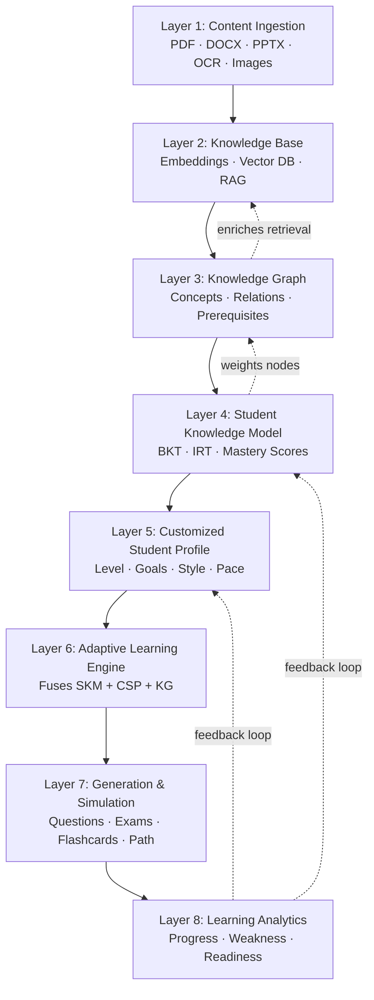

The diagram is the **target** architecture. Current implementation status per layer:

| # | Layer | Status |
|---|-------|--------|
| 1 | Content Ingestion | **Partially implemented** — Docling ingestion, structure-aware chunking, and PAL OCR/embedding providers exist as service modules; the automated upload-to-vectors workflow is not wired yet |
| 2 | Knowledge Base (RAG) | **Partially implemented** — embedding generation and pgvector storage/search exist; the retrieval/RAG service and API are planned (ADR-0009) |
| 3 | Knowledge Graph | **Planned** (§13) — no concept extraction or graph store exists |
| 4 | Student Knowledge Model (BKT/IRT) | **Planned** — research basis defined (§27); no implementation |
| 5 | Customized Student Profile | **Partially implemented** — profile model + GET/PUT profile API for a subset of the planned fields (education level, major, university, preferred language, VARK style, daily available minutes) |
| 6 | Adaptive Learning Engine | **Planned** (§16) |
| 7 | Generation & Simulation | **Planned** |
| 8 | Learning Analytics | **Planned** |

---

## 3. Problem Statement

OpenLearn AI targets seven interconnected problems in self-directed learning. The responses below describe the designed system; implementation status per component follows §2.3.

| # | Problem | Today's Reality | OpenLearn AI Design Response |
|---|---------|-----------------|------------------------------|
| 1 | **Content overload** | Students face hundreds of pages with no guidance on what matters most or in which order. | Concept extraction with prerequisite relationships (Knowledge Graph) so study priority follows structural dependencies, not page order. **Planned.** |
| 2 | **Absence of feedback** | Misconceptions surface only at the exam, after weeks of compounded study. | Immediate, per-activity mastery updates in the Student Knowledge Model so gaps are detected before they propagate. **Planned** (research basis §27). |
| 3 | **Random review** | Review order ignores spaced-repetition research; students re-read arbitrarily. | SM-2 scheduling based on measured mastery and elapsed time since last study. **Planned** (research basis §27). |
| 4 | **Rapid forgetting** | Without structured repetition, roughly 60% of new material is lost within 24 hours (Ebbinghaus curve). | Forgetting prediction (Half-Life Regression) combined with scheduling so review happens before the predicted forgetting threshold. **Planned** (research basis §27). |
| 5 | **Paid and closed tools** | Comparable adaptive features are locked behind subscriptions and closed source. | Fully open-source under AGPL-3.0 — free to use, modify, and extend. **Current project stance.** |
| 6 | **Poor Arabic support** | Most educational AI is English-first: Arabic OCR, embeddings, and generation underperform. | Arabic/English-first model selection and bilingual UX with RTL support. **Design principle**; language constraints (en/ar) are implemented in the profile model. |
| 7 | **Data privacy** | Sensitive academic content is uploaded to third-party clouds. | Self-hostable stack, provider abstraction with local alternatives, minimum-data principle (§9.3), and credentials owned by a self-hosted IdP (ADR-0006). **Partially implemented** (architecture), **planned** (fully local processing). |

---

## 4. Educational Philosophy & Design Principles

### 4.1 Educational Intelligence, Not Chatbots

The foundational philosophy is that educational technology should exhibit intelligence, not merely conversational capability. A chatbot is a passive information-retrieval system: it answers when asked. An intelligent tutor is an active pedagogical agent: it identifies misconceptions, recommends study strategies, adjusts difficulty based on performance, and schedules review to prevent forgetting — the difference between a search engine and a personal teacher.

OpenLearn AI implements this philosophy through three modeling components: the Knowledge Graph (what concepts exist and how they relate), the Student Knowledge Model (what the student currently understands), and the Customized Student Profile (who the student is, their goals, and how they prefer to learn). The Adaptive Learning Engine is designed to fuse all three so decisions are knowledge-structured, cognition-aware, and learner-personalized. This fusion is a **design principle**; the components themselves are planned (§2.3).

### 4.2 Eight Design Principles

The architecture is governed by eight design principles. They are constraints on architectural decisions, not aspirations: a design choice that violates one is rejected regardless of its technical advantages.

| # | Principle | Definition | Architectural Implication |
|---|-----------|------------|--------------------------|
| 1 | **Open Source First** | All core components are open-source; proprietary dependencies are acceptable only as optional plugins, never requirements. | No proprietary database, LLM runtime, or cloud service as a hard dependency; every component must have an open-source alternative. |
| 2 | **Privacy First** | Student data never leaves the user's control without explicit, informed consent. | Cloud providers are configuration choices, not defaults; no authentication secrets in the application database (ADR-0006); no external telemetry. |
| 3 | **Local First** | All core features must be operable offline with local models and data. | **Target:** local providers for every capability as a configuration preset. Current staging mixes cloud (Gemini OCR, LiteLLM/OpenAI) and locally executed (BGE-M3, pgvector) components; a deployable all-local mode is planned (§9). |
| 4 | **Cloud Optional** | Cloud providers are enhancements, not requirements; the system degrades gracefully when they are unavailable. | PAL fallback semantics (implemented, §8.3); provider substitution by configuration, not code. |
| 5 | **Modular Design** | Components are independent modules communicating through contracts, not shared internals. | Domain modules as packages inside the backend process (ADR-0001); PAL as the enforced boundary between core services and AI providers (ADR-0009). |
| 6 | **Provider Agnostic** | No AI component is hard-coded to a specific provider. | PAL typed interfaces — embedding, OCR, ranking, reasoning, vector DB — plus a shared base contract. Speech and vision interfaces are **planned** (§29); the current interface set is six files, not seven. |
| 7 | **Offline Friendly** | Full functionality when disconnected; offline is a baseline, not an edge case. | Mock providers enable offline development and tests today; cloud failures must not cascade to local components. A deployable offline mode is **planned** (§9). |
| 8 | **Research Driven** | Every pedagogical algorithm is grounded in published research. | BKT (Corbett & Anderson, 1995), IRT (Wainer et al.), SM-2 (Wozniak), Half-Life Regression (Settles & Meeder), VARK (Fleming). Research basis in §27; implementations **planned**. |

### 4.3 Principle Conflicts and Resolution

When principles conflict, precedence is fixed: **Privacy First > Local First > Provider Agnostic > Modular Design > Open Source First > Cloud Optional > Offline Friendly > Research Driven**. Privacy and local capability are therefore never traded away for quality, while research-driven improvements are always welcome but never override a higher principle. Example: bundling modules to simplify local deployment would violate Modular Design, so module boundaries are kept and in-process communication is used instead of network calls.

---

## 5. Competitive Positioning

### 5.1 Positioning

Existing tools each solve one slice of the problem: document chat (ChatPDF-style products), quiz generation (Quizgecko), spaced repetition (RemNote), and course sequencing (Adapt). None integrates content understanding, learner modeling, and adaptive decision-making into one closed loop. OpenLearn AI's intended differentiation rests on four pillars:

1. **Closed-loop integration** of Knowledge Graph, Student Knowledge Model, and Student Profile into a single adaptive engine — **planned** (§2.3).
2. **Provider-agnostic hybrid execution** — one codebase where every AI component is replaceable through the PAL, avoiding vendor lock-in — **partially implemented** (§7, §8); local execution modes are planned.
3. **Arabic/English-first design** — model selection criteria, bilingual UX, and RTL support as first-class requirements — **design principle**; language constraints implemented in the data model.
4. **Open source and self-hostable** — AGPL-3.0, no per-seat cost, privacy through self-hosting — **current project stance**.

### 5.2 Capability Status

The v4.0 feature-comparison matrix presented target capabilities as if shipped. The honest version:

| Capability | Status | Notes |
|------------|--------|-------|
| Document ingestion (Docling: PDF, DOCX, HTML, MD, images) | **Implemented** | Targeted-OCR policy per ADR-0009; pipeline details in §11 |
| Structure-aware chunking (1200/150 chars, deterministic IDs) | **Implemented** | Custom chunker; details in §11.4 |
| OCR — Gemini (`gemini-2.5-flash`) | **Implemented** | PaddleOCR/Surya remain benchmark candidates in `experiments/` only (ADR-0003) |
| Embeddings — BGE-M3, 1024-dim dense | **Implemented** | sentence-transformers |
| Vector storage + similarity search — PostgreSQL + pgvector | **Implemented** | ADR-0004; cosine similarity |
| Provider abstraction, fallback, streaming semantics (PAL) | **Implemented** | §8 |
| LLM gateway — LiteLLM (`gpt-4o-mini`, `gpt-3.5-turbo`) | **Implemented** | ADR-0005; staging deployment |
| Authentication & RBAC — Keycloak/OIDC | **Implemented** | ADR-0006 |
| Course/material APIs, S3-compatible presigned uploads | **Implemented** | §22 |
| Student profile subset (6 fields) + profile API | **Implemented** | Full 13-field CSP and SKM integration planned |
| RAG Q&A with citation grounding | **Planned** | Pipeline defined in ADR-0009 |
| Chat endpoints & WebSocket streaming | **Planned** | Transport protocol defined in ADR-0009 |
| Knowledge Graph (concepts, prerequisites, visualization) | **Planned** | §13 |
| Student Knowledge Model (BKT/IRT) | **Planned** | Research basis §27 |
| Adaptive engine, SM-2/HLR scheduling, CAT exams | **Planned** | Research basis §27 |
| Learning analytics | **Planned** | — |
| Local (fully offline) execution mode | **Planned** | §9; only mock/local abstractions exist today |
| Speech / vision modalities | **Planned** | §29 |

---

## Part II: Architecture

---

## 6. System Overview

### 6.1 As-Built Architecture (staging)

The verified current system is a modular monolith with a single PostgreSQL database, async workers, a cloud LLM gateway, and a containerized observability stack:

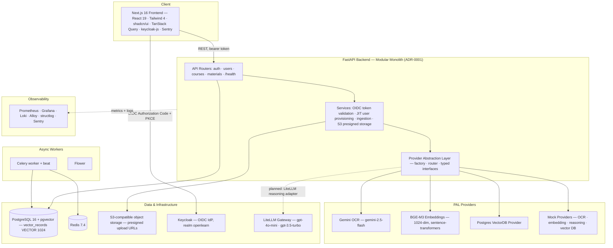

**Component notes (all verified):**

- **Frontend:** Next.js 16.3.1 / React 19 / TypeScript 5, Tailwind CSS 4 + shadcn/ui, TanStack Query, `keycloak-js` for OIDC, Sentry; Storybook + Vitest + Playwright + ESLint quality infrastructure. No client-state library beyond React/TanStack is currently in use.
- **Backend:** FastAPI + uvicorn, async SQLAlchemy 2 + asyncpg + Alembic, Pydantic Settings, structlog, Sentry SDK, Prometheus instrumentator. API surface today: `auth`, `users` (profile GET/PUT), `courses` (CRUD), `materials` (course-scoped presigned upload-URL + registration), plus `/health` and a staging error probe. See §22 for the verified endpoint inventory and the planned surface.
- **Authentication:** Keycloak is the identity authority (realm `openlearn`, public client `openlearn-frontend`, audience `openlearn-api`). The backend validates RS256 access tokens against the realm JWKS, maps `(issuer, subject)` to a local user with just-in-time provisioning, and enforces RBAC from realm roles. No password hashes or refresh tokens are stored in the application database (ADR-0006).
- **Storage:** course materials live in S3-compatible object storage behind presigned upload URLs (server-generated object keys); material rows are registered with a `pending` status. Content scanning/processing is a future phase.
- **Workers:** Celery workers + beat on Redis, monitored by Flower. The material-processing workflow that will connect uploads to ingestion/embeddings is **planned**.
- **LLM gateway:** LiteLLM proxy deployed as its own staging service (`infra/litellm-config.yaml`): `gpt-4o-mini` (default) and `gpt-3.5-turbo` (fallback), request budget cap ($10 / 30 days), `drop_params`, and a Langfuse success callback configured (the Langfuse service itself is not deployed; log/metric observability is Prometheus/Grafana/Loki/Alloy).

**Deployment topology (verified from compose files):**

| Environment | Compose file | Services |
|-------------|--------------|----------|
| Development | `infra/docker-compose.dev.yml` | `db` (pgvector/pgvector:pg16), `keycloak` 26.7.3 (realm import), `keycloak-bootstrap` (test user + `student` role) |
| Staging | `infra/docker-compose.staging.yml` | `backend`, `frontend`, `litellm`, `db` (pgvector/pgvector:pg16), `redis`, `celery_worker`, `celery_beat`, `flower`, `keycloak`, `prometheus`, `grafana`, `loki`, `alloy` |

CI/CD: GitHub Actions workflows (`ci.yml`, `deploy-staging.yml`, `storybook.yml`) build and publish GHCR images and deploy the staging compose stack. The backend image runs **Python 3.11** (`python:3.11-slim`); the frontend image runs Node 22. **No reverse proxy is deployed** (no Nginx); services are exposed on host ports directly.

### 6.2 Target Architecture

The eight-layer target architecture (§2.3) remains the project's direction and is intentionally preserved. Components not present in §6.1 are **planned**, not deployed:

- RAG retrieval service (query embedding → pgvector search → context construction → reasoning call → source preservation) and citation-grounded answers (ADR-0009).
- Chat application transport over WebSocket with the ADR-0009 event protocol (`retrieval_started`, `sources_found`, `reasoning_started`, `token`, `done`, `error`).
- Knowledge Graph store and prerequisite-aware query expansion (§13).
- Student Knowledge Model, profile–model integration, Adaptive Learning Engine, review scheduling (§14–§16).
- Analytics, recommendation, review, exam, and knowledge-graph API surfaces (§22).
- Local/hybrid deployment presets including a local LLM runtime (§9).
- Speech and vision modalities (§29).

The as-built diagram in §6.1 is the single architecture reference for what exists today; §17 (data flow) and §18–§24 (engineering sections) have been reconciled with it in Passes 2–3.

---

## 7. Hybrid AI Architecture

### 7.1 Core Philosophy

The Hybrid AI Architecture rests on one principle: **there is only one product, not two**. The platform does not ship separate "local" and "cloud" editions. It ships one system in which every AI component is replaceable through abstraction, and the deployment chooses per component whether to use a local or cloud provider — trading privacy, quality, hardware cost, and latency explicitly. A student with a GPU workstation can run reasoning locally while using cloud OCR; an institution with privacy mandates can run everything on its own infrastructure; a student with modest hardware can run everything cloud. Same codebase, same deployment mechanics, different configuration.

This remains the governing philosophy. Its mechanism — the Provider Abstraction Layer — is implemented and described in §8; the deployable local configurations it enables are **planned** (§9).

### 7.2 Current Realization vs Target

| Aspect | Current (staging, verified) | Target |
|--------|-----------------------------|--------|
| Provider selection | Configuration-driven factory (`settings.ai_*` knobs) constructing typed providers | Unchanged, extended to local providers |
| Reasoning | PAL mock provider (deterministic, for tests/dev); LiteLLM gateway deployed as infrastructure (ADR-0005) | LiteLLM-backed PAL reasoning adapter; local LLM (e.g., Ollama) as development/fallback path per ADR-0005 |
| Embeddings | BGE-M3 running in-process (sentence-transformers), 1024-dim | Unchanged; cloud embeddings remain an optional alternative |
| OCR | Gemini (`gemini-2.5-flash`) via google-genai SDK | Unchanged; local engine adoption decided by the ADR-0003 benchmark process |
| Vector DB | PostgreSQL + pgvector (ADR-0004) | Unchanged; a dedicated store only if evidence demands (ADR-0004) |
| Ranking/reranking | Interface defined; no provider | BGE reranker or equivalent (planned; deferred in ADR-0009) |
| Fallback | PAL router: ordered chain, fallback only on `ProviderError`, streaming fallback only before the first chunk (§8.3) | Unchanged — semantics are stable |
| Local execution mode | Not deployable; mock providers cover offline development/tests | Deployable local/hybrid presets (§9) |

**What is not true (correcting v4.0):** no local LLM runtime (Ollama) is deployed; no ChromaDB, Neo4j, or MinIO-required services exist; speech/vision providers do not exist; the reasoning path through LiteLLM is not yet wired into PAL. Claims to the contrary in §11–§31 were stale and have been corrected in this revision.

### 7.3 Design Rationale

- **Maintenance:** one codebase with provider abstraction avoids the diverging local/cloud codepaths of a two-product strategy; provider changes are configuration, not code.
- **User flexibility:** hardware, connectivity, and privacy requirements change over time; per-component provider choice lets a deployment adapt without data migration or workflow changes.
- **Architectural purity:** PAL is an enforced boundary, not a convenience wrapper — no core service references a provider SDK directly, which prevents creeping single-provider dependencies (enforced via interface contracts, ADR-0009).

---

## 8. Provider Abstraction Layer

The PAL is the architectural boundary between the application and AI providers. Per ADR-0009, **PAL is a provider abstraction layer and nothing else**: it owns capability interfaces, normalized result models, provider adapters, a typed exception hierarchy, provider configuration, provider construction (factory), and ordered fallback. It does not own ingestion, chunking, retrieval, RAG context construction, WebSocket transport, or business logic — those belong to application services. There is no plugin framework, provider marketplace, or dynamic discovery; provider selection is explicit configuration.

### 8.1 Interfaces (Implemented)

The implemented PAL defines **five capability interfaces plus a shared base contract** — six interface files total. There are no speech or vision interfaces (planned, §29).

| Interface (file) | Purpose | Contract | Providers (status) |
|------------------|---------|----------|--------------------|
| `BasePALInterface` (`interfaces/base.py`) | Shared contract | `health_check() -> HealthStatus` | Required of every provider |
| `EmbeddingInterface` (`interfaces/embedding.py`) | Vector embeddings | `dimension` property; `embed(text)`; `embed_batch(texts)`; `EmbeddingResult` enforces `len(vector) == dimension` | **BGE-M3** (1024-dim); **mock** (configurable dimension, default 1024) |
| `OCRInterface` (`interfaces/ocr.py`) | Text extraction | `extract_text(source)`; `extract_text_batch(sources)` → `OCRResult` | **Gemini** (`gemini-2.5-flash`, google-genai SDK, PDF-page input); **mock** |
| `ReasoningInterface` (`interfaces/reasoning.py`) | LLM reasoning | `reason(messages, ...) -> ReasoningResult`; `reason_stream(messages, ...) -> AsyncIterator[ReasoningChunk]`; `generate(prompt, ...)` compatibility wrapper | **Mock only** — LiteLLM-backed adapter **planned** (ADR-0005) |
| `VectorDBInterface` (`interfaces/vector_db.py`) | Vector storage | `upsert(records)`; `search(vector, top_k, filters)`; `get(id)`; `delete(ids and/or filters)` → count | **PostgreSQL + pgvector** (session-backed); **mock** |
| `RankingInterface` (`interfaces/ranking.py`) | Re-ranking | `rank(query, candidates, top_k)` | **None yet** — deferred (ADR-0009); BGE reranker is the candidate |

Provider adapter inventory (`backend/app/pal/providers/`): embedding — `bge_m3_provider`, `mock_provider`; OCR — `gemini_provider`, `mock_provider`; reasoning — `mock_provider`; vector DB — `postgres_provider`, `mock_provider`.

### 8.2 Factory and Configuration

Configuration flows **env → Pydantic Settings → PAL factory → provider instance** (ADR-0009). The factory functions (`backend/app/pal/factory.py`) select providers from settings:

- OCR: `ai_ocr_provider` (`mock` | `gemini`), model from `ai_ocr_model`, key from `GEMINI_API_KEY`.
- Embedding: `ai_embedding_provider` (`mock` | `bge-m3`) and `ai_embedding_dimension`.
- Reasoning: `ai_reasoning_provider` (`mock`; further options as adapters land).
- Vector DB: `ai_vector_db_provider` (`mock` | `postgres`); the postgres provider is session-backed — callers pass their request-scoped `AsyncSession`.

Unknown provider names raise `ConfigurationError` immediately (no silent fallback). Mock providers implement every contract so the full stack runs in tests and offline development.

### 8.3 Router and Fallback Semantics (Implemented)

`PALRouter` (`backend/app/pal/router.py`) executes operations against an ordered provider chain:

1. **Ordered fallback** — first provider success wins. No load balancing, scoring, or dynamic discovery.
2. **Fallback only on `ProviderError`** (timeout, unavailability, rate limit, 5xx). `InvalidInputError`, `ConfigurationError`, and programming errors fail immediately — no masking of caller bugs.
3. **Streaming** (`execute_stream`): fallback is allowed only **before the first chunk** is emitted; after that, a failure is terminal. No mid-stream provider switching.
4. **Observability:** every fallback is logged via structlog (provider, error class, latency); `health_check()` aggregates all configured providers concurrently and never raises.

### 8.4 Exception Hierarchy

```text
PALError
├── ProviderError                    # fallback-eligible
│   ├── ProviderUnavailableError
│   ├── ProviderTimeoutError
│   ├── ProviderRateLimitError
│   └── ProviderServerError
├── InvalidInputError                # no fallback
├── ConfigurationError               # no fallback
└── UnsupportedOperationError        # no fallback
```

---

## 9. Local vs Cloud Execution Model

> **Status: design principle / target model.** The three-mode model describes configuration presets the product is intended to support. They are **not currently deployable**: there are no Compose profiles for local/hybrid/cloud execution, no local model runtime (Ollama) ships, and no ChromaDB/FAISS-style embedded stores exist. The current deployment (§6.1) mixes cloud providers (Gemini OCR, LiteLLM/OpenAI) with locally executed components (BGE-M3 in-process, pgvector, Keycloak, Redis) and uses mock providers for offline development and tests.

### 9.1 Three Execution Modes (Target)

| Mode | Intent (design) | Current Reality |
|------|-----------------|-----------------|
| **Local** | All providers local: local LLM runtime, local embeddings, local OCR, local storage. No internet required; maximal privacy; highest hardware demand. Target hardware guidance: minimum 8 GB RAM; 16 GB RAM with a GPU recommended for local LLM inference. | **Planned.** Only mock/local abstractions exist; BGE-M3 and pgvector already run locally, but no deployable all-local preset exists and no local LLM runtime ships. |
| **Hybrid** | Per-component choice: e.g., local reasoning with cloud OCR, or cloud reasoning with local storage. The default product philosophy. | **Partially realized by configuration** — staging already mixes cloud and local components; explicit hybrid presets are planned. |
| **Cloud** | All AI providers cloud-hosted; minimal hardware (a browser-capable device suffices); requires connectivity. | Closest to today's staging (cloud OCR + LiteLLM/OpenAI), though not packaged as a distinct preset. |

Target hardware sizing per mode is additionally elaborated in `docs/design/OpenLearn_AI_System_Requirements_and_Deployment_Profiles.md`, a supporting deployment requirements/profiles document. It complements this specification; it is not designated as a higher authority by the ADR-0002 documentation hierarchy.

### 9.2 Graceful Degradation

- **Implemented:** the PAL router's degradation rules (§8.3) — ordered chain, `ProviderError`-only fallback, pre-first-chunk streaming fallback, structured logging. Degradation behavior is explicit configuration, not implicit behavior, and is unit-tested.
- **Design intent (planned):** a third degradation tier of minimal "safe fallbacks" (e.g., template-based generation, hash-based pseudo-embeddings) that always work at reduced quality. Today's mock providers serve tests and offline development; they are **not** production safe-fallbacks.

### 9.3 Data Flow and the Minimum-Data Principle

**Design principle:** the system transmits only the minimum data an operation requires, and sensitivity-aware routing should steer sensitive data to local providers where configured.

Current data-flow reality (verified):

- **Cloud OCR:** single-page PDF bytes are transmitted to the Gemini API per OCR request.
- **LLM usage (planned path):** once the LiteLLM reasoning adapter is wired, prompts and retrieved context chunks — not whole documents or histories — are the intended payload; LiteLLM routes them to the configured OpenAI models.
- **Embeddings and vectors:** BGE-M3 runs in-process; vectors stay in the project's PostgreSQL database.
- **Authentication:** credentials and identity data are held by the self-hosted Keycloak (ADR-0006), not the application database.

A data-sensitivity classifier (tagging data public/personal/sensitive and warning on cloud routing) is **design intent, not implemented**.

---

## 10. AI Model Selection Strategy

### 10.1 Model Categories and Current Choices

The architecture does not hard-code models; categories have selection criteria, and concrete models are configuration (§8.2). The table reflects verified current choices and their governed status:

| Category | Current Choice (verified) | Planned / Alternatives | Governing ADR |
|----------|---------------------------|------------------------|---------------|
| Reasoning (LLM) | Via **LiteLLM** gateway: `gpt-4o-mini` (default), `gpt-3.5-turbo` (fallback); budget cap; `drop_params` | LiteLLM-backed PAL adapter; local development path via Ollama (e.g., Qwen) per ADR-0005 intent; other providers (Anthropic, GLM) routable through the gateway | ADR-0005 |
| Embeddings | **BGE-M3** (`BAAI/bge-m3`) via sentence-transformers — dense, 1024-dim, multilingual (Arabic/English), in-process | Changing embedding models later requires an explicit dimension migration (ADR-0009) | ADR-0009 |
| OCR | **Gemini `gemini-2.5-flash`** via the official google-genai SDK (PDF-page input) | Local engines (PaddleOCR, Surya) remain **benchmark candidates** in `experiments/OCR/ocr-benchmark/` only; a winning engine would be reimplemented in the backend per ADR-0003 | ADR-0003 |
| Vector store | **PostgreSQL + pgvector** — `vector_records` table, `VECTOR(1024)`, cosine similarity | Qdrant/ChromaDB only if measured evidence demands a dedicated store | ADR-0004 |
| Ranking / reranking | Interface defined; no provider | BGE reranker (or equivalent cross-encoder) | ADR-0009 (deferred) |
| Speech / Vision | None | Future modalities (interfaces to be added when first needed) | §29 |

### 10.2 Selection Criteria

Model choices in each category are evaluated on four dimensions:

- **Quality** — task performance with emphasis on Arabic/English multilingual behavior: generation quality and instruction-following for reasoning; retrieval accuracy (e.g., MTEB-class benchmarks) for embeddings; Arabic character accuracy and layout preservation for OCR. Measurement is to follow the ADR-0003 methodology (hand-verified ground truth → metrics → engines). The implemented `backend/app/eval/` package provides the harness mechanism (CLI, evaluator registry, dataset loading) — not yet the completed evaluation framework, and no comprehensive benchmark results exist in the baseline.
- **Resource requirements** — VRAM/RAM must fit the target deployment profile; local model sizing is evaluated against the deployment-profiles document (§9.1).
- **Privacy impact** — does the choice transmit data externally? Sensitive-data routing follows §9.3.
- **Latency** — reasoning latency targets (NFR-1: RAG response < 3 s) and streaming behavior; local inference trades throughput for privacy.

### 10.3 Current Default Configuration (Verified)

| Component | Current Default (staging baseline) | Notes |
|-----------|------------------------------------|-------|
| LLM gateway | **LiteLLM proxy** — `gpt-4o-mini` default, `gpt-3.5-turbo` fallback, master-key auth, $10/30-day budget cap | ADR-0005; `infra/litellm-config.yaml` |
| PAL reasoning provider | **Mock** (deterministic) | LiteLLM-backed adapter **planned** |
| Embeddings | **BGE-M3** (sentence-transformers), 1024-dim dense | Mock provider with configurable dimension for tests |
| OCR | **Gemini** `gemini-2.5-flash` (google-genai SDK) | Key via `GEMINI_API_KEY`; model via `ai_ocr_model` |
| Vector DB | **PostgreSQL + pgvector** — `vector_records`, `VECTOR(1024)`, cosine | Session-backed provider; ADR-0004 |
| Ranking | None (interface only) | Deferred — ADR-0009 |
| Chunking (pipeline default) | Custom structure-aware chunker — `chunk_size=1200`, `chunk_overlap=150` characters | Application-level config (`chunk_size`/`chunk_overlap`) |

**Superseded defaults removed.** The v4.0 defaults — Ollama + Qwen 2.5 reasoning, PaddleOCR, ChromaDB vector store — are **no longer accurate** and are superseded by the implementation and by ADR-0004/ADR-0005/ADR-0009. ChromaDB and Ollama remain *possible future options* (a dedicated vector store if evidence demands; a local LLM path per ADR-0005's development intent), but neither is deployed. All defaults above are configuration presets (`settings.ai_*` knobs) and can be changed without code modifications.

---

## Part III: Core Capabilities

---

## 11. Document Processing Pipeline

The Document Processing Pipeline is the first layer of the system — it transforms raw educational content into structured, chunked text with provenance, preparing it for embedding and downstream knowledge processing. It is the foundation upon which all subsequent layers operate: without properly extracted, segmented, and traceable text, the Knowledge Base cannot generate meaningful embeddings, the Knowledge Graph cannot extract coherent concepts, and the Student Knowledge Model cannot track mastery of identifiable learning objectives.

**Status summary.** The ingestion and chunking core is implemented; the automated workflow that connects an uploaded material to stored vectors is not wired yet. Per ADR-0009 the target flow is Docling extraction → targeted OCR (only pages with insufficient text) → canonical document → structure-aware chunks → batch embeddings → PostgreSQL + pgvector. Of these stages, extraction, chunking, the OCR/embedding/vector-store providers, and the upload-registration entry point exist as verified modules; the targeted-OCR orchestration loop, the automated batch-embedding step, and the worker tasks that would chain them are planned.

### 11.1 Current Implemented Pipeline (Verified)

| Stage | Status | Implementation (staging baseline) |
|-------|--------|-----------------------------------|
| Upload & registration | **Implemented** | Course-scoped presigned upload URL against S3-compatible storage; server-generated object keys; `materials` row created with status `pending`. There is deliberately no status state machine yet — the status vocabulary is owned by the future processing phase. |
| Text extraction | **Implemented** (service module) | `backend/app/services/ingestion.py`: Docling 2.127.0 conversion → application-level `CanonicalDocument`; deterministic `document_id`; per-page text with page-size metadata; source metadata (filename, mimetype, binary hash, URI); conversion status preserved, including `PARTIAL_SUCCESS` with per-error details (§11.3). |
| Targeted OCR | **Provider implemented; orchestration planned** | `GeminiOCRProvider` (`gemini-2.5-flash`, official google-genai SDK): local PDF path → validated bytes → Gemini request → `OCRResult`; batch extraction is sequential (§11.5). The per-page triggering loop is ADR-0009 design; the application-side orchestration service is not demonstrated in the current baseline. |
| Structure-aware chunking | **Implemented** | `backend/app/documents/chunking.py`: deterministic, dependency-free chunker (§11.4). |
| Embedding | **Provider implemented; automated step planned** | BGE-M3 provider (1024-dim, sentence-transformers) constructible through the PAL factory; the automated chunk → embedding → storage wiring is planned. |
| Vector persistence | **Provider + table implemented; write path planned** | PostgreSQL + pgvector `vector_records` table (§12.1) with a session-backed PAL provider; automated ingestion-time writes are planned. |
| Worker execution | **Infrastructure implemented; tasks planned** | Celery worker/beat + Flower are deployed, but no material-processing tasks are registered in the baseline. |
| Metadata enrichment | **Planned** | §11.6. |
| KG extraction / RAG | **Planned** | §13, §12.2. |

### 11.2 Implemented Flow (As-Is)

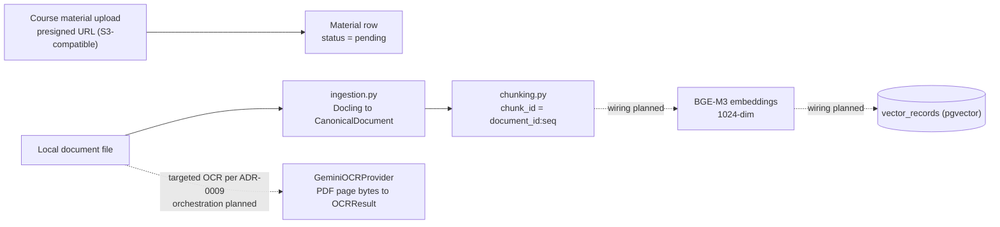

Solid edges are verified implemented paths; dotted edges are planned wiring. The enabled input formats (verified against the installed Docling environment and the ingestion service's explicit allow-list) are **PDF, DOCX, HTML, Markdown, and images** (PNG, JPG/JPEG, TIFF, BMP, GIF). Docling also recognizes DOC and MHTML, but the ingestion service rejects them ("supported by Docling but not enabled for ingestion at this step") rather than processing them untested. PPTX and plain text — listed as supported in v4.0 — are **not** part of the enabled format set.

### 11.3 Text Extraction and the Canonical Document (Implemented)

Extraction is delegated to Docling rather than to per-format libraries; the v4.0 description of PyMuPDF/python-docx/python-pptx extraction is superseded. The ingestion service converts a local file and normalizes the result into `CanonicalDocument` — an application-level Pydantic model, deliberately outside the PAL (ADR-0009). It carries: `document_id` (deterministic, derived from the source file stem), `source`, `title` (file stem — never invented), `language` (only when derivable; otherwise `None`), `pages` (each with `page_number`, extracted `text`, and page-size metadata), and source-level `metadata` (filename, mimetype, binary hash, URI, conversion status, page count, and any conversion errors). Page text preserves Docling's reading order, and empty pages are preserved explicitly.

Determinism is a design requirement: because `document_id` is derived from the source and chunk IDs are derived from `document_id` plus sequence (§11.4), re-ingesting the same document produces the same identifiers, making ingestion idempotent. Conversion failures raise typed application errors (`DocumentNotFoundError`, `UnsupportedDocumentTypeError`, `DocumentConversionError`); partial conversion success keeps the content and makes the errors visible in metadata.

ADR-0009 adds a downstream rule that the RAG service must honor: retrieval never reduces retrieved content to bare strings — `chunk_id`, `document_id`, and page references must survive into the answer's sources.

### 11.4 Structure-Aware Chunking (Implemented)

Chunking is implemented by a custom, dependency-free module rather than a third-party chunking library. The Week 6 plan named Chonkie with an explicit fallback clause; inspection showed its chunkers operate on a single plain string and expose only text/offsets/token_count — page boundaries, section metadata, ID assignment, and overlap bookkeeping would all have remained in this codebase anyway, while pulling in the HuggingFace tokenizers stack across an API-version boundary. The plan's authorized fallback — "simple structure-aware chunking" — is what this module implements. (The v4.0 description of LangChain-based ~500-word chunking is superseded: no LangChain chunker exists in the codebase, and the actual defaults are 1200/150 characters.)

The algorithm is deterministic — no randomness, no clocks, no locale dependence:

1. Each page's text is split into paragraphs on blank lines; each paragraph keeps its page number and the page's `section` metadata when present. Paragraphs longer than `chunk_size` are split at sentence boundaries; a sentence still longer than `chunk_size` is hard-split at whitespace. Atomic pieces therefore always satisfy `len ≤ chunk_size`.
2. Pieces are packed greedily into chunks of at most `chunk_size` characters, deliberately ignoring page boundaries so obvious structure stays intact; up to `chunk_overlap` characters worth of trailing pieces of the previous chunk are carried into the next chunk when they fit.
3. Each chunk records: `chunk_id` (`{document_id}:{seq}`, zero-based, deterministic), `document_id`, `text`, `pages` (sorted unique page numbers of its pieces), `section` (from the first contributing piece that has one), `language` (the document language — never invented per chunk), and `metadata` (`char_count`, `page_count`).

Sizing is configuration, not code: `chunk_document()` accepts `chunk_size`/`chunk_overlap` explicitly or falls back to the application settings (1200 / 150 characters in the current configuration), and validates `1 ≤ chunk_size` and `0 ≤ chunk_overlap < chunk_size` (`ValueError` otherwise). Empty or whitespace-only pages produce no chunks, and a document with no usable text yields an empty list — no meaningless empty chunks are created.

### 11.5 OCR Processing (Provider Implemented; Orchestration Planned)

Two layers must be distinguished. The **OCR provider** is implemented: `GeminiOCRProvider` implements the PAL `OCRInterface` using the official google-genai SDK (explicitly not the deprecated google-generativeai package; no Files API usage). Its contract is deliberately narrow — local PDF path → bytes (validated `%PDF-` header) → Gemini request → `OCRResult` — and it knows nothing about documents, pages, quality thresholds, or fallback orchestration; the model comes from configuration (`ai_ocr_model`, currently `gemini-2.5-flash`) and the key from `GEMINI_API_KEY`. Batch extraction is a sequential loop over single-file requests. Each request transmits one PDF page to the Gemini API — see §9.3 for the data-flow implication. The backend also declares pypdfium2 for targeted-OCR source extraction (page-level PDF handling), consistent with this single-page contract.

The **targeted-OCR policy** is ADR-0009 design: OCR is a fallback, never the default path. Per page, OCR runs only when the extracted text is insufficient (`len(text) < OCR_MIN_TEXT_CHARS`, configurable); OCR text replaces the extracted text, OCR region metadata is attached when available, Docling's document structure is preserved, and OCR coordinates are never realigned. A known limitation is accepted for now: a garbage but non-empty text layer passes the threshold, and there is no OCR-quality detection system. The application service that would execute this loop (`services/ocr.py` per ADR-0009) is not demonstrated in the current baseline — the trigger loop is planned wiring even though the extraction side (which runs with Docling's internal OCR disabled, `do_ocr=False`) and the provider side both exist.

Provider selection, corrected: the shipped OCR provider is **Gemini**. PaddleOCR and Surya are **benchmark candidates** inside `experiments/OCR/ocr-benchmark/` only — per ADR-0003 they are never imported by product code, and a winning local engine would be reimplemented in the backend after the benchmark process (ground truth → metrics → engines) selects it. The v4.0 claim that PaddleOCR was the configured local OCR default is superseded.

### 11.6 Metadata Enrichment (Planned)

The implemented chunk metadata today is structural: `section`, page provenance, character count, page count, and document-level language. The richer enrichment described in v4.0 — automatic language detection per chunk, difficulty estimation from vocabulary frequency and sentence complexity, and content-type classification (definitions, explanations, examples, proofs, problems) — is **planned design**, not implemented. These remain valuable targets: language tags would let generation match output language; difficulty hints would seed adaptive difficulty calibration (§16) and be refined by the Knowledge Graph and Student Knowledge Model; content-type labels would enable question types appropriate to each content category. They should be built on top of the deterministic chunk model without breaking its determinism guarantees.

### 11.7 Target Pipeline (Planned)

The full pipeline chains the implemented modules into the ADR-0009 flow:

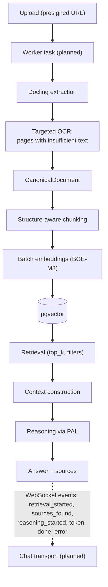

The worker task, the automated chaining, and everything from retrieval onward are planned (ADR-0009). WebSocket is an application transport — PAL knows nothing about it — and the event list above is the complete ADR-0009 protocol. Knowledge-graph extraction (§13) is a parallel planned branch, not part of the v1 pipeline.

---

## 12. Knowledge Pipeline

**Status summary.** The vector infrastructure — embedding provider, vector store, storage schema, and the PAL contracts that abstract them — is implemented. The retrieval and generation pipeline that turns stored vectors into citation-grounded answers is planned: the pipeline shape and service ownership are defined in ADR-0009, and no retrieval API, RAG service, or chat endpoint exists in the baseline.

### 12.1 Current Vector Infrastructure (Implemented)

**Embeddings.** The embedding provider is BGE-M3 (`BAAI/bge-m3`) via sentence-transformers — dense, 1024-dimensional, multilingual (Arabic/English), running in-process. `EmbeddingResult` enforces `len(vector) == dimension` at the PAL boundary, and the mock embedding provider (configurable dimension, default 1024) mirrors the contract for tests and offline development. Per ADR-0009, heavy local models are to be lazy-loaded and instantiated once. Changing the embedding model later is not a drop-in swap: it requires an explicit dimension migration (ADR-0009), and the storage layer's dimension is intentionally fixed (1024) rather than read from embedding settings, so configuration drift surfaces as an error instead of silent truncation.

**Vector storage.** PostgreSQL + pgvector is the vector-store decision (ADR-0004), implemented as the `vector_records` table: a text primary key (the vector/chunk identifier), an `embedding` column of type `VECTOR(1024)`, nullable `content`, a JSONB `metadata` column carrying document/chunk provenance (`document_id`, `chunk_id`, page references — mirroring the PAL `VectorRecord` DTO contract), and timestamps. Cosine similarity is the similarity operator. The PAL `VectorDBInterface` contract is `upsert`, `search(vector, top_k, filters)`, `get`, and `delete` — including deleting all vectors of a document (delete-by-document/filter, not only by ID). `top_k` is configurable (default ≈ 5); no fixed range is frozen into the architecture. The postgres provider is session-backed (callers pass their request-scoped `AsyncSession`); a mock provider covers tests.

**Search today.** Vector similarity search with filters exists as a PAL contract and a pgvector implementation. Keyword/BM25 search, re-ranking, query expansion, and retrieval APIs do not exist.

### 12.2 Target RAG Pipeline (Planned)

The conceptual pipeline remains:

```text
document
→ extraction                   (implemented module)
→ chunking                     (implemented module)
→ embedding                    (implemented provider; automated step planned)
→ vector storage               (implemented store; automated write planned)
→ retrieval                    (planned — RAG service)
→ reranking / context assembly (planned — ranking deferred per ADR-0009)
→ reasoning                    (planned — LiteLLM-backed PAL adapter)
→ grounded answer              (planned)
```

The RAG service owns query embedding → search → context construction → reasoning call → source preservation (ADR-0009). Its educational rationale is unchanged and remains the design's center of gravity: minimize hallucination in educational contexts, where factual accuracy is paramount. Three mechanisms are specified: **citation grounding** (every generated response includes references to specific source chunks), **structured output enforcement** (the LLM produces responses in a structured format with explicit claim-source mappings), and **confidence scoring** (the retrieval stage estimates how well the retrieved context covers the query; low-confidence retrievals trigger a clarification prompt rather than a potentially inaccurate answer). None of these is implemented today; all are design requirements for the planned service.

### 12.3 Retrieval Process Design (Planned)

The four-stage retrieval design from v4.0 is preserved as the target. The v1 ADR-0009 contract is narrower — pgvector similarity search with filters — so the later stages are design extensions to be introduced after the v1 loop works.

**Query embedding (planned).** The student's question is embedded with the same configured embedding provider used for document chunks; dimension and model must match, because mismatches produce meaningless similarity scores. The PAL makes one shared embedding configuration the natural path for both indexing and querying.

**Hybrid search (design extension).** The v4.0 design combines semantic search (the query vector against stored embeddings) with keyword search (BM25 over chunk text), merged with a configurable weighting (default: 70% semantic / 30% keyword). The rationale stands: semantic search captures conceptual similarity — a query about "logistic regression prerequisites" retrieves chunks about "linear regression" even when the exact phrase never appears; keyword search captures exact terminology — a query about "Bayes' theorem" retrieves chunks containing the exact term, which embeddings may under-represent for mathematical notation. The current pgvector contract implements the semantic half; the keyword stage and merge weighting are not implemented and are not part of the ADR-0009 v1 contract.

**Re-ranking (planned; deferred).** The `RankingInterface` exists — `rank(query, candidates, top_k)` — but no provider is bound. A cross-encoder re-ranker (BGE reranker or equivalent) remains the candidate: jointly processing the query and each candidate chunk yields a more accurate relevance score than the bi-encoder similarity used in the initial search, at the cost of one model inference per query-chunk pair — hence applying it only to the top-K candidates (design default K = 20) from the first stage. ADR-0009 explicitly defers ranking/reranking to a later roadmap phase.

**Context assembly (planned).** Re-ranked results are assembled into a context window that respects the LLM's maximum context length, truncating the lowest-ranked chunks while preserving a minimum number of chunks (design default: 3) so generation always has grounding material. Whatever assembly does, ADR-0009's rule applies: `chunk_id`, `document_id`, and page references must survive into the answer's sources.

### 12.4 Provider Abstraction in the Knowledge Pipeline

The knowledge pipeline is a primary beneficiary of the PAL. Implemented today: the embedding stage binds to `EmbeddingInterface` (BGE-M3 local; cloud alternatives remain an optional configuration), and vector storage binds to `VectorDBInterface` (PostgreSQL + pgvector; Qdrant/ChromaDB only if measured evidence demands a dedicated store — ADR-0004). Planned bindings: retrieval and context assembly live in application services (not PAL — ADR-0009 assigns them to the application), reasoning through the LiteLLM-backed adapter, and ranking once a provider is selected. Local/cloud combination freedom — e.g., local embeddings with a cloud reranker — remains a configuration-level property of the architecture, not a current deployment fact.

### 12.5 Automatic Knowledge-Base Population (Planned)

Today, uploaded materials are registered as `pending` and nothing processes them automatically. The planned workflow wires upload → ingestion → chunking → batch embedding → pgvector writes (§11.7), turning the implemented modules into an automatically populated knowledge base. Until that wiring lands, there is no demonstrated production path from an uploaded material to stored vectors, and no retrieval endpoint exists to consume them.

---

## 13. Knowledge Graph Architecture

**Status: planned capability.** No component of the Knowledge Graph exists in the baseline: no graph store is deployed (staging runs PostgreSQL + pgvector only, ADR-0004), the PAL has no graph-store interface (the interface set is the six capability files of §8.1), and no concept-extraction service exists. This section is preserved as target architecture and design rationale — the KG vision is a load-bearing part of the eight-layer loop (§2.3), not an optional extra.

### 13.1 Purpose and Rationale (Design)

The Knowledge Graph gives the system a structural map of the subject: which concepts exist, how they relate, and in what order they can meaningfully be learned. Three downstream capabilities depend on it. First, **study ordering** that follows structural dependencies rather than page order (§3, problem 1). Second, **prerequisite-aware retrieval** that expands queries to foundational material when prerequisite mastery is weak (§13.4). Third, **explainable adaptation**: mastery states can annotate graph nodes, and recommendations can cite the prerequisite chain that motivated them — the "enriches retrieval" and "weights nodes" feedback edges of the eight-layer loop.

### 13.2 Concept and Relation Extraction (Planned)

Concept and relation extraction will use the configured reasoning provider through the PAL `ReasoningInterface` to identify named concepts, technical terms, and key ideas in chunked text. The extraction is prompt-driven: each chunk is processed with a prompt that instructs the model to identify concepts and classify their relationships into `is-a` (hierarchical classification — "Logistic Regression is-a Classification Algorithm"), `prerequisite-of` (learning dependency — "Linear Algebra prerequisite-of Principal Component Analysis"), and `part-of` (structural composition — "Backpropagation part-of Neural Network Training").

Extraction quality will depend heavily on the reasoning provider's instruction-following capability and structured output support: LLMs that support JSON mode produce more consistently structured triples, reducing post-processing errors, and few-shot prompting with example triples from the same domain improves extraction accuracy by demonstrating the expected format and granularity. Because the LiteLLM-backed reasoning adapter is itself planned (§8.1, §10.1), extraction necessarily follows it in the roadmap.

### 13.3 Storage Architecture (Planned — Corrected)

The v4.0 text presented three PAL-configurable graph backends — Neo4j, NetworkX, and PostgreSQL JSONB — with Neo4j "recommended for production". **Corrected status:** no graph backend exists; the PAL has no graph-store interface; and the only deployed datastore is PostgreSQL + pgvector (ADR-0004). Introducing a graph store would be a future architecture decision — most naturally a new PAL capability interface plus a new ADR — not a configuration switch in the current codebase. No Neo4j service is deployed, and none is planned for the current milestone.

The option space remains useful design material:

| Option | Type | Strengths | Trade-offs | Fit |
|--------|------|-----------|------------|-----|
| PostgreSQL (relational/JSONB edges) | Reuse of the existing database | No new infrastructure; persistent; transactional with application data; adequate for moderate graph queries | Less ergonomic traversal; no native graph visualization | Minimal deployments; lowest-friction first implementation |
| Neo4j (or a similar dedicated graph DB) | Dedicated graph database | Native graph queries and traversal; visualization ecosystem; scales to large graphs | Separate service to operate; higher memory overhead; requires a new PAL interface and an ADR | Production deployments with complex graphs and interactive visualization |
| NetworkX (in-memory) | Python library | Zero external dependencies; fast for small graphs; Python-native | Not persistent (must serialize); limited scalability; no concurrent access | Development, testing, offline experimentation |

Read against the current baseline, the PostgreSQL option aligns with ADR-0004's one-database philosophy and is the natural starting point if prerequisite data is needed before a dedicated store is justified; a dedicated graph DB remains a deliberate, evidence-driven future decision — mirroring how the vector-store decision was made (deferral → ADR-0004).

### 13.4 Knowledge Graph Enrichment of RAG (Planned)

The Knowledge Graph is designed to enrich RAG retrieval through prerequisite-aware query expansion. When a student asks about "Principal Component Analysis," the retrieval service would first query the graph for all prerequisites of PCA (Linear Algebra, Variance, Eigenvalues, Covariance), then expand the semantic search to include chunks related to those prerequisite concepts — ensuring that the retrieved context provides not only direct information about PCA but also foundational knowledge the student may need when prerequisite mastery is weak.

This enrichment is to be controlled by the Adaptive Learning Engine: if the Student Knowledge Model indicates strong mastery of Linear Algebra and Variance, the engine instructs retrieval to skip prerequisite expansion and focus on PCA-related chunks; if prerequisite mastery is weak, it instructs retrieval to expand the query broadly for comprehensive foundational context. Both the KG and the adaptive engine are planned (§16), so this control loop is a design of the target system, not current behavior.

---

## 14. Student Knowledge Model

**Status: conceptual model and planned implementation.** The design below — mastery estimation, the evolution strategy, BKT and IRT — is preserved in full as research-grounded architecture. In the verified baseline, no SKM data model exists (the database contains `users`, `profiles`, `courses`, `enrollments`, `materials`, and `vector_records` only), no mastery estimates are computed or stored, and no learning interactions are captured. What exists on the student side today is identity and declared profile data (§14.5, §15.1).

### 14.1 Purpose and Philosophy (Design)

The Student Knowledge Model (SKM) is the cognitive component of the system — it tracks what the student knows, how well they know it, and where their understanding is incomplete. The SKM answers the question "What does the student understand?", which is distinct from the Customized Student Profile's question "Who is the student?" Both are necessary for adaptive learning: knowing that a student struggles with a concept is insufficient if you do not also know whether they have the prerequisite knowledge to benefit from remediation, whether they prefer visual explanations, and whether they have 15 minutes or 2 hours available for study.

The SKM follows an incremental evolution strategy that starts with simple heuristics and progressively incorporates more sophisticated models as data accumulates. This strategy avoids the cold-start problem that afflicts complex models deployed before sufficient student interaction data is available.

### 14.2 Evolution Strategy (Planned)

| Stage | Formula | When Used | Justification |
|-------|---------|-----------|---------------|
| v0.5.0 — Heuristic | `Mastery = Correct / Total` | Initial deployment, first few interactions | Simple, interpretable, requires minimal data. Provides a coarse mastery estimate that enables basic adaptive behavior. |
| v0.5.1 — Weighted Moving Average | `Mastery = weighted_avg(recent_answers, decay=0.9)` | After 10+ interactions per concept | Incorporates recency bias — recent answers are more indicative of current mastery than older answers. More responsive to learning and forgetting. |
| v0.5.2 — Bayesian Knowledge Tracing | `Mastery = BKT.update(P(L), answer)` | After sufficient data for parameter estimation | Research-grounded model (Corbett & Anderson, 1995) that estimates four knowledge parameters per concept. Provides principled mastery estimation with explicit handling of guess and slip probabilities. |

This evolution strategy ensures that the SKM produces useful mastery estimates from the very first student interaction, rather than requiring hundreds of data points before producing its first recommendation. The initial heuristic is crude but functional, enabling the Adaptive Engine to make preliminary decisions; as the student interacts more, the model upgrades, producing increasingly accurate estimates. This ladder is the planned implementation sequence — none of its stages is built today.

### 14.3 Bayesian Knowledge Tracing (Planned)

Bayesian Knowledge Tracing is the target model for the SKM's mature stage. BKT models student knowledge as a binary latent variable (the student either knows the concept or does not) that transitions from unknown to known through learning. The model estimates four parameters per concept:

| Parameter | Symbol | Meaning | Typical Range |
|-----------|--------|---------|---------------|
| Initial Knowledge Probability | P(L0) | Probability that the student already knows the concept before any instruction | 0.1–0.3 (novice) to 0.5–0.7 (advanced) |
| Learning Transition Probability | P(T) | Probability that the student transitions from unknown to known after a learning opportunity | 0.05–0.3 |
| Guess Probability | P(G) | Probability that the student answers correctly without actually knowing the concept | 0.1–0.25 (for MCQ) |
| Slip Probability | P(S) | Probability that the student answers incorrectly despite actually knowing the concept | 0.05–0.15 |

BKT updates the mastery estimate after each student interaction using Bayesian inference: if the student answers correctly, the probability of knowledge increases (but accounts for the possibility of a guess); if the student answers incorrectly, the probability of knowledge decreases (but accounts for the possibility of a slip). The resulting mastery estimate is a probability between 0 and 1 that can be thresholded (e.g., mastery > 0.85 indicates the concept is sufficiently learned) to produce binary mastery decisions.

The initial knowledge probability P(L0) is to be set by the Customized Student Profile — a student with an advanced background in a domain receives higher P(L0) values for domain concepts, reducing the number of interactions needed to confirm existing knowledge. This integration between CSP and SKM is one of the key feedback loops that makes the system adaptive: the profile informs the model's initial assumptions, and the model's subsequent updates refine the profile's auto-estimated fields (learning speed, overall mastery level). Both directions are planned (§15.4).

### 14.4 Item Response Theory (Planned)

Item Response Theory complements BKT by estimating question difficulty rather than student knowledge. IRT models the probability of a correct answer as a function of student ability and question difficulty. The one-parameter logistic model (1PL, also known as the Rasch model) uses only a difficulty parameter per question, while the two-parameter logistic model (2PL) adds a discrimination parameter that captures how sharply the question distinguishes between students of different ability levels.

IRT is particularly valuable for the Adaptive Exam Simulator (CAT), where question selection depends on accurate difficulty estimates. BKT tells the system whether a student knows a concept; IRT tells the system whether a specific question is appropriate for a student at that knowledge level. The combination of BKT (concept-level mastery) and IRT (question-level difficulty) enables the exam simulator to select questions that are neither too easy (uninformative) nor too hard (frustrating), optimizing the information gained per question and minimizing exam duration. Research bases for both models are catalogued in §27.

### 14.5 Currently Implemented Student Data (Verified)

The implemented student-side data model is identity plus declared profile, not cognition. `users` maps a Keycloak identity — the pair `(keycloak_issuer, keycloak_subject)` — to a local application user with just-in-time provisioning and `email_verified` synchronization (ADR-0006); `profiles` stores the six-field subset described in §15.1; realm roles (`student`, `instructor`, `admin`) drive RBAC. No mastery, attempt, response, or review tables exist. When the SKM is built, it will extend this schema (and its migrations) rather than reuse unrelated tables.

---

## 15. Customized Student Profile

### 15.1 Current Implementation (Verified)

The implemented profile is a deliberate Week-6 subset of the designed CSP, stored in the `profiles` table (one row per user, enforced by a unique constraint):

| Column | Implemented Type | Notes |
|--------|------------------|-------|
| `education_level` | string, nullable | The spec designs this as an enum, but enum members are not yet defined, so Phase 1 stores strings |
| `major` | string, nullable | Free text |
| `university` | string, nullable | Free text |
| `preferred_language` | string, non-null, default `en` | CHECK constraint `preferred_language IN ('en', 'ar')` — the en/ar bilingual focus is enforced at the data level |
| `learning_style_vark` | string, nullable | Same enum-pending situation as education level |
| `daily_available_minutes` | integer, nullable | CHECK constraint: NULL, or 1–1440 (physical minutes-per-day ceiling); NULL allowed until onboarding supplies a value |

Identity and access context (verified): profiles belong to users provisioned just-in-time from Keycloak identities (ADR-0006); API access uses bearer tokens validated by the backend; RBAC comes from realm roles; profile read/update endpoints are exposed through the users router (§6.1). No settings surface, no fields beyond the six, no sensitivity metadata, and no mastery fields exist yet.

### 15.2 The Designed 13-Field Profile (Design)

The full CSP design captures thirteen fields — the "personal" side of the adaptive equation. While the SKM answers "what does the student know?", the CSP answers "who is the student?" — their goals, preferences, constraints, and context. Without it, the system could identify weak concepts but could not choose the appropriate remediation format, pacing, or scheduling. The table preserves the original design and states each field's implementation status:

| # | Field | Type (design) | Collection Method (design) | Used By (design) | Status |
|---|-------|---------------|----------------------------|------------------|--------|
| 1 | Education Level | Enum | Manual (onboarding) | Learning Path, Exam difficulty, Question Generation | **Implemented** (as string, pending enum members) |
| 2 | Major / Field of Study | String | Manual | Learning Path recommendations, Concept prioritization | **Implemented** |
| 3 | University / Institution | String | Manual | Analytics, Community features | **Implemented** |
| 4 | Current Courses | Array | Auto (when creating materials) | Learning Path, Dashboard | Planned |
| 5 | Short-term Goals | Text | Manual + editable | Learning Path, Analytics goal tracking | Planned |
| 6 | Long-term Goals | Text | Manual | Learning Path, Analytics | Planned |
| 7 | Learning Style (VARK) | Enum | Short quiz onboarding | Content format selection, Question Generation format | **Implemented** (as string, pending enum members; quiz onboarding itself planned) |
| 8 | Preferred Language | Enum | Manual + auto-detect | All output generation | **Implemented** (as string with en/ar CHECK; auto-detect planned) |
| 9 | Learning Speed | Enum | Auto (from answer timing) | Spaced Repetition scheduling, Exam pacing, Path duration | Planned |
| 10 | Daily Available Minutes | Integer | Manual + periodic update | Spaced Repetition, Learning Path scheduling | **Implemented** |
| 11 | Past Test Results | JSON | Manual / import | SKM initialization, Analytics, Difficulty calibration | Planned |
| 12 | Per-Concept Mastery | Float [0–1] | Auto (from SKM) | Learning Path, Analytics heatmap | Planned (depends on the SKM, §14) |
| 13 | Academic Interests | Array of Tags | Manual + auto-suggest | Learning Path recommendations, Content suggestions | Planned |

The collection methods — "short quiz onboarding", auto-detection, auto-suggestion — are design descriptions of intended product behavior, not implemented flows. Fields 4, 9, 11, and 12 are also depended on by planned components (SKM, adaptive engine), so their delivery order follows those components.

### 15.3 CSP Integration Points (Planned Design)

The CSP is designed to feed six system components, each using a different subset of the fields. These integrations activate as their consuming components are built (adaptive engine §16, SKM §14, analytics surfaces §22); today only the data entry points exist.

**Personalized Learning Path:** Uses education level, major, goals, available time, and learning speed to construct a study plan that covers prerequisite concepts first, prioritizes weak areas, respects time constraints, and targets the student's stated goals. A student with 30 minutes daily and a short-term goal of exam preparation receives a compressed, exam-focused path; a student with 2 hours daily and a long-term goal of comprehensive understanding receives a broader, deeper path.

**Adaptive Exam Simulator:** Uses education level, learning speed, and learning style to adjust exam difficulty, pacing, and question format. Visual learners receive more diagram-based questions; fast learners receive more time-pressured sections.

**Spaced Repetition Scheduling:** Uses daily available minutes and learning speed to determine review frequency and session length. A student with 15 minutes available receives short, focused review sessions on the most critical concepts; a student with 60 minutes available receives longer sessions that cover more concepts at lower intensity.

**Difficulty Adjustment:** Uses education level and past test results to calibrate the initial difficulty of generated questions and to set the starting difficulty for adaptive exams. An advanced student receives harder initial questions; a struggling student receives easier ones, with difficulty adjusting dynamically based on subsequent performance.

**Content Personalization:** Uses learning style and preferred language to select content format and language. Visual learners receive explanations with diagrams and charts; auditory learners receive TTS narration; kinesthetic learners receive interactive problem-solving exercises.

**Analytics & Goal Tracking:** Uses stated goals and per-concept mastery to visualize progress toward goals, showing how much of each goal's prerequisite knowledge has been mastered and what remains.

### 15.4 Bidirectional SKM–CSP Integration (Planned Design)

The SKM and CSP are designed as a bidirectional feedback loop that continuously enriches both models. The SKM would update the CSP's auto-estimated fields: learning speed is calculated from average answer timing across all concepts, overall mastery level is derived from the mean mastery score across all tracked concepts, and academic interest tags are auto-suggested based on the concepts where the student demonstrates highest engagement (most questions asked, longest study sessions, highest accuracy).

Conversely, the CSP initializes the SKM's parameters. When a new student registers, their education level and past test results would determine the initial P(L0) values for all concepts in the student's materials. An advanced student receives higher initial knowledge probabilities, reducing the number of confirmation interactions needed; a student with poor past results receives lower initial probabilities, ensuring that the system does not prematurely assume mastery where it likely does not exist. Both directions require the SKM (§14) and are therefore planned.

Privacy note: profile data is application data in the project's PostgreSQL database; authentication material lives in Keycloak (ADR-0006); transmission of profile-derived data to cloud providers is governed by the minimum-data principle (§9.3). Fine-grained sensitivity tagging of profile fields remains design intent (§9.3).

---

## 16. Adaptive Learning Engine

**Status: planned architecture.** No adaptive engine, recommendation service, scheduling code, or exam simulator exists in the baseline. BKT, IRT, CAT, SM-2, and Half-Life Regression are research foundations (§27) with no implementation; no recommendation is generated anywhere in the current system. This section preserves the full design so the intended behavior is not lost.

### 16.1 Fusion Architecture (Planned)

The Adaptive Learning Engine is designed as the central decision-making component of the system — the component that transforms raw data (knowledge states, preferences, structural relationships) into actionable pedagogical recommendations. It fuses three information sources:

- **SKM — Cognitive State:** Where is the student cognitively? What concepts have they mastered, what concepts are they struggling with, and what concepts have they never encountered?
- **CSP — Personal Context:** Who is the student and what constraints shape their learning? What are their goals, how much time do they have, what format do they prefer, and what pace suits them?
- **KG — Knowledge Structure:** What concepts exist and how are they related? What are the prerequisite chains that must be followed, and what are the parallel branches that can be studied independently?

The engine produces four types of decisions: what to study next (concept selection), at what difficulty (content calibration), in what format (modality selection), and when to review (scheduling optimization). Each decision combines inputs from all three sources rather than relying on any single one.

### 16.2 Decision Process (Planned Design)

The decision process follows a structured algorithm that evaluates candidate concepts through multiple filters before producing a final recommendation:

**Step 1 — Candidate Generation:** The engine generates a list of candidate concepts from the student's active materials, filtering out concepts where mastery exceeds the mastery threshold (design default: 0.85 — the concept is sufficiently learned and does not require immediate study).

**Step 2 — Prerequisite Check:** For each candidate concept, the engine queries the Knowledge Graph to verify that the student has mastered (or at least partially mastered, threshold > 0.5) the prerequisite concepts. Concepts whose prerequisites are unmet are deprioritized — studying PCA without understanding Variance is inefficient regardless of the student's interest.

**Step 3 — Priority Scoring:** Each remaining candidate is scored using a weighted formula that combines: mastery deficit (higher deficit = higher priority), prerequisite readiness (more prerequisites mastered = higher priority), goal alignment (concepts directly related to stated goals = higher priority), and time efficiency (concepts that can be meaningfully studied in the available time = higher priority).

**Step 4 — Recommendation Production:** The top-scored candidates are formatted into a recommendation that includes: the concept name, a brief rationale (why this concept now), prerequisite status, suggested study duration, recommended format (based on CSP learning style), and review scheduling (based on SM-2 and forgetting predictions).

The thresholds (0.85 mastery, > 0.5 prerequisite readiness) and the priority-scoring weights are design defaults to be calibrated during implementation — they are stated here to make the intended behavior concrete, not because any of them runs today.

### 16.3 Component Diagram (Planned)

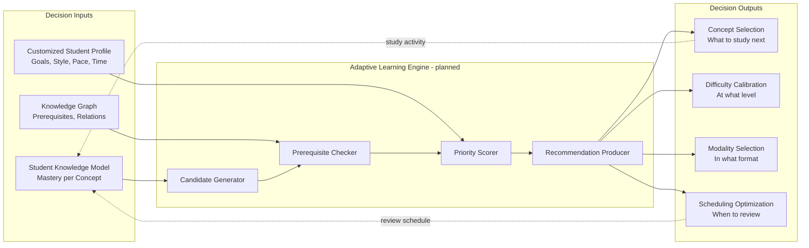

### 16.4 Spaced Repetition — SM-2 (Planned)

The Spaced Repetition component implements the SM-2 algorithm (Wozniak), which schedules review sessions based on the student's demonstrated recall performance. Each concept has a review record that tracks: the date of the last review, the interval in days until the next scheduled review, and an ease factor that determines how the interval grows after successful recall.

The algorithm operates as follows: when a student reviews a concept and recalls it successfully (quality rating ≥ 4 on a 0–5 scale), the interval is multiplied by the ease factor (default: 2.5), increasing the spacing between reviews. When recall fails (quality rating < 3), the interval is reset to 1 day, and the ease factor is decreased by 0.2, ensuring that difficult concepts are reviewed more frequently. This mechanism produces a review schedule that automatically focuses attention on concepts approaching the forgetting threshold while spacing out reviews of well-learned concepts to maximize study efficiency. Half-Life Regression (Settles & Meeder) is the planned complement for predicting per-concept forgetting rates, so that reviews can be triggered before the predicted forgetting threshold rather than on a fixed calendar (research basis in §27). Neither is implemented.

### 16.5 Adaptive Exam Simulator — CAT (Planned)

The Computerized Adaptive Testing (CAT) simulator is designed to construct exam sessions that adapt question difficulty based on the student's real-time performance. The simulator starts with a question at medium difficulty (estimated from the student's current mastery and IRT difficulty parameters). After each answer, the simulator updates the student's estimated ability and selects the next question at a difficulty level that maximizes information gain — a question that the student has approximately 50% probability of answering correctly provides the most information about their true ability level.

The CAT simulator terminates when the ability estimate stabilizes within a confidence interval (indicating that further questions would not significantly change the estimate) or when a maximum question count is reached (preventing excessively long exams). After termination, it produces an exam report that includes: estimated ability level, per-concept mastery updates (from BKT), identified weak areas, and recommended follow-up study activities. CAT depends on the SKM (§14) and IRT parameter estimation, and is therefore planned behind them.

---

## 17. Learning Workflow & End-to-End Data Flow

### 17.1 Current Verified Flow (Implemented)

The end-to-end flow that exists today is the content-and-identity foundation, not the learning loop:

1. **Sign-in.** The student authenticates at Keycloak (OIDC Authorization Code + PKCE); the frontend presents the access token as a bearer token; the backend validates it (RS256 against the realm JWKS, issuer, audience, lifetime), maps `(issuer, subject)` to a local user with just-in-time provisioning, and enforces RBAC from realm roles (ADR-0006).
2. **Course setup.** Authenticated CRUD on courses, with enrollment records (unique per user–course pair) tracking membership.
3. **Material upload.** For a course, the student requests a presigned upload URL, uploads directly to S3-compatible storage, and the material is registered with a server-generated object key and status `pending`. Nothing processes the file automatically yet (§11.1, §12.5).
4. **Profile.** The student reads and updates the six-field profile subset (§15.1).
5. **Vector foundation.** The ingestion, chunking, and embedding/vector modules exist as services (§11, §12.1) but are not wired into the upload flow; no automatic path leads from an uploaded material to stored vectors.

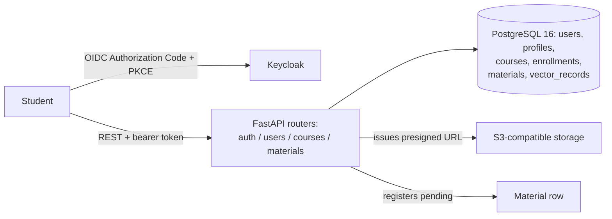

### 17.2 Target Learning Loop (Planned)

The closed feedback loop remains the system's most important architectural feature — it ensures that every learning activity updates the cognitive models (SKM and CSP), which in turn update the adaptive decisions, which produce new learning activities, which again update the models. This continuous cycle is what distinguishes an intelligent tutor from a static tool. **The following diagram is the target architecture; only the §17.1 subset is implemented today.** No chat/RAG exchange, no question answering, no mastery updates, and no adaptive recommendations exist in the current baseline.

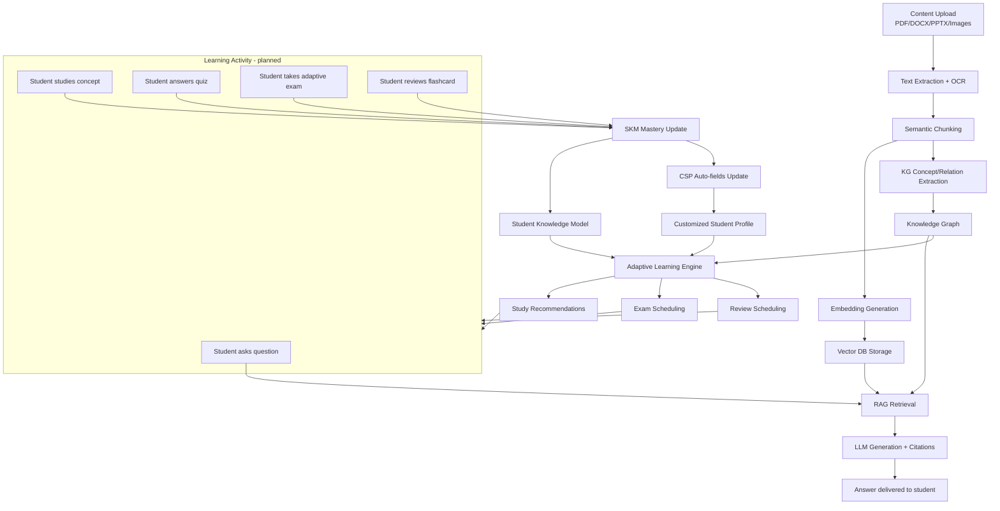

### 17.3 Feedback Loop Dynamics (Target Design)

The feedback loop is designed to operate at two time scales: immediate (within a single learning session) and cumulative (across multiple sessions over days and weeks).

**Immediate feedback:** When a student answers a quiz question incorrectly, the SKM would immediately decrease the mastery estimate for the relevant concept, the Adaptive Engine would immediately adjust the next recommendation (perhaps suggesting a prerequisite review instead of advancing to a new concept), and the review schedule would immediately prioritize the concept for the next study session. This immediate responsiveness ensures that the system reacts to misconceptions before they compound.

**Cumulative feedback:** Over days and weeks, the accumulated interaction data enables the SKM to upgrade from heuristics to BKT, the CSP to refine auto-estimated fields (learning speed, academic interests), and the Adaptive Engine to identify long-term patterns (which concepts consistently require multiple review cycles, which study formats consistently produce better outcomes for this student). This cumulative intelligence is what makes the system increasingly personalized over time — a student who has used OpenLearn AI for a month receives recommendations that are substantially more tailored than those received on the first day. Both time scales are properties of the target loop (§17.2); neither operates today.

---

## Part IV: Engineering

---

## 18. Software Architecture

### 18.1 Modular Monolith (ADR-0001)

The system follows a Modular Monolith architecture — a single unified application that is internally divided into independent modules with well-defined boundaries and interface contracts. Each module encapsulates a specific domain (ingestion, embedding, retrieval, generation, knowledge graph, student knowledge model, profile, adaptive engine, analytics) and communicates with other modules through service interfaces rather than shared database tables or direct code calls.

**Current state of the monolith.** The verified baseline implements the skeleton of this design, not yet all of its domains. What exists today inside the single FastAPI application: API routing (`auth`, `users`, `courses`, `materials`), identity and user provisioning, course/material management with presigned uploads, document ingestion and chunking, the Provider Abstraction Layer with its six interface contracts, vector persistence, Celery worker infrastructure, configuration, observability, and a basic evaluation harness. The remaining domain modules — retrieval/RAG, generation, knowledge graph, student knowledge model, adaptive engine, analytics — are **planned** (§12–§16, §22.4). They are described in this specification as target architecture and must not be read as deployed code.

The Modular Monolith architecture is chosen over a microservices architecture for three reasons. First, a graduation project must be deployable on a single machine without orchestrating multiple services across a cluster — microservices introduce deployment complexity that exceeds the project's operational scope. Second, the modules in OpenLearn AI have high data coupling (SKM reads from KG, Adaptive Engine reads from SKM and CSP), which would require extensive inter-service communication in a microservices architecture, increasing latency and reducing reliability. Third, a Modular Monolith preserves the option to extract any module into an independent service in the future — the module boundaries and interface contracts are identical to what microservices would require, making future extraction a deployment change rather than an architectural rewrite.

### 18.2 Current Container View (As-Is — Verified)

The following diagram shows only what is deployed and verified at the staging baseline (§6.1 is the authoritative as-built reference; this view adds the container/module perspective).

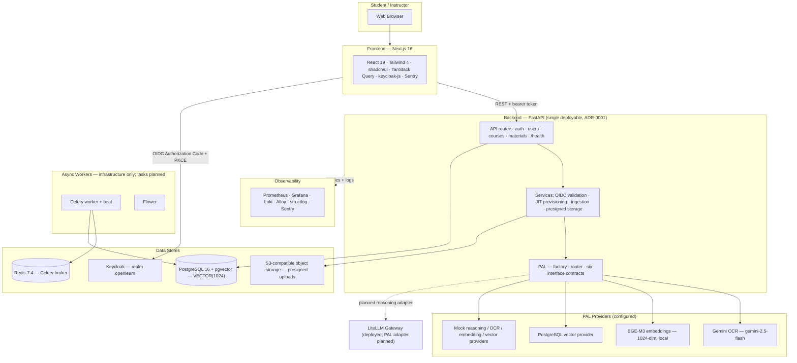

### 18.3 Target Container View (Planned)

The target container set adds the modules that carry the learning experience. Everything marked **planned** below is design intent (§12–§16, §22.4, §13), not deployed infrastructure:

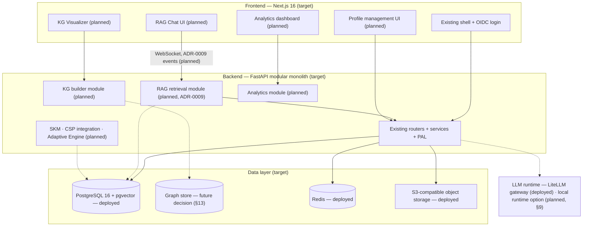

### 18.4 Module Boundaries

The implemented boundary discipline has three verified anchors. First, route handlers are thin: FastAPI routers in `app/api/` delegate to services in `app/services/` and never embed business logic or SQL. Second, provider isolation: no core module imports an AI-provider library directly — all provider-specific code lives behind the PAL's six interface contracts, with provider selection by explicit configuration (factory settings), no plugin framework and no dynamic discovery (ADR-0009). Third, a single persistence vocabulary: all database access goes through the SQLAlchemy models in `app/models/`, and document/chunk provenance travels as Pydantic domain models (`CanonicalDocument`, `Chunk`) rather than ad-hoc dictionaries.

The original v4.0 boundary doctrine — every module defined by a service interface (Python abstract class), a repository interface, and a domain model, with interfaces registered in a dependency-injection container and modules never importing each other's internals — is preserved as the **target maturity bar** for the planned domain modules. The dependency-injection container and per-module repository interfaces are not verified in the current baseline; as modules are added, this discipline is what keeps the monolith extractable (§18.1).

---

## 19. Backend Architecture

### 19.1 Technology Stack (Verified)

The backend is implemented in **Python 3.11** (Docker runtime `python:3.11-slim`) using FastAPI as the web framework, Pydantic (v2, via `pydantic-settings`) for validation and configuration, SQLAlchemy 2 in async mode for database ORM, and Celery with Redis for asynchronous task infrastructure. The choice of FastAPI is justified by its native async support, automatic OpenAPI documentation generation, and type-safe request/response validation through Pydantic — critical requirements for an educational platform that handles file uploads and long-running AI generation tasks. FastAPI's framework-level WebSocket support is the reserved transport for the planned streaming chat interface (§22.4, ADR-0009); no WebSocket endpoint ships today.

| Concern | Technology (pinned in `backend/requirements.txt`) |
|---------|---------------------------------------------------|
| Runtime | Python 3.11 (`python:3.11-slim`) |
| Web framework | `fastapi==0.138.1`, `uvicorn==0.49.0` |
| Validation / configuration | Pydantic v2 (`pydantic-settings==2.15.0`) |
| ORM / driver | `sqlalchemy==2.0.43` (async), `asyncpg==0.30.0` |
| Migrations | `alembic==1.16.5` (12 applied migration files) |
| Vector storage | `pgvector==0.4.1` — `VECTOR(1024)` (ADR-0004) |
| Authentication | `PyJWT==2.13.0` + `cryptography==45.0.4` — RS256/JWKS validation of Keycloak tokens; password hashing is owned by Keycloak, not the backend (ADR-0006) |
| Task queue | `celery[redis]==5.6.3`, `flower==2.0.1` |
| Ingestion | `docling==2.127.0`, `pypdfium2==5.13.0` |
| OCR provider | `google-genai==1.24.0` (Gemini `gemini-2.5-flash`) |
| Embeddings | `sentence-transformers==3.3.1` (BAAI/bge-m3, 1024-dim, local) |
| Object storage | `boto3==1.35.36` (S3-compatible API, presigned URLs) |
| Observability | `structlog==25.5.0`, `sentry-sdk==2.35.0`, `prometheus-fastapi-instrumentator==7.1.0` |

The dependency list is deliberately minimal — dependencies are added only when code requires them, not preemptively. Notably absent by design: LangChain, ChromaDB, bcrypt, and any local-LLM runtime (superseded defaults are recorded in §10).

### 19.2 Application Layout (Verified)

The verified backend package layout:

```text
backend/app/
├── api/             # FastAPI routers: auth, users, courses, materials (registered in main.py)
├── services/        # ingestion.py (Docling extraction); auth/ (oidc.py, user_service.py)
├── models/          # User, Profile, Course, Enrollment, Material, VectorRecordModel
├── pal/             # factory.py, router.py, exceptions.py,
│                    #   interfaces/ (base, embedding, ocr, ranking, reasoning, vector_db),
│                    #   providers/ocr/gemini_provider.py
├── documents/       # chunking.py — deterministic structure-aware chunker
├── workers/         # celery_app (referenced by staging compose); task definitions not in baseline
├── config           # Pydantic Settings: app name, CORS origins, Keycloak URLs,
│                    #   provider selection knobs, chunk_size/chunk_overlap, GEMINI_API_KEY
├── db/              # Base declarative layer
├── observability/   # setup_observability(), setup_metrics() — structlog, Sentry, Prometheus
└── eval/            # basic evaluation harness: python -m app.eval CLI, evaluator registry,
                     #   JSON dataset loading/validation, pass/fail counting, seeded dummy evaluator
```

Packages beyond this list were not part of this pass's evidence bundle and are not claimed here. The `app/eval/` package is the basic harness described in §1 and §10.2 — the ADR-0003 evaluation framework (methodology, ground-truth datasets, benchmark engines) remains to be built on top of it.

### 19.3 Layering and Request Path (Implemented, with a Design Principle)

The implemented request path is: HTTP request → CORS middleware (settings-driven allow-list) → FastAPI route handler (thin) → service layer (OIDC validation, JIT user provisioning, ingestion, presigned storage) → SQLAlchemy models or PAL providers → response. Structured logging (structlog) and Sentry instrumentation wrap the request lifecycle; Prometheus instruments the app; `/health` returns a plain liveness probe.

The v4.0 layering doctrine — controller layer (route handlers), service layer (business logic), repository layer (database access), and domain-model layer, with route handlers never containing business logic and business logic never containing SQL — is preserved as the **design principle** for the planned domain modules. In the verified baseline the service/model boundary is real and enforced, while a formally separate repository layer is not: services query SQLAlchemy models directly. The doctrine remains the target discipline as retrieval, RAG, SKM, and adaptive modules are added.

### 19.4 Asynchronous Processing (Infrastructure Implemented; Workflow Planned)

**Verified current state.** Celery worker and beat containers run in staging against Redis (compose commands target `app.workers.celery_app`), and Flower exposes worker visibility on the staging host. However, **no material-processing tasks are registered in the baseline** — the workers are infrastructure awaiting a workload. The upload path today is synchronous and deliberately minimal: the API issues a presigned upload URL, registers the material row with status `pending`, and returns; no processing follows yet (§11.1).

**Target pattern (preserved design).** Long-running operations — targeted OCR, embedding generation, RAG context construction, knowledge-graph extraction, and batch question generation — are to be handled asynchronously through Celery tasks: the API returns `202 Accepted` with a job reference, the worker processes in the background, and the frontend receives progress updates via WebSocket messages (ADR-0009 event protocol) when the worker reports status changes. This pattern is essential for responsive interaction: OCR on a 100-page PDF can take 30–60 seconds, and embedding generation for hundreds of chunks adds further time. If these operations were synchronous, the API would block for minutes and the platform would be unusable during processing. The async pattern decouples user-facing response time from background processing time.

At the provider level, the PAL router already implements streaming semantics (first-chunk passthrough) and ordered fallback for reasoning providers, but no product traffic streams today — the configured reasoning provider is the mock, and the LiteLLM-backed adapter is planned (§8.1, ADR-0005).

---

## 20. Frontend Architecture

### 20.1 Technology and Structure (Verified)

The frontend is implemented using **Next.js 16.3.1** with the App Router pattern, **React 19.2.8** for component rendering, **TypeScript 5** for type safety, and **Tailwind CSS 4** with the shadcn/ui toolchain for styling and components (component dependencies: `shadcn` CLI, `@baseui/react`, `lucide-react`, `class-variance-authority`, `clsx`, `tailwind-merge`, `tw-animate-css`, `next-themes`). Server state is managed with **TanStack Query 5** (API data fetching, caching, and synchronization), authentication uses **`keycloak-js` 26.2.4**, and error monitoring uses **`@sentry/nextjs`**. There is **no additional client-state library** (no Zustand or Redux) — React state plus TanStack Query covers current needs, matching §6.1.

The choice of Next.js is justified by its server-side rendering capability (which improves initial page load performance and SEO), its App Router pattern (which provides clean route organization with nested layouts), and its API-route capability (which can proxy backend requests where needed). The v4.0 claim that the frontend already uses native WebSocket support for real-time chat and progress updates is **corrected**: WebSocket transport is planned (§22.4, ADR-0009) and no WebSocket client code or dependency exists in the verified baseline.

The production image (`frontend/Dockerfile`) is a multi-stage build on `node:22-alpine` producing a Next.js standalone output, running as a non-root `nextjs` user on port 3000, with `NEXT_PUBLIC_API_URL` and `NEXT_PUBLIC_SENTRY_DSN` injected as build arguments.

### 20.2 Tooling and Quality Infrastructure (Verified)

The frontend ships a quality-infrastructure suite that is itself an implemented deliverable: **Storybook 10** with accessibility, docs, and Vitest addons plus Chromatic visual-review publishing; **Vitest** (browser-mode runner via Playwright, coverage via v8); **Playwright** for end-to-end testing; **ESLint 9** with `eslint-config-next`; and dedicated CI workflows (`ci.yml`, `deploy-staging.yml`, `storybook.yml`) that build GHCR images and run the Storybook pipeline. The verified evidence base for the frontend is the dependency manifest, Dockerfile, and CI configuration; a page-level route inventory was not part of this pass's evidence bundle.

### 20.3 Key Frontend Modules (Planned / In Progress — Preserved Design)

The five feature modules below are the intended user-facing experience. **None of them is a complete, shipped learning surface today** — the verified baseline establishes the stack, the auth integration path, and the tooling, not a finished dashboard, chat, exam, adaptive, or WebSocket UI. The module designs are preserved in full so the intended experience is not lost:

**Material Management UI (planned; most immediately unblocked):** Handles file upload, processing progress display, material listing, and document viewing against the already-implemented course/material API (presigned upload URL + registration, §22.3). TanStack Query manages material state; the real-time processing progress display depends on the planned worker phase and status surface (§11.1, §22.4).

**RAG Chat Interface (planned):** The conversational interface where students ask questions and receive citation-backed answers. Requires the planned RAG retrieval module and WebSocket transport (ADR-0009 event protocol: `retrieval_started`, `sources_found`, `reasoning_started`, `token`, `done`, `error`) — none of which exist in the baseline. Explanation modes (Socratic, direct, exam-focused) selectable from the CSP's preferred learning approach remain the design.

**Knowledge Graph Visualizer (planned):** Renders the concept-relation graph interactively. Depends on the knowledge-graph store and builder (§13) and on a graph-rendering library (Cytoscape.js or D3.js were the intended choices; neither is currently a dependency). Node color-coding by mastery level (green = mastered, yellow = partial, red = weak) assumes the planned SKM (§14).

**Analytics Dashboard (planned):** Learning progress, concept mastery heatmap, study time distribution, exam readiness scores, and goal tracking. Depends on the planned analytics API surface (§22.4) and on a charting library (Recharts was the intended choice; not currently a dependency). Overview and detail views remain the design.

**Profile Management UI (planned; partially unblocked):** Onboarding wizard (VARK quiz, goals setting, time preferences), profile editing, and auto-updated field display. The backend already exposes the verified six-field profile with read/update endpoints (§15.1), so profile editing can be built against real endpoints today; the designed 13-field extension (§15.2), goals, and auto-estimated fields await their planned data model and adaptive engine.

### 20.4 Frontend–Backend Integration

Current integration path (verified): the frontend authenticates the user in the browser via `keycloak-js` against Keycloak (Authorization Code + PKCE, §6.1), attaches bearer access tokens to REST calls, and targets the backend at the configured `NEXT_PUBLIC_API_URL`. Planned integration additions: WebSocket connections for streaming chat and processing progress (ADR-0009), and consumption of the planned analytics/recommendation/review/KG surfaces (§22.4). The v4.0 sequence combining MinIO uploads with WebSocket status pushes is superseded by the verified presigned-upload flow (§11.1) until the processing phase lands.

---

## 21. Database Design

### 21.1 Data Stores: Current Reality (Verified)

The verified system runs **one relational database for all application data** — PostgreSQL 16 with the pgvector extension — plus three supporting stores. The v4.0 multi-store table (ChromaDB as default vector store, MinIO as deployed object storage, NetworkX/Neo4j as knowledge-graph stores) described target aspirations as current fact and is corrected here:

| Store | Engine (verified) | Purpose today | Access path |
|-------|-------------------|---------------|-------------|
| Relational + vector | `pgvector/pgvector:pg16` | All relational data (`users`, `profiles`, `courses`, `enrollments`, `materials`) and embeddings (`vector_records`, `VECTOR(1024)`) — ADR-0004 | SQLAlchemy 2 (async) + PAL `VectorDBInterface` |
| Queue | Redis 7.4 (AOF, password auth) | Celery broker/result backend — infrastructure only, no tasks yet | Celery |
| Object storage | S3-compatible endpoint (by configuration; no storage service in compose) | Original course-material binaries behind presigned upload URLs | `boto3` S3 API |
| Identity | Keycloak (dev: Postgres-backed; staging: H2 file store) | Identity provider, credentials, realm roles | OIDC / JWKS (ADR-0006) |

Corrections to record explicitly: **ChromaDB** is no longer any part of the current architecture (ADR-0004 superseded it; an alternative vector store would be a new PAL provider implementation, not a configuration switch to an embedded ChromaDB). **Neo4j/NetworkX** are future graph-store options evaluated in §13 — no graph store is deployed and the PAL has no graph interface. **MinIO** is not a deployed service; the S3 API is consumed from a configured endpoint (self-hosted MinIO remains a valid target-mode choice, §23.3).

### 21.2 Implemented Schema (Verified)

Six ORM models exist (`app/models/__init__.py`): `User`, `Profile`, `Course`, `Enrollment`, `Material`, `VectorRecordModel`. There are no mastery, adaptive, chat, exam, question, review, goal, or concept tables.

| Table | Key columns and constraints (verified) |
|-------|----------------------------------------|
| `users` | UUID PK; `keycloak_issuer` (String 512) + `keycloak_subject` (String 255) — the identity pair; `email` unique + indexed; `email_verified` (bool); `settings` JSONB. **No password hash, no role column** (removed by migration; ADR-0006) |
| `profiles` | 1:1 with `users` (unique `user_id`, FK CASCADE); Week-6 CSP subset: `education_level` (String 50), `major`, `university` (String 255), `preferred_language` (default `en`, CHECK `en`/`ar`), `learning_style_vark` (String 20), `daily_available_minutes` (CHECK 1–1440, NULL until onboarding) |
| `courses` | UUID PK; `owner_id` FK → `users` CASCADE + indexed; `title` (String 255); `description` (Text, nullable); `created_at` |
| `enrollments` | `course_id` + `user_id` FKs, both CASCADE; unique constraint `(course_id, user_id)`; `created_at` |
| `materials` | `course_id` FK CASCADE + indexed; `title`; `s3_key` — **server-generated**, unique, never taken from a client-supplied path; `status` default `pending` with deliberately **no CHECK constraint** (status vocabulary owned by the future processing phase); `uploaded_by` FK → `users` CASCADE |
| `vector_records` | Text PK; `embedding` `VECTOR(1024)` — every write validated against the `EMBEDDING_DIMENSION = 1024` constant, deliberately decoupled from `settings.ai_embedding_dimension` so configuration drift fails loudly instead of silently; `content` (nullable Text); `metadata` JSONB (NOT NULL) carrying document/chunk provenance (`document_id`, `chunk_id`, pages, filename, mimetype, hash) per the PAL `VectorRecord` DTO; `created_at`/`updated_at`. **No FKs by design**: `CanonicalDocument`/`Chunk` are Pydantic domain models, not database entities |

Two deliberate design policies are visible in the model comments and preserved: user-owned rows cascade on deletion (no orphaned courses, enrollments, or materials), and enum-style vocabularies (material status, profile enums) are kept open until their owning feature phase defines them.

### 21.3 Migrations (Verified)

The schema is managed by Alembic with twelve migration files, whose history also records the authentication migration mandated by ADR-0006:

```text
bf5c36537834  create users table
7f4ffd64a291  add keycloak identity fields
a21491100d85  add auth fields and refresh tokens
c8103d7a5b42  drop role column
fbdb3885535f  remove legacy authentication storage
  — from here on, identity lives entirely in Keycloak (ADR-0006) —
0c4a02b4b578  create profiles table
6bee296ddce1  restrict preferred_language to supported values
75d18b9eb2fe  drop users.preferred_lang (language lives in profiles)
128458792565  create courses and enrollments
4f402fda7122  create materials table
f3a1b7c9d4e2  add vector_records table
c462e4812d07  merge migration heads
```

### 21.4 Target Schema (Planned — ERD Preserved)

The entity-relationship design below is the **target schema**: it shows the implemented entities alongside the planned ones so the full data model remains visible as one design. Implemented today: `USER`, `PROFILE` (as the CSP subset), `COURSE`, `ENROLLMENT`, `MATERIAL`, and the vector store (provenance in JSONB, not a `CHUNK` table). Planned: `CONCEPT`, `SKM_RECORD`, `REVIEW_ITEM`, `QUESTION`, `QUIZ_ATTEMPT`, `EXAM_SESSION`, `CHAT_SESSION`, `GOAL`, `FLASHCARD`, `SUMMARY`, and a dedicated `CHUNK` entity (a future normalization decision — chunk provenance currently rides in `vector_records.metadata`, §11.4/§12.1).

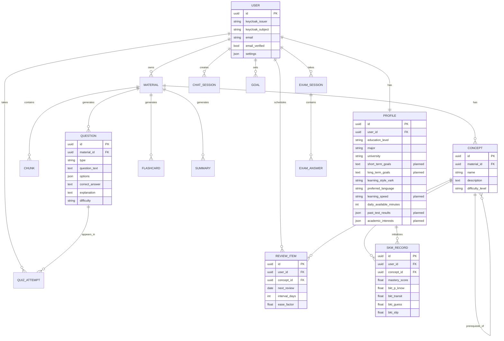

Corrections applied to the carried-over diagram: the `USER` entity no longer contains `password_hash` (credentials live in Keycloak) or `preferred_lang` (dropped by migration; language lives in `profiles`); `CSP` is relabeled `PROFILE` to match the implemented table. Fields annotated "planned" extend the verified six-field profile toward the designed CSP (§15.2); the SKM/adaptive entities are design intent only (§14, §16).

### 21.5 Data-Access Philosophy (Design Principle)

The store-per-access-pattern philosophy is preserved as the growth path: relational data stays in PostgreSQL; vectors stay in PostgreSQL + pgvector accessed exclusively through the PAL `VectorDBInterface` (so a future vector store is a new PAL provider plus configuration, per ADR-0004's interface seam); object storage stays behind the S3 API; and a graph store, when justified by KG workloads (§13), arrives as its own decision with its own ADR. What the philosophy no longer claims is that this multi-store posture exists broadly today — it exists exactly as enumerated in §21.1, and each additional store is added when its workload materializes.

---

## 22. API Design

### 22.1 API Style (Current REST; Streaming Planned)

The API today is REST/JSON over HTTP with bearer-token authentication and a settings-driven CORS allow-list. The dual-architecture rationale is preserved as design: standard operations benefit from REST's simplicity, caching support, and HTTP infrastructure, while interactive operations (streaming chat, progress updates, exam sessions) are to use WebSocket's bidirectional, low-latency channel once the RAG/chat phase lands (ADR-0009 event protocol). No WebSocket endpoint exists in the current baseline.

### 22.2 Authentication and Identity (Verified — ADR-0006)

Authentication is delegated to **Keycloak (OIDC)**; the backend renders no login pages. Users authenticate in the browser via the public client `openlearn-frontend` (Authorization Code + PKCE, §6.1). API requests present a Keycloak-issued access token as a bearer token, which the backend validates with PyJWT against the realm's JWKS (`PyJWKClient` with key caching):

- **Signature and claims:** RS256 only; `exp`, `iat`, `iss`, `aud`, `sub` required; audience restricted to `openlearn-api`; issuer checked against the configured realm URL. Validation failures raise a typed error path, not a silent pass.
- **Token lifetime:** the realm export sets a 300-second access-token lifespan with refresh handled by Keycloak (`refreshTokenMaxReuse: 0`). No refresh tokens are stored in the application database.
- **Roles:** realm roles are extracted from `realm_access.roles`. The bootstrap realm defines `student` (default), `instructor`, and `admin`; RBAC enforcement maps these roles at the API layer.
- **Identity mapping:** `(issuer, subject)` maps to a local user with **just-in-time provisioning** — first login creates the user, `email_verified` is synchronized on subsequent logins, and an email collision with a different identity is rejected rather than merged.
- **Credential storage:** the application database stores **no password hashes** — credentials are owned by Keycloak, and migrations `c8103d7a5b42`/`fbdb3885535f` removed the legacy local-authentication storage.

Historical note: the v4.0 text described self-issued JWTs, bcrypt password hashing with monthly secret rotation, and five API roles (including Guest and Contributor). All of that is **superseded** by ADR-0006 and the verified implementation above.

### 22.3 Verified Endpoint Inventory (Implemented)

The verified API surface is four routers registered in `app/main.py`, plus health and a staging probe. Per-route paths and request/response schemas live in the router files, which were outside this pass's evidence bundle; the inventory below is therefore stated at router/capability level (to be refined from the router sources in a later evidence pass):

| Router | Verified capability | Auth |
|--------|--------------------|------|
| `auth` | Identity-flow support endpoints backing the Keycloak integration (§22.2) | Bearer/OIDC |
| `users` | Profile read and update for the authenticated user — the six-field CSP subset (§15.1) | Bearer (realm role) |
| `courses` | Course CRUD with ownership enforcement (`owner_id` scoping) | Bearer (realm role) |
| `materials` | Course-scoped upload: presigned URL issuance + material registration with `pending` status (server-generated `s3_key`) | Bearer (realm role) |
| (root) | `GET /` service root; `GET /health` liveness probe; `GET /test/error` — staging-only Sentry verification probe (to be removed before production) | Public (root/health) |

### 22.4 Planned API Surface (Preserved Design)

The following endpoint design from v4.0 is **preserved in full as the target API**; none of these endpoints is implemented today. Dependencies mark what must land first:

| Method | Path | Purpose | Status / depends on |
|--------|------|---------|--------------------|
| POST | `/materials/{id}/process` (shape TBD) | Trigger processing; job reference for the worker phase | Planned — material-processing tasks (§11.1) |
| GET | `/materials/{id}/status` | Processing status once a status state machine exists | Planned — worker phase (§11.1) |
| POST | `/chat/session` | Create new chat session | Planned — RAG retrieval (ADR-0009) |
| WS | `/ws/chat/{session_id}` | Streaming chat connection (`retrieval_started` → `sources_found` → `reasoning_started` → `token` → `done`/`error`) | Planned — RAG + WebSocket transport |
| POST | `/questions/generate` | Generate questions for material | Planned — reasoning provider (LiteLLM adapter, §8.1) |
| POST | `/exams/start` | Start adaptive exam session | Planned — adaptive engine (§16) |
| WS | `/ws/exams/{session_id}` | Interactive exam connection | Planned — adaptive engine |
| GET | `/analytics/dashboard` | Learning analytics overview | Planned — analytics module |
| GET | `/analytics/heatmap` | Concept mastery heatmap | Planned — SKM (§14) |
| GET | `/recommendations/today` | Daily study recommendations | Planned — adaptive engine (§16) |
| GET | `/reviews/scheduled` | Scheduled review items | Planned — SM-2/HLR scheduling (§16) |
| GET | `/knowledge-graph/{material_id}` | Material knowledge graph | Planned — KG pipeline (§13) |

The endpoint vocabulary (chat, exams, analytics, recommendations, reviews, knowledge graph) is kept unchanged so the frontend design (§20.3) and the target loop (§17.2) retain their API contract; only the implementation status is corrected.

---

## 23. Infrastructure & Deployment Modes

### 23.1 Current Environments (Verified)

Two Docker Compose environments exist in `infra/`. The **development** compose runs three services: `db` (`pgvector/pgvector:pg16`), `keycloak` 26.7.3 (`start-dev --import-realm` with the realm export, Postgres-backed), and a one-shot `keycloak-bootstrap` that provisions the shared dev test user and realm roles. The **staging** compose runs thirteen services, published from GHCR images (`IMAGE_TAG`-tagged) by GitHub Actions (`ci.yml` builds, `deploy-staging.yml` deploys, `storybook.yml` runs the Storybook pipeline; `infra/deploy.sh` assists rollout):

| Service | Image / pin | Notes (verified) |
|---------|-------------|------------------|
| `backend` | GHCR backend image | Port 8000; env `DATABASE_URL`, `REDIS_PASSWORD`, `LITELLM_API_BASE=http://litellm:4000`; `/health` healthcheck |
| `frontend` | GHCR frontend image | Port 3000; `SENTRY_DSN` injected; healthcheck via Node fetch |
| `litellm` | `ghcr.io/berriai/litellm:main-latest` | Bound to `127.0.0.1:4000`; config from `litellm-config.yaml`; master + salt keys via env |
| `db` | `pgvector/pgvector:pg16` | `pg_isready` healthcheck; named volume |
| `redis` | `redis:7.4-alpine` | AOF persistence + `--requirepass`; ping healthcheck |
| `celery_worker` / `celery_beat` | GHCR backend image | `celery -A app.workers.celery_app worker|beat` — infrastructure only, no tasks registered (§19.4) |
| `flower` | GHCR backend image | `127.0.0.1:5555`; `FLOWER_UNAUTHENTICATED_API=true` (staging convenience to tighten) |
| `keycloak` | `quay.io/keycloak/keycloak:latest` | `start-dev --import-realm`; H2 file store in staging (version skew vs dev's pinned 26.7.3 — flag for alignment) |
| `prometheus` / `grafana` / `loki` / `alloy` | latest images | Prometheus 127.0.0.1:9090; Grafana :3001 with provisioning; Loki 127.0.0.1:3100; Alloy tails Docker logs into Loki |

Corrections against v4.0: there is **no reverse proxy** (no Nginx service — HTTP ports are exposed directly on the host), **no MinIO service** (S3-compatible storage is consumed from a configured endpoint), and **no Ollama, ChromaDB, or Neo4j services anywhere in the compose files**.

### 23.2 Staging Topology (As-Is)

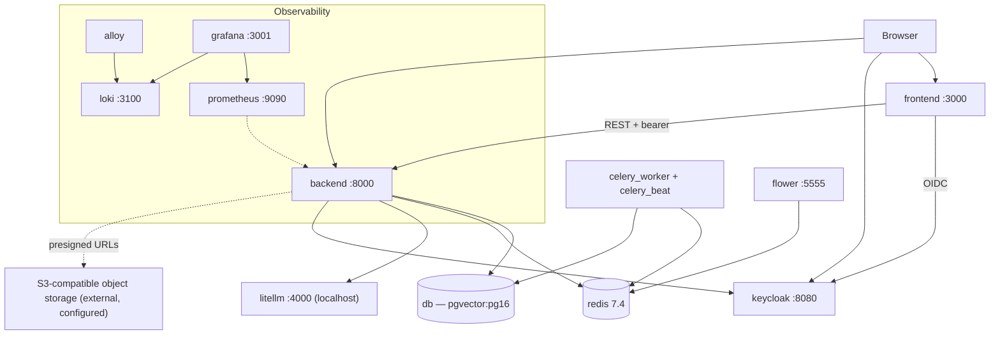

### 23.3 Deployment Modes (Design Preserved; Current Reality Explicit)

The three-configuration philosophy from the Hybrid AI Architecture (§7, §9) is preserved: Local (all providers local, maximal privacy, highest hardware demand), Hybrid (per-component local/cloud choice), and Cloud (all cloud, minimal hardware). Each configuration remains a complete Docker Compose story in the target design — one-command startup with mode selection, and provider-specific services optional per mode.

**What exists today** is one development compose and one staging compose. The v4.0 claim of per-mode compose profiles (`--profile local|hybrid|cloud` selecting `ollama`, `chromadb`, `cloud-proxy` service groups) does not match the verified files: no such profiles exist. Mode selection today happens through **PAL provider configuration** (settings-level provider selection, §8.2) rather than through separate service topologies. The current staging shape is effectively hybrid: local embeddings (BGE-M3) and local pgvector, cloud OCR (Gemini), mock reasoning with the LiteLLM cloud gateway deployed for the planned adapter, and an external S3-compatible store.

**Target mode topologies (planned):**

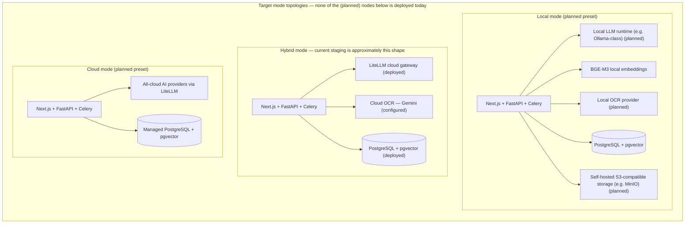

The mode-specific service choices (local LLM runtime, local OCR provider, self-hosted object storage) are the **planned** extension of the verified provider-configuration mechanism; offering them as one-command presets remains a target deliverable (§9).

### 23.4 Hardware Requirements by Mode (Target Guidance)

The sizing table is retained as **target guidance aligned with §9.1** — it informs the deployment-profiles document and future presets; it does not describe the current staging deployment (which is CPU-only with cloud APIs):

| Mode | Minimum RAM | Recommended RAM | GPU | Storage | Internet |
|------|-------------|-----------------|-----|---------|----------|
| Local | 8 GB | 16 GB (GPU recommended for local LLM inference) | NVIDIA 8GB+ VRAM | 20 GB | Not required |
| Hybrid | 4 GB | 8 GB | Optional (improves local LLM speed) | 10 GB | Required (for cloud APIs) |
| Cloud | 2 GB | 4 GB | Not required | 5 GB | Required (persistent) |

---

## 24. Security & Privacy

### 24.1 Security Architecture (Control Framework)

The security architecture keeps its four-layer framing — transport security, authentication security, data security, and operational security — with one honesty correction: **not every layer is currently implemented**. The framework below maps each layer to its verified controls and its planned ones, so the target posture stays visible without implying protections that do not exist yet. Educational data is personally sensitive and must be protected at the infrastructure level as well as the application level; the planned layers exist to guarantee that end-state.

### 24.2 Implemented Controls (Verified)

- **Authentication (Keycloak/OIDC, ADR-0006):** RS256 access tokens validated against the realm JWKS with audience and issuer enforcement; `exp`/`iat`/`iss`/`aud`/`sub` required; short-lived tokens (300 s) with Keycloak-managed refresh (`refreshTokenMaxReuse: 0`). No passwords or refresh tokens are stored in the application database; credentials belong to Keycloak entirely.
- **Authorization:** realm roles (`student` default, `instructor`, `admin`) extracted from token claims and enforced at the API layer; ownership scoping in the data model (courses belong to `owner_id`; materials are course-scoped; all user-owned rows cascade on delete so revoked users leave no orphaned data).
- **Identity lifecycle:** just-in-time provisioning keyed on `(issuer, subject)`; `email_verified` synchronization; rejection of email collisions across distinct identities rather than silent account merging.
- **Upload safety:** server-generated S3 object keys (a client-supplied path is never trusted), presigned upload URLs, unique `s3_key` per material, and a `pending` status that keeps unscanned content out of processing until the planned scan/processing phase defines the transition.
- **Input validation and configuration hygiene:** Pydantic request validation; settings-driven CORS allow-list; all credentials injected via environment variables (`DATABASE_URL`, `REDIS_PASSWORD`, `LITELLM_MASTER_KEY`/`LITELLM_SALT_KEY`, `KEYCLOAK_ADMIN_*`, `SENTRY_DSN`, `GEMINI_API_KEY`) — no secrets in the repository. LiteLLM holds a master key and a salt key for virtual-key encryption; dev-only bootstrap credentials (`admin/admin`, required test-user password variable) are explicitly non-production.
- **Operational visibility:** structlog structured logging, Sentry error tracking (backend and frontend, with a staging error probe endpoint), Prometheus metrics instrumentation, and `/health` liveness probes wired into compose healthchecks.

### 24.3 Planned Controls (Target)

- **Transport security:** no reverse proxy is deployed today, so no in-cluster TLS termination exists yet. The target architecture terminates TLS at a reverse proxy (Nginx is a candidate for the target deployment) with HTTP→HTTPS redirection; until then, transport protection depends on the deployment environment's ingress.
- **Rate limiting and abuse controls** on authentication and AI-cost-bearing endpoints (the LiteLLM request budget cap is the first, partial instantiation of cost control).
- **Upload content/virus scanning** before a material leaves `pending` (the material model comment reserves this for the processing phase).
- **Audit logging** of security-relevant events (role changes, profile updates, material lifecycle transitions) beyond today's structured application logs.
- **Encryption of sensitive fields at rest** if/when sensitive profile data beyond the current six fields is introduced, plus reliance on managed/volume encryption for the database.
- **Realm key management:** JWKS-based signing makes rotation a Keycloak operational concern (the v4.0 "monthly secret rotation" applied to self-issued JWTs and is superseded); monitoring of realm key rotation is a planned operational task.
- **Worker reliability controls:** task retries, dead-letter handling, and idempotent processing semantics once material-processing tasks exist (§19.4).

### 24.4 Privacy Architecture (Principles Preserved; Current Defaults Corrected)

The privacy architecture remains the most distinctive feature of OpenLearn AI, and its three guarantees are preserved as design principles — with the current defaults stated truthfully:

**Local Processing Guarantee (design principle).** All core features — document processing, embedding generation, similarity search, LLM generation, knowledge graph construction, mastery tracking, and learning analytics — are to be able to operate entirely on the student's local machine without transmitting any data to external services. The PAL keeps every AI capability provider-substitutable, which is what makes the guarantee reachable. **Current default mix:** extraction (Docling), embeddings (BGE-M3), similarity search, and vector storage (pgvector) already run locally; OCR defaults to the cloud Gemini provider (`gemini-2.5-flash`) when configured; reasoning is the mock provider (no external transmission) with the LiteLLM cloud gateway deployed for the planned adapter. The v4.0 claim that the default configuration is exclusively local is therefore corrected — the shipped default is a hybrid, and the all-local preset is planned (§9, §23.3).

**Minimum Data Principle (design principle, unmodified).** When cloud providers are used, the system transmits only the minimum data necessary for the specific operation: for embedding generation, only the text chunks being embedded — not the entire document corpus; for LLM generation, only the retrieved context chunks and the student's prompt — not the student's entire interaction history. Cloud providers receive task-specific data slices rather than comprehensive student profiles. This principle governs every current and future provider call, including Gemini OCR page batches.

**Explicit Consent Mechanism (planned).** Cloud providers are never activated without explicit configuration, and the target onboarding wizard is to inform the student about data-transmission implications before cloud providers are enabled. Today's mechanism is configuration-level provider selection by the operator; the student-facing consent flow is planned, not built. A student or institution declining cloud services receives the planned all-local preset — full functionality at potentially lower quality or speed, with guaranteed data isolation (§9's institution self-hosting path).

### 24.5 Reliability & Operational Concerns

**Implemented today:** compose healthchecks across the core services (backend `/health`, frontend Node fetch probe, `pg_isready`, Redis ping, Keycloak TCP probe) with `restart: unless-stopped` and ordered `depends_on` conditions; PAL provider fallback with ordered fallback semantics, gather-style health checks across providers, and a typed exception hierarchy (`ProviderError`, `ConfigurationError`) so provider failures fail loudly and predictably (§8); ingestion preserves `PARTIAL_SUCCESS` conversion status with per-error details instead of silently dropping content; Sentry error tracking with the staging error probe; Prometheus/Grafana/Loki/Alloy log-and-metric pipeline; Flower for worker visibility (authentication currently disabled in its staging config — flagged to tighten before any shared deployment).

**Planned:** retry and dead-letter policies for worker tasks; the material status state machine that makes processing observable and recoverable; SLOs and alerting rules on top of the existing metric pipeline; backup/restore drills for PostgreSQL and the object store; rate limiting (§24.3); and runbooks for the Keycloak/LiteLLM/pgvector services. The reliability philosophy is unchanged from v4.0 — degrade explicitly, never silently — and now rests on verified mechanisms rather than planned ones alone.

---

## 25. Performance & Scalability

> **Status: targets and design model.** No load tests, latency benchmarks, or throughput measurements exist in the verified baseline — the `backend/app/eval/` package is a seeded evaluation harness mechanism, not a performance benchmark (§1, §10.2). Every quantitative value in this section is an **architectural target or planning assumption**, not a measured result, and each requires the listed measurement method before it can be treated as evidence. What *is* verified is the current resource profile (§25.2): which performance-relevant mechanisms exist and which do not.

### 25.1 Non-Functional Requirements (Targets)

The system targets the following non-functional requirements, calibrated for the hardware guidance of §9.1 (local mode: 8 GB RAM minimum, 16 GB RAM with a GPU recommended for local LLM inference) and the single-host deployment reality of §23:

| Code | Category | Requirement (target) | Measurement Method (planned) |
|------|----------|----------------------|------------------------------|
| NFR-1 | Performance | RAG query response < 3 s (end-to-end: embedding + retrieval + generation) | Postman / k6 latency testing |
| NFR-2 | Performance | 10 MCQ generation < 30 s | Timer from request to last question delivered |
| NFR-3 | Performance | PDF processing (100 pages) < 60 s including OCR | Worker processing timestamp |
| NFR-4 | Scalability | 50 concurrent users on a single server | Load testing with k6 |
| NFR-5 | Reliability | Uptime > 99% in production deployment | Monitoring dashboard (Grafana, §26) |
| NFR-6 | Security | Keycloak/OIDC authentication (RS256 access tokens validated via JWKS) with transport security enforced at the environment's ingress | Security audit checklist |
| NFR-7 | Privacy | Offline-capable operation without external API calls (the all-local mode is a planned preset, §9.1; today mock providers support offline development and tests) | Offline mode test |
| NFR-8 | Usability | Arabic/English bilingual + full RTL support | UI testing across both languages |
| NFR-9 | Usability | One-command deployment (Docker Compose) | Deployment verification |
| NFR-10 | Maintainability | Test coverage >= 70% on core modules | pytest-cov reporting |

Corrections against v4.0: NFR-4's "(4GB RAM for hybrid mode)" contradicted the §9.1 hardware guidance (8 GB minimum) and has been removed; NFR-6 described bcrypt plus self-issued JWT authentication, which is superseded by Keycloak/OIDC (ADR-0006, §24). NFR-1 through NFR-3 additionally presuppose the RAG/generation pipeline (§12.2) and worker-chained document processing (§11.7), which are planned; the targets are retained because they shape the architecture now (§25.3), not because they are met.

### 25.2 Current Resource Profile (Verified)

The performance-relevant reality of the staging baseline:

- **In-process AI workloads.** BGE-M3 embeddings run in-process (sentence-transformers, CPU) — the dominant memory/CPU consumer on the backend container. Docling extraction and structure-aware chunking (§11.3, §11.4) run in-process and are CPU-bound. Gemini OCR is network-bound (one single-page PDF request per call, §9.3) and shifts OCR compute off-host entirely.
- **Asynchronous infrastructure deployed; heavy work not yet wired.** Celery worker, Celery Beat, Flower, and the Redis broker are deployed in staging (§23.1), but the automated material-processing chain (upload → ingestion → chunking → embeddings → pgvector) is not wired yet (§11.1, §12.5) — so in practice no heavy background workload runs today.
- **Database.** One PostgreSQL 16 instance with pgvector stores relational data and vectors (`vector_records`, `VECTOR(1024)`, cosine similarity, ADR-0004). There is no separate vector server, no cache tier, and no read replicas.
- **No application cache.** Redis currently serves as the Celery broker only; no application-level caching of profiles, materials, or search results exists.
- **Gateway.** LiteLLM is a lightweight proxy deployed in staging; it carries no product traffic yet because the PAL reasoning adapter is not wired (§6.1, ADR-0005).
- **Observability without baselines.** Prometheus metrics, Grafana dashboards, and Loki/Alloy log aggregation are deployed (§23.1) — the means to observe performance exist; no performance baselines have been recorded.

### 25.3 Target Scalability Model (Design)

The mechanisms below preserve the original scaling rationale as design intent — configured levers for the growth path, not tuned or benchmarked mechanisms:

- **Async processing and worker scale-out (infrastructure deployed; workloads planned).** The FastAPI application handles requests asynchronously, and Celery + Redis provides the distributed task layer. Ingestion, OCR orchestration, embedding, and RAG work (ADR-0009) are designed to run on workers so that request latency stays independent of document workloads; scaling throughput then becomes a matter of worker replicas and concurrency settings, with Flower providing task visibility (§23.2). Autoscaling is a deployment-level extension, not part of the current Compose topology.
- **Database and pgvector search (storage implemented; index tuning to be benchmarked).** pgvector supports approximate-nearest-neighbor indexes (HNSW, IVFFlat) on `vector_records` for fast cosine search as collections grow; index choice and parameters are to be selected against measured recall/latency, not assumed. Because the embedding dimension is fixed at 1024 (§12.1), index planning has a stable shape. Horizontal database scale-out — read replicas, partitioning, or a dedicated vector store — is a target consideration; per ADR-0004 a dedicated store would be reconsidered only with measured evidence that PostgreSQL + pgvector is insufficient. The v4.0 text describing ChromaDB HNSW sizing, sub-second retrieval claims, multi-instance sharding, and migration to Pinecone/Weaviate is superseded (ADR-0004).
- **Caching (design intent).** Redis-based application caching — frequently accessed data such as user profiles, material metadata, recent quiz attempts, and popular search results, with TTL-per-data-type plus event-based invalidation between the service and repository layers — remains the design. Today Redis serves only as the Celery broker (§25.2).
- **LLM response streaming (partially implemented).** Token-by-token streaming is the designed chat transport: the PAL router already implements streaming-capable reasoning with pre-first-chunk fallback (§8.3), and FastAPI's WebSocket support is the reserved transport for the planned chat interface (§22.1, ADR-0009). The end-to-end streaming path to the client does not exist yet; "first tokens perceived almost immediately" is a design objective with no measured first-token latency.
- **Provider fallback as performance insurance (implemented).** The PAL router's ordered fallback chain (§8.3) and LiteLLM's configured model fallback (`gpt-4o-mini` → `gpt-3.5-turbo`) keep AI operations responsive when a provider degrades — a reliability mechanism that also bounds tail behavior by converting hard failures into degraded-but-successful responses.
- **Stateless horizontal scaling (target).** Backend and worker containers are stateless — state lives in PostgreSQL, Redis, and S3-compatible object storage — so the current Compose topology maps onto multi-replica deployment behind a reverse proxy as the product grows (§23.4 target guidance; no reverse proxy is deployed today).

---

## 26. Technology Stack

### 26.1 Current Stack (Verified against the staging baseline)

The inventory below is the as-built technology stack, verified against the repository at the baseline commit. **Implemented** entries map to code, configuration, or compose definitions in the repository; **Planned** entries belong to the target architecture and are tracked in their respective sections; **Historical** entries are v4.0 defaults that have been superseded — each is retained with its supersession reason and governing ADR, because knowing what was rejected and why is part of the architecture record (ADR-0002 governs where ADRs conflict with this table).

| Layer | Technology | Status | Purpose / Notes |
|-------|-----------|--------|-----------------|
| **Backend** | FastAPI 0.138.1 (Python 3.11, `python:3.11-slim`) | Implemented | Async web framework; automatic OpenAPI docs; Pydantic-native validation |
| **Backend** | Pydantic v2 (`pydantic-settings` 2.15.0) | Implemented | Settings-driven configuration; all `ai_*` provider knobs are settings (§8.2) |
| **Backend** | SQLAlchemy 2 (2.0.43, async mode) | Implemented | Async ORM over PostgreSQL |
| **Backend** | Alembic 1.16.5 | Implemented | Database migrations |
| **Backend** | Celery 5.6.3 + Redis broker; Flower 2.0.1 | Implemented | Task-queue infrastructure (worker/beat/monitoring deployed; processing tasks not yet wired, §11.1) |
| **Backend** | structlog 25.5.0 | Implemented | Structured JSON logging across the backend |
| **Backend** | FastAPI WebSocket support | Planned | Reserved transport for streaming chat (ADR-0009 event protocol, §22.1); no WebSocket endpoint ships today |
| **Frontend** | Next.js 16.3.1 (App Router) + React 19.2.8 | Implemented | SSR, App Router organization; no client-state library beyond React/TanStack |
| **Frontend** | TypeScript 5 | Implemented | Type safety across the frontend |
| **Frontend** | Tailwind CSS 4 + shadcn/ui toolchain (`shadcn` CLI, `@base-ui/react`, `lucide-react`, CVA, `tailwind-merge`, `next-themes`) | Implemented | Styling and component system |
| **Frontend** | TanStack Query 5 | Implemented | Server-state fetching, caching, and synchronization |
| **Frontend** | `keycloak-js` 26.2.4 | Implemented | OIDC Authorization Code + PKCE in the browser (§6.1, ADR-0006) |
| **Frontend** | `@sentry/nextjs` 10.74 | Implemented | Frontend error monitoring |
| **Frontend** | Analytics charts (Recharts/Nivo) and KG visualizer (Cytoscape.js/D3.js) | Planned | For the planned analytics dashboard (§22.4) and KG exploration (§13); no chart or graph-visualization code exists |
| **Frontend** | Zustand | Historical | v4.0 default for client state; superseded — React state plus TanStack Query covers current needs (§20.1) |
| **Database** | PostgreSQL 16 + pgvector (`pgvector/pgvector:pg16` image; `pgvector` 0.4.1 Python package) | Implemented | Relational store and vectors in one database (`vector_records`, `VECTOR(1024)`, cosine similarity; ADR-0004) |
| **Database** | asyncpg 0.30.0 | Implemented | Async PostgreSQL driver |
| **Database** | Redis 7.4 | Implemented | Celery broker; application-cache role is design intent (§25.3) |
| **Database** | ChromaDB | Historical | v4.0 vector-store default; superseded by PostgreSQL + pgvector (ADR-0004). A dedicated store would be a new PAL provider implementation, reconsidered only on measured evidence |
| **Authentication** | Keycloak (26.7.3 in dev; `latest` in staging), realm `openlearn` | Implemented | OIDC identity provider; public client `openlearn-frontend`, audience `openlearn-api` (ADR-0006) |
| **Authentication** | PyJWT 2.13.0 + `cryptography` 45.0.4 | Implemented | RS256 access-token validation against the realm JWKS (§22.2, §24.2) |
| **Authentication** | bcrypt password hashing | Historical | v4.0 approach; superseded — credential handling is owned entirely by Keycloak; no passwords are stored in the application database (ADR-0006) |
| **AI/PAL** | PAL: five capability interfaces + shared base contract, provider factory, router with ordered/streaming fallback, typed exception hierarchy | Implemented | The provider abstraction boundary (ADR-0009, §8); mock providers exist for all provider-backed interfaces |
| **AI/PAL** | Gemini OCR (`gemini-2.5-flash` via `google-genai` 1.24.0) | Implemented | OCR provider — single-page PDF requests (§11.5); model and key from settings (`ai_ocr_model`, `GEMINI_API_KEY`) |
| **AI/PAL** | BGE-M3 (`BAAI/bge-m3` via `sentence-transformers` 3.3.1), 1024-dim dense | Implemented | In-process local embeddings |
| **AI/PAL** | LiteLLM gateway (`main-latest` image) | Implemented (deployed; not yet product-wired) | Staging LLM gateway: `gpt-4o-mini` primary, `gpt-3.5-turbo` fallback, budget cap, `drop_params` (ADR-0005, §6.1); the PAL reasoning adapter is planned |
| **AI/PAL** | bge-reranker-v2-m3 | Planned | Re-ranking provider for the RAG pipeline (§12.2); no ranking provider is bound today |
| **AI/PAL** | pyBKT, py-irt | Planned | Candidate libraries for BKT (§14.3) and IRT (§14.4); no adaptive-learning code exists (§16) |
| **AI/PAL** | Ollama + Qwen 2.5 | Historical | v4.0 local-LLM default; superseded — no local LLM runtime ships, and reasoning is gateway-mediated (ADR-0005). A local runtime remains possible as a future PAL provider if evaluation evidence supports it |
| **Document processing** | Docling 2.127.0 | Implemented | PDF/DOCX/HTML/Markdown/image extraction into `CanonicalDocument` (§11.3) |
| **Document processing** | pypdfium2 5.13.0 | Implemented | Page-level PDF extraction producing targeted-OCR sources |
| **Document processing** | PaddleOCR / Surya | Historical (benchmark candidates) | v4.0 OCR default; superseded by the Gemini provider. Retained only as benchmark candidates in `experiments/OCR/` under the ADR-0003 process — never imported by product code |
| **Document processing** | PyMuPDF / python-docx / python-pptx | Historical | v4.0 per-format extraction assumption; superseded by Docling (§11.3) |
| **Document processing** | LangChain text splitters | Historical | v4.0 chunking assumption; superseded by the custom structure-aware chunker with parameterized size/overlap (§11.4); LangChain is not a dependency |
| **Infrastructure** | Docker + Docker Compose (dev: 3 services; staging: 13 services) | Implemented | One-command environments (§23.1) |
| **Infrastructure** | GitHub Actions CI/CD + GHCR images | Implemented | `ci.yml`, `deploy-staging.yml`, `storybook.yml` build, publish, and deploy the stack |
| **Infrastructure** | S3-compatible object storage via boto3 1.35.36 | Implemented | Presigned uploads with server-generated keys (§11.1); the endpoint is configuration — no storage service exists in the compose files |
| **Infrastructure** | MinIO | Historical | v4.0 assumption of a deployed MinIO service; superseded — storage is consumed from a configured S3-compatible endpoint (self-hosted MinIO remains a valid target-mode choice, §23.3) |
| **Infrastructure** | Nginx reverse proxy | Historical / target candidate | Not deployed today (§23.1); TLS termination at a reverse proxy is target architecture (§24.3) |
| **Observability** | Prometheus + Grafana + Loki + Alloy | Implemented (staging) | Metrics, dashboards, and log aggregation (§23.1) |
| **Observability** | `prometheus-fastapi-instrumentator` 7.1.0 | Implemented | HTTP metrics on the backend |
| **Observability** | Sentry (`sentry-sdk` 2.35.0) | Implemented | Backend error monitoring (paired with `@sentry/nextjs` on the frontend) |
| **Observability** | Langfuse | Configured, not deployed | LiteLLM carries a Langfuse success callback; the Langfuse service itself is not deployed (§6.1) |
| **Testing / evaluation** | pytest + coverage | Implemented | Backend test suite; the 70% core-coverage gate is the NFR-10 target |
| **Testing / evaluation** | `backend/app/eval/` harness | Implemented (basic) | CLI (`python -m app.eval`), evaluator registry, JSON dataset loading/validation, seeded dummy evaluator; the complete ADR-0003 evaluation framework is planned (§10.2) |
| **Testing / evaluation** | Storybook 10.6 + Vitest + Playwright + ESLint 9 (+ Chromatic) | Implemented (frontend) | Component workshop, unit/browser testing, E2E infrastructure, linting |
| **Testing / evaluation** | k6 / Postman load testing | Planned | The measurement methods behind NFR-1–NFR-4 (§25.1); no load-test assets exist in the repository |
| **Development tooling** | Dev Compose profile + `infra/dev/` bootstrap scripts | Implemented | Local environment; Keycloak realm bootstrap and realm import |
| **Development tooling** | Deployment profiles document (`OpenLearn_AI_System_Requirements_and_Deployment_Profiles.md`) | Supporting reference | Complements §9.1/§23.4 hardware guidance; not an authority above this specification (ADR-0002) |

### 26.2 Stack Selection Rationale (Preserved)

The original stack-selection logic remains sound and is preserved in compressed form: FastAPI was chosen over Django/Flask for native async and type-safe validation on an AI-heavy workload; SQLAlchemy 2 + Alembic over Tortoise/Prisma for mature async ORM and versioned migrations on PostgreSQL; Celery + Redis over Dramatiq/Huey for the broker/queue combination and Flower visibility; PostgreSQL + pgvector (ADR-0004) over embedded vector stores for one database with transactions and provenance; Next.js/React/Tailwind for SSR, ecosystem maturity, and the shadcn/ui component path; Keycloak (ADR-0006) over application-managed identity to keep credentials and token lifecycle out of the application database; LiteLLM (ADR-0005) to give the reasoning path model fallback, budget control, and provider substitution without code changes; and Docker Compose for one-command reproducibility within a graduation project's operational scope (the modular-monolith reasoning of ADR-0001 applies). Each planned entry above inherits its justification from the section that specifies it.

---

## Part V: Research & Vision

---

## 27. Research Components

### 27.1 Research Foundations

Every pedagogical algorithm in OpenLearn AI is grounded in published research. The system does not employ ad-hoc heuristics without theoretical justification — this is a requirement of both the Research Driven design principle and the academic standards expected by graduation committee reviewers. One distinction governs this section: a research foundation justifies a design decision; it does not by itself constitute an implemented capability. BKT, IRT, CAT, SM-2, and Half-Life Regression are the research-grounded design of the Student Knowledge Model and Adaptive Learning Engine (§14, §16) — none is implemented in the baseline. The following table maps each algorithm to its research foundation and its actual implementation status:

| Algorithm | Research Foundation | Key Paper | Implementation Status |
|-----------|---------------------|-----------|----------------------|
| Bayesian Knowledge Tracing | Cognitive mastery modeling | Corbett & Anderson, 1995 — "Knowledge Tracing: Modeling the Acquisition of Problem-Solving Skills" | **Planned** — pyBKT is the candidate library (§14.3); no knowledge-tracing code exists |
| Item Response Theory | Question difficulty estimation | Wainer et al. — "Computerized Adaptive Testing: A Primer" | **Planned** — py-irt is the candidate library (§14.4) |
| Computerized Adaptive Testing | Adaptive exam construction | Wainer et al. + Lord, 1980 — "Applications of Item Response Theory to Practical Testing Problems" | **Planned** — custom CAT engine designed (§16.5) |
| Spaced Repetition (SM-2) | Review scheduling optimization | Wozniak, 1990 — "SuperMemo" | **Planned** — custom SM-2 designed (§16.4) |
| Forgetting Prediction (Half-Life Regression) | Retention probability estimation | Settles & Meeder, 2016 — "A Trainable Spaced Repetition Model for Language Learning" | **Planned** — complements SM-2 review scheduling (§16.4) |
| VARK Learning Styles | Learning modality classification | Fleming, 2001 — "VARK: A Guide to Learning Styles" | **Field implemented** — `learning_style_vark` is stored in the profile (§15.1); the onboarding quiz that populates it is planned |
| Semantic Chunking | Text segmentation strategy | NLP literature on topic segmentation and discourse structure | **Implemented differently** — custom structure-aware chunking over Docling's document structure with parameterized size/overlap (§11.4); the v4.0 LangChain text-splitter reference is superseded, and LangChain is not a dependency |

The same research-grounding discipline extends to the AI infrastructure decisions, where ADRs record the reasoning: retrieval-augmented generation and citation grounding shape the target pipeline (ADR-0009, §12.2); semantic embeddings justify the BGE-M3 selection and its 1024-dimension contract (§12.1); OCR research — particularly for Arabic — is the reason the ADR-0003 benchmark process (ground truth → metrics → engines) exists rather than a default being assumed (§11.5); and knowledge-graph learning research underlies the target KG architecture (§13). Where a research preference and a verified ADR decision conflict, the ADR governs and the research remains as recorded rationale — for example, the embedding and OCR literature informed the candidates, but ADR-0004 and ADR-0003 fixed how and when those candidates are adopted.

### 27.2 Publishable Research Topics

OpenLearn AI presents several research opportunities that extend beyond the project's implementation scope and are suitable for publication in academic conferences and journals. Each topic is stated against the current reality: the needed data flows and models are the designed architecture (§12–§16), so these are research programs the platform is built to enable, not capabilities it can already exercise at full depth.

**Knowledge Tracing in Multilingual Contexts:** Most BKT and IRT research has been conducted in English-language educational settings. OpenLearn AI's multilingual (Arabic + English) environment provides a unique testbed for studying how knowledge tracing models perform across languages, whether Arabic-specific calibration is needed, and how cross-language concept mastery correlates. This topic is publishable at AIED, LAK, and EDM conferences.

**Adaptive Learning with Knowledge Graph Integration:** Existing adaptive learning systems typically operate on flat concept lists without structural relationships. OpenLearn AI's integration of Knowledge Graph prerequisite chains into the adaptive decision process introduces a structural dimension that is largely unexplored in the literature. Research questions include: How does prerequisite-aware concept selection compare to mastery-only selection? Does prerequisite enforcement reduce learning time? Does it improve retention? This topic is publishable at AIED and LAK.

**Forgetting Prediction for Educational Content:** Half-Life Regression was originally developed for vocabulary learning (flashcards). Its application to educational content at the concept level (where concepts have different inherent difficulty and prerequisite depth) is a novel extension. Research questions include: How does concept-level forgetting differ from word-level forgetting? Does prerequisite mastery affect forgetting rates? Can forgetting models be improved by incorporating Knowledge Graph structure?

**Educational RAG with Citation Grounding:** Standard RAG systems retrieve and generate without explicit citation mapping. OpenLearn AI's citation-grounded generation design (where every claim in the LLM response is mapped to a specific source chunk, ADR-0009) provides a framework for studying how citation grounding affects student trust, factual accuracy, and learning outcomes. This topic bridges educational AI and NLP, suitable for ACL/EMNLP workshops on educational applications.

**Provider-Agnostic Hybrid AI for Education:** The Hybrid AI Architecture itself is a research contribution. Most educational AI systems are either fully local (limited quality) or fully cloud (limited privacy). The provider-agnostic abstraction that enables free combination of local and cloud providers is an architectural pattern that has not been systematically studied in the educational technology context — and OpenLearn AI implements its core: the PAL interface set, factory, and fallback router are verified code (§8), giving the pattern a working reference implementation for the questions below. Research questions include: How does provider choice affect learning outcomes? Does local privacy assurance improve student engagement? What are the performance-quality tradeoffs across different hybrid configurations?

### 27.3 Target Conferences and Journals

| Conference / Journal | Domain | Level | Relevance |
|----------------------|--------|-------|-----------|
| AIED (AI in Education) | Educational AI | Top-tier | Direct match — adaptive learning, knowledge tracing |
| LAK (Learning Analytics & Knowledge) | Learning Analytics | Top-tier | Analytics dashboard, mastery tracking |
| EDM (Educational Data Mining) | EDM | Top-tier | BKT data analysis, forgetting prediction |
| ACL / EMNLP | NLP | Top-tier | Multilingual RAG, Arabic NLP |
| Arabic NLP Workshop | Arabic AI | Specialized | Arabic OCR, Arabic embeddings |
| SIGCSE | Computer Science Education | Top-tier | Open-source educational tools |

---

## 28. Risk Management

### 28.1 Technical Risk Register

The risk register below distinguishes two kinds of rows: risks whose mitigations are **implemented today** (infrastructure and provider risks, where the PAL, Keycloak, LiteLLM, and the staging stack already do the work), and risks attached to **planned capabilities** (RAG, knowledge graph, adaptive learning), whose mitigations are designed but activate only when those features are built. Each fallback is a concrete, actionable alternative deployable without architectural redesign — a configuration or implementation adjustment, not a fundamental rework. Probability/impact ratings for planned-feature rows are planning assumptions carried from v4.0; none has been quantified against operational data.

| Risk | Probability | Impact | Primary Fallback | Ultimate Fallback |
|------|-------------|--------|------------------|-------------------|
| OCR quality insufficient for Arabic | High | High | **Current:** Gemini (`gemini-2.5-flash`) provider implemented; a local engine (PaddleOCR/Surya candidates) is adopted only through the ADR-0003 benchmark; Arabic-specific preprocessing can be added in the ingestion service | **Planned:** support only text-native PDFs in the initial release; defer scanned-PDF support |
| LLM provider failure or degradation | Medium | High | **Current:** PAL router ordered fallback with pre-first-chunk streaming fallback (§8.3, unit-tested); LiteLLM model fallback (`gpt-4o-mini` → `gpt-3.5-turbo`) configured | **Current:** substitute any provider via configuration (§8.2); gateway-level routing changes require no code |
| Embedding provider failure or model substitution | Low | Medium | **Current:** BGE-M3 runs locally in-process (no external embedding API dependency); mock provider covers tests | **Planned:** any embedding-model swap requires an explicit dimension migration (ADR-0009, §12.1) — treated as a schema event, not a config flip |
| LLM interaction latency and API cost | Medium | High | **Current:** LiteLLM budget cap ($10 / 30 days) and `drop_params` enforced in staging; **Planned:** smaller/faster models selectable via gateway config once reasoning traffic flows | **Planned:** route to cheaper providers through configuration; local runtime only if the ADR-0005-aligned evaluation supports it |
| Generated questions contain factual errors (hallucination) | Medium | High | **Planned:** citation-grounded generation against retrieved source chunks plus JSON structured output (ADR-0009, §12.2) | **Planned:** "Report Error" mechanism for manual correction; flag low-confidence questions |
| Concept extraction produces noisy or irrelevant triples | Medium | Medium | **Planned** (KG is §13): few-shot prompting with domain-specific examples; post-extraction filtering | **Planned:** display concepts without relations until extraction quality is demonstrated |
| Graph-store operational overhead (if adopted) | Low | Low | **Corrected context:** no graph store is deployed (§13); introducing one is a future ADR plus a new PAL interface, not a configuration switch. Fallback if adopted and costly: PostgreSQL JSONB representation before any dedicated store | **Planned:** abandon interactive graph visualization; keep the structural data relational |
| BKT parameter estimation requires more data than available | Medium | Medium | **Planned:** the SKM evolution strategy starts with the heuristic stage and upgrades to BKT only after sufficient data (§14.2) | **Planned:** "Insufficient Data" indicator for concepts with fewer than 5 interactions |
| Adaptive Engine produces counter-intuitive recommendations | Medium | Medium | **Planned:** rule-based fallback mode with explicit rationale transparency (§16.2) | **Planned:** "Skip Recommendation" action; manual study-path selection |
| IRT/CAT implementation complexity exceeds timeline capacity | High | Medium | **Planned:** simplified CAT first (Easy → Medium → Hard progression, §16.5) | **Planned:** 1PL (Rasch) only; defer 2PL and discrimination estimation |
| Forgetting prediction inaccurate for concept-level data | Medium | Low | **Planned:** simplified Ebbinghaus formula (`R = e^(-t/s)` with `s` calibrated per difficulty level) | **Planned:** defer Half-Life Regression; use fixed SM-2 intervals |
| Document parsing failures on complex PDFs | Medium | Medium | **Current:** Docling extraction with per-page preservation and error capture in `CanonicalDocument` (§11.3); targeted-OCR orchestration planned (§11.7) | **Planned:** mark the material's processing as failed with operator retry once the status workflow exists |
| Worker failure or task backlog growth | Medium | Medium | **Current:** Celery/Redis/Flower infrastructure deployed with health visibility (§23.2); **Planned:** task-level retries and dead-letter handling when processing tasks are wired (§11.7) | **Planned:** re-run idempotent tasks from source documents; processing state stays recoverable by design |
| Database and storage growth | Medium | Medium | **Current:** vectors and relational data share one PostgreSQL instance with provenance metadata in JSONB (§12.1); **Planned:** pgvector ANN indexing and retention/pruning policies as scale demands (§25.3) | **Planned:** read replicas or a dedicated vector store reconsidered per ADR-0004 on measured evidence |
| Single-host resource constraints (CPU-only production) | Medium | Medium | **Current:** staging runs the full 13-service stack within modest hardware; OCR compute is offloaded to Gemini; embeddings run on CPU; Prometheus/Grafana give visibility (§23.1, §25.2) | **Planned:** reduced service sets for constrained environments (core backend, db, Keycloak, Redis); AI work scales through workers (§25.3) |
| Observability gaps for AI behavior | Low | Medium | **Current:** Prometheus/Grafana/Loki/Alloy deployed; LiteLLM carries a Langfuse callback though the Langfuse service is not deployed (§6.1) | **Planned:** LLM-call tracing and quality dashboards as reasoning traffic lands |
| Incomplete evaluation framework | Medium | High | **Current:** basic harness exists (CLI, registry, seeded evaluator, §10.2); **Planned:** the ADR-0003 methodology (hand-verified ground truth → metrics → engines) | **Residual risk:** until the framework exists, model-quality claims — especially Arabic OCR and generation quality — remain unmeasured (§25.1) |
| Cloud provider API changes break provider implementations | Low | Medium | **Current:** PAL isolates changes to a single adapter class per provider (§8); LiteLLM absorbs gateway-side API changes | **Current:** switch providers through configuration |
| Docker deployment fails on Windows environments | Medium | High | **Current guidance:** WSL2 + Docker Desktop as the standard Windows setup | **Current guidance:** GitHub Codespaces as an alternative development environment |

### 28.2 Risk Mitigation Philosophy

The risk mitigation philosophy follows the "Fallback Always" principle: for every identified risk there is a concrete fallback plan, prioritized in two tiers — a primary fallback (an alternative approach that achieves the same goal with different means) and an ultimate fallback (an acceptable compromise that sacrifices some capability to ensure core functionality continues). The register marks which of these fallbacks are already implemented and which are designed and waiting on their feature: the provider-risk tier (PAL fallback, provider substitution via configuration, budget caps) is real, tested code today, while the feature-risk tier (RAG grounding, KG filtering, adaptive fallbacks) activates as those features are built.

This philosophy recognizes that technical risks in AI systems are not merely probabilistic — several are near-certain. OCR quality will be insufficient for some documents. LLM generation will produce occasional errors. Knowledge-graph extraction will produce noise. The difference between successful and unsuccessful projects is not whether risks occur, but whether the project has prepared alternatives that enable continued progress despite risk materialization. The same philosophy bounded the architecture itself: the mock-provider strategy, the seeded evaluation harness, and the staged staging deployment are all expressions of "degrade gracefully, verify honestly, keep building."

---

## 29. Future Vision

### 29.1 Three-Year Roadmap

> **Status: aspirational roadmap.** The verified baseline covers the content-and-identity foundation (§17.1) — authentication, courses and materials, profile, and the PAL/ingestion/vector infrastructure. The RAG/generation, knowledge-graph, adaptive, and analytics layers are the roadmap's substance and are specified as targets in §§12–§16. Year targets below (users, stars, papers, revenue) are goals to measure progress against, not forecasts or committed schedules.

The long-term vision for OpenLearn AI extends beyond the graduation project scope into a sustainable open-source ecosystem and potential commercial platform. The roadmap is organized into three phases that progressively expand the platform's reach, capabilities, and community.

**Year 1 (Graduation Project):** The primary goal is completing v1.0 as a functional, well-documented, publicly accessible graduation project. Key milestones include: publishing the GitHub repository under AGPL-3.0, achieving 100+ GitHub stars, onboarding 50+ beta users from the university community, publishing one research paper at an Arabic or regional AI conference, and establishing the foundational codebase and architecture that future contributors can build upon. Within this phase, the verified staging baseline already delivers the platform's foundation; the remaining v1.0 work is the processing and learning loop itself (§11.7, §12.2, §16).

**Year 2 (Open Source Community):** The second year focuses on building a sustainable open-source community around the platform. Key milestones include: releasing v2.0-v3.0 with advanced features (multi-user classrooms, teacher dashboards, mobile-responsive design), achieving 1,000+ GitHub stars with 10+ active contributors from different countries, developing a mobile app (React Native or Flutter) for iOS and Android, publishing at a top-tier international conference (AIED or LAK), and establishing a contribution guide, governance model, and regular release cadence.

**Year 3 (Global Platform):** The third year envisions OpenLearn AI as a globally accessible educational platform. Key milestones include: launching a freemium SaaS offering for institutions and individual users, achieving 100,000+ registered users across 20+ countries, supporting 6+ languages (Arabic, English, French, Spanish, Turkish, Urdu), establishing an Enterprise Tier for universities and educational institutions, and securing seed funding for a dedicated development team of 5-10 engineers.

### 29.2 Evolution Metrics (Aspirational Targets)

| Metric | Year 1 | Year 2 | Year 3 |
|--------|--------|--------|--------|
| Users | 50 | 10,000 | 100,000+ |
| GitHub Stars | 100 | 1,000+ | 10,000+ |
| Contributors | 1-2 | 10+ | 50+ |
| Supported Languages | 2 (Arabic, English) | 4 | 6+ |
| Research Papers | 1 | 3 | 5+ |
| Team Size | 1 student | 3-5 volunteers | 5-10 employees |
| Revenue | 0 | Donations | SaaS revenue |

### 29.3 Capability Horizons (Preserved Design)

Beyond the roadmap's business milestones, the architecture keeps deliberate extension points open, and the long-term capability set is preserved here as design intent:

- **Complete RAG with citation-grounded answers** — retrieval, context assembly, and grounded generation per ADR-0009 (§12.2), so every answer can show its sources.
- **Knowledge graph** — concept/prerequisite structure enabling study ordering, prerequisite-aware retrieval, and explainable adaptation (§13).
- **Student Knowledge Model and adaptive learning** — mastery estimation evolving from heuristics through BKT/IRT, with CAT-based exams and SM-2/HLR review scheduling (§14, §16, §27).
- **Richer personalization** — the full thirteen-field profile with sensitivity metadata and settings surfaces (§15.2), feeding format, pacing, and scheduling decisions.
- **Multimodal learning** — speech and vision capability interfaces are planned extensions of the PAL interface set (§8.1); no speech or vision code exists.
- **Arabic-first educational intelligence** — Arabic/English quality as a first-class evaluation dimension (ADR-0003 methodology), RTL experience, and Arabic-language model evaluation (§10, §27.2).
- **Scalable provider substitution** — the configuration-driven provider factory keeps every AI component substitutable as models evolve (§8), and the LiteLLM gateway gives the reasoning path cost and model governance (ADR-0005).
- **Advanced evaluation and learning analytics** — the ADR-0003 evaluation methodology maturing from the basic harness into benchmarked model comparisons (§10.2), with analytics surfaces for instructors (§22.4).

None of these horizons is current capability; each names the section where its design is specified and its status is tracked.

---

## 30. Graduation Project Value

### 30.1 Academic and Practical Value

OpenLearn AI demonstrates value across six dimensions that correspond to common graduation committee evaluation criteria:

**Originality and Innovation (20%):** The project introduces two novel contributions: the integration of Knowledge Graph prerequisite chains into adaptive learning decisions (existing adaptive systems operate on flat concept lists), and the Hybrid AI Architecture that enables provider-agnostic AI system design for educational technology (existing systems are either fully cloud or fully local). The second contribution is already implemented and verified — the PAL interface set, factory, and fallback router are working code (§8) — while the first is preserved as the design that the verified foundation was built to serve (§13, §16). These contributions are not incremental improvements over existing tools — they represent architectural innovations that change how educational AI systems are designed and deployed.

**Technical Feasibility (20%):** The project is designed for incremental delivery with eight runnable releases (v0.1 through v1.0), each providing demonstrable functionality. The release plan defines the minimum viable product (v0.2) as a complete experience — upload a PDF, receive summaries, answer questions, study flashcards, and interact with a RAG chatbot — and every subsequent release is designed to add verified, tested capabilities. The current verified state is the content-and-identity foundation (§17.1): authentication, courses and materials with presigned uploads, the profile API, and the PAL/ingestion/chunking/vector infrastructure. The live demo strategy uses pre-generated data to avoid LLM latency risks during committee presentations, ensuring a smooth demonstration regardless of network conditions or model loading times.

**Theoretical Knowledge (15%):** The project requires and demonstrates understanding of Bayesian Knowledge Tracing (Corbett & Anderson, 1995), Item Response Theory (Wainer et al.), Computerized Adaptive Testing, Spaced Repetition (SM-2), Half-Life Regression (Settles & Meeder), and RAG architecture. Each algorithm is cited, explained, and justified in this specification (§14, §16, §27). The theoretical grounding is demonstrated in the specification and the design work today; the corresponding model implementations are planned (§16), while the provider-abstraction and vector infrastructure those models will operate on is implemented and verified (§8, §12.1).

**Engineering Quality (15%):** The architecture follows established software engineering practices: modular design with explicit boundaries (ADR-0001), dependency abstraction through the Provider Abstraction Layer (ADR-0009), asynchronous infrastructure for long-running tasks (Celery + Redis + Flower, §23.1), streaming-capable provider routing with WebSocket transport planned for the chat interface (§8.3, §22.1), testing (pytest + coverage on the backend; Storybook/Vitest/Playwright on the frontend; 70% coverage on core modules as the target), a CI/CD pipeline on GitHub Actions, and Docker-based one-command deployment. The infrastructure and quality gates are enforced today through linting rules, code review templates, and automated checks; the interaction features they will serve (chat, exams, analytics) are planned (§22.4).

**Presentation and Documentation (10%):** The project produces comprehensive documentation: this technical specification, an OpenAPI specification auto-generated by FastAPI, a developer guide, a user guide, and a Docusaurus-powered documentation website. The presentation includes a 20-25 slide deck, a 3-minute demo video, and a live demonstration with pre-prepared fallback data.

**Impact and Value (10%):** The project addresses a real problem affecting millions of Arabic-speaking students who lack access to adaptive educational technology. The open-source license ensures that the platform remains free and community-maintained beyond the graduation project, creating lasting value rather than a disposable academic exercise. Beta testing with 5+ real students is planned to validate that the platform addresses genuine needs, not imagined requirements.

### 30.2 Evaluation Criteria Mapping

| Committee Criterion | Weight | How OpenLearn AI Addresses It |
|---------------------|--------|-------------------------------|
| Originality and Innovation | 20% | CSP + Adaptive Engine + Hybrid AI Architecture = unique combination; Knowledge Graph integration in adaptive decisions = novel approach; the PAL core of the Hybrid AI contribution is implemented and verified (§8) |
| Technical Feasibility | 20% | Verified foundation already runnable in staging + planned live demo + E2E test infrastructure + 8 incremental releases with runnable milestones |
| Theoretical Knowledge | 15% | BKT, IRT, CAT, SM-2, Half-Life Regression — all cited and explained; implementation planned (§14, §16, §27) |
| Engineering Quality | 15% | Modular Monolith (ADR-0001) + Provider Abstraction (ADR-0009) + tests + CI/CD + Docker deployment |
| Presentation and Documentation | 10% | Technical Specification + OpenAPI docs + User Guide + Demo Video + Slides |
| Impact and Value | 10% | Planned student beta testing + Open source (AGPL-3.0) + Arabic support + Free access |
| Scalability | 5% | Clear roadmap + Open source community model + Cloud/hybrid deployment modes (§9, §23.3) |
| Working Within Constraints | 5% | Milestone tracking + Risk management with two-tier fallbacks (§28) + Incremental delivery |

---

## 31. Conclusion

OpenLearn AI Version 4.1 specifies a platform whose architecture is provider-agnostic, privacy-conscious, and honestly sequenced. The design principle is unchanged: every AI capability — OCR, embedding, ranking, reasoning, and vector storage (with speech and vision as planned extensions, §8.1) — sits behind a provider abstraction, so students and institutions can combine local and cloud providers according to their hardware, privacy requirements, and quality needs. What this revision adds is the distinction between that design and today's verified reality, so the document can serve as both an as-built specification and a target architecture.

The eight-layer system architecture — Content Ingestion, Knowledge Base, Knowledge Graph, Student Knowledge Model, Customized Student Profile, Adaptive Learning Engine, Generation & Simulation, and Learning Analytics — remains the designed closed loop that separates this platform from superficial document interaction. The verified baseline implements the loop's foundation: identity and RBAC through Keycloak, courses and materials with presigned uploads, the profile subset, document ingestion and structure-aware chunking, embeddings with pgvector storage and search, and the PAL that abstracts every AI provider (§17.1). The remaining layers — retrieval and grounded generation, the knowledge graph, the Student Knowledge Model, the adaptive engine, and analytics — are specified in full with their research grounding (§§12–§16, §27) and sequenced as the roadmap's substance (§29).

The Provider Abstraction Layer is the architectural mechanism that makes the hybrid philosophy operational, and it exists as verified code: five capability interfaces plus a shared base contract with standardized result models, a configuration-driven provider factory, a router with ordered fallback and pre-first-chunk streaming-fallback semantics, and a typed exception hierarchy (§8, ADR-0009). Providers bind through configuration rather than code, which keeps the system current as AI models evolve, adaptable as hardware constraints change, and resilient when cloud services degrade.

The implemented technology stack is deliberately minimal: FastAPI on Python 3.11, a Next.js 16 / React 19 frontend, PostgreSQL 16 with pgvector as the single data store for relational data and vectors, Keycloak for OIDC authentication, LiteLLM as the staging LLM gateway, Docling for document extraction, BGE-M3 for in-process embeddings, Gemini for OCR, Celery + Redis for asynchronous infrastructure, and Prometheus/Grafana/Loki/Alloy for observability — all deployed through Docker Compose (§23, §26). The current defaults mix cloud providers (Gemini OCR, LiteLLM/OpenAI reasoning once wired) with locally executed components (BGE-M3, pgvector); the all-local profile remains a target preset (§9.1). Superseded v4.0 defaults — ChromaDB, Ollama, Qwen 2.5, PaddleOCR, MinIO-as-service, Neo4j, bcrypt — are recorded as historical with their supersession rationale, not silently dropped (§26.1).

Every pedagogical algorithm in the design is grounded in published research — Bayesian Knowledge Tracing (Corbett & Anderson, 1995), Item Response Theory (Wainer et al.), Spaced Repetition (Wozniak), Half-Life Regression (Settles & Meeder), and VARK Learning Styles (Fleming) — and that grounding is the design's strength; the implementations are the roadmap (§14, §16, §27). The risk management strategy pairs implemented fallbacks (provider fallback, configuration-driven substitution, budget caps) with designed fallbacks for every planned feature, ensuring continued progress despite inevitable challenges (§28).

The platform is positioned to serve as both a graduation project demonstrating theoretical depth and engineering quality, and as the foundation for a sustainable open-source educational platform that addresses the real needs of under-served linguistic communities worldwide. What it claims today is what it has verified; what it designs, it documents — and the distance between the two is measured, visible, and intentional.
