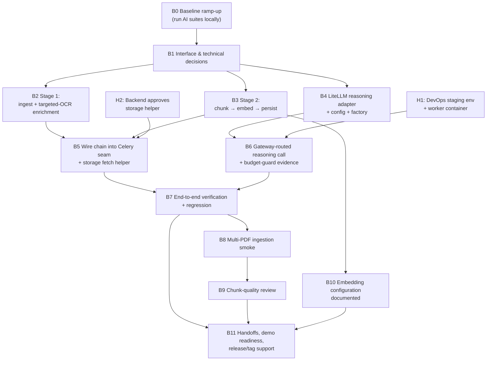
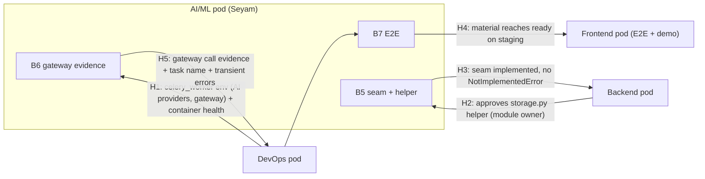

# AI Week 7–8 Execution Roadmap

Implementation-ready engineering roadmap for the AI/ML pod's Week 7–8 deliverables on branch `ai-week7-8`. It consolidates the Week 7 carryovers and the Week 8 requirements into one sequential plan for a **single executor: Seyam (AI/ML Lead)**, who personally implements every AI/ML batch. Other pods (Backend, DevOps, Frontend) appear only as external dependencies, contract owners, or consumers.

**Execution status at the time of writing:** documentation and planning only. No engineering batch has been started. The first authorized batch is **B0** (Phase 0). Do not start it without Seyam's explicit instruction.

---

## 1. Purpose and Scope

### 1.1 Purpose

This roadmap turns the remaining Week 7 and Week 8 AI/ML work into an ordered sequence of small, verifiable implementation batches. Each batch is specified precisely enough that it can be executed by reading this document plus the living ledger (`progress.md`) alone, without reconstructing the original assignment from chat history or memory. The roadmap also defines the acceptance criteria, verification gates, and evidence obligations that every batch must satisfy before the next one may start.

### 1.2 Scope

In scope:

* Completing the worker-side document-ingestion pipeline: Docling ingestion, targeted OCR, structure-aware chunking, BGE-M3 embeddings, and pgvector persistence, composed into the existing Celery material-processing task.
* A LiteLLM-backed PAL reasoning adapter, its configuration, and its dependency line.
* Exercising the reasoning gateway through the intended application path with the budget guard active.
* A multi-PDF ingestion smoke test and the recorded chunk-quality review.
* Documenting the embedding configuration.
* Verifying PAL fallback and health-check behavior inside the actual worker execution path.
* Coordinating the minimal storage-fetch helper with Backend, respecting existing module ownership.
* Preserving the existing material-processing lifecycle: atomic claiming, idempotency, status transitions, and failure handling.
* Preserving existing tests; adding or updating tests only where the assigned work requires them.
* The verification, staging evidence, demo readiness, and release-tag support required by the official Week 8 assignment.

Out of scope (do not start, do not pull in): everything listed in Section 11.3, including retrieval, RAG, reprocessing endpoints, golden-set benchmarking, and any architecture beyond a single new pipeline module.

### 1.3 Single-executor rule

Every AI/ML batch in this roadmap is implemented personally by Seyam. No batch is assigned to, deferred to, or awaited from another AI/ML team member. Earlier two-person allocations that existed in prior revisions of the Week 8 plan are superseded by this document; they are retained only as historical mapping (Section 7.3), never as an execution plan. Backend, DevOps, and Frontend counterparts remain responsible for their own modules and contracts; this roadmap documents the required coordination with them, not work delegated to them.

---

## 2. Source Documents and Authority Hierarchy

### 2.1 Repository authority hierarchy

Per `docs/README.md` and ADR-0002 (`docs/adr/0002-documentation-authority.md`), the binding order is:

1. **ADRs** (`docs/adr/`) — binding architecture decisions; they override every other document. Directly governing: ADR-0009 (PAL, ingestion, targeted-OCR policy), ADR-0005 (LiteLLM gateway), ADR-0004 (pgvector vector store), ADR-0003 (OCR benchmark location — local engines stay in `experiments/`).
2. **Repository README** — entry point and orientation.
3. **Technical specification** (`docs/design/OpenLearn_AI_v4_Technical_Specification.md`) — product and technical design authority.
4. **Execution plan** (`planning/Roadmap/44-WEEK-EXECUTION-PLAN .md`) — schedule authority: what ships when. Note the filename contains a space before `.md`.
5. **Research** (`docs/research/`) — informs decisions; never implementation authority.

### 2.2 Task-specific input documents

* `WEEK-8-AI-POD-EXECUTION-ROADMAP (1).md` (repository root) — the AI pod's Week 8 internal execution roadmap. Major planning input; its repository findings were recorded against `staging` commit `7dccffaf12c9d0aa0127f4d57a2ca5816b6a8035` (2026-10-01) and are treated as historical evidence, re-verified against the current branch (Section 3) before being incorporated here. Its two-person task allocation is superseded by the single-executor rule.
* `GLM-batch-n-patch-lifecycle-rules.md` (repository root) — batch and patch lifecycle rules from a previous frontend task. Its safeguards (repository verification, Git-state preservation, honest reporting, complete patches) are preserved and adapted for this task in `docs/tasks/ai-week7-8/GLM-batch-n-patch-lifecycle-rules.md`.
* `planning/Roadmap/44-WEEK-EXECUTION-PLAN .md` — "Week 7 — Async Pipeline Wiring + LLM Gateway Traffic" and "Week 8 — Integration Close-Out + v0.2" sections: the official assignment scope and acceptance criteria for both weeks.

Both root-level input documents are superseded by this directory's documents and are removed by the documentation-preparation task that created this roadmap. Their content is preserved in Sections 3–14 below and in the lifecycle rules.

### 2.3 Precedence rule for conflicts

If documents conflict: ADRs first, then the technical specification, then the official execution plan, then this roadmap, then `progress.md` observations. A conflict discovered during execution is recorded in `progress.md` as a deviation or open question — never silently resolved by changing requirements.

---

## 3. Verified Repository Baseline

All facts in this section were verified by direct inspection of the working clone on **2026-10-04**, before any documentation changes were made. They are recorded facts, not assumptions. Where a claim could not be re-verified in this environment, it is explicitly marked.

### 3.1 Git state at task start

| Item | Verified value |
|---|---|
| Repository remote | `https://github.com/OpenLearn-AI/OpenLearn-AI.git` |
| Branch | `ai-week7-8` (local), tracking `origin/ai-week7-8` |
| Local HEAD | `a16a6c56f8fda2145cee5ef2abe901e84504a4d6` — "added task docs" (2026-10-04) |
| `origin/ai-week7-8` | `a16a6c56f8fda2145cee5ef2abe901e84504a4d6` — identical; branch in sync |
| Working tree | Clean (no staged, unstaged, or untracked changes) |
| Branch composition | `origin/staging` @ `b6852e5` (merge of PR #66, 2026-10-04) + one commit `a16a6c5` adding the two task input documents |

### 3.2 Relationship to the historical evidence commit

The superseded Week 8 roadmap recorded its code findings against `staging` @ `7dccffa` (2026-10-01). A `git diff 7dccffa..a16a6c5` on the current branch shows:

* **No changes under `backend/` at all.** Every backend-code finding from the historical document therefore remains valid for this branch without exception, and each load-bearing finding was additionally re-verified directly (Section 3.4).
* Infra-only changes: `infra/docker-compose.staging.yml` (Grafana dashboards volume mount), new `infra/grafana/dashboards/api-latency-p95.json`, new `infra/grafana/provisioning/dashboards/dashboards.yaml` (PR #66, dashboards-as-code).
* The two input documents were added at the repository root.

### 3.3 Verification method and environment limits

Verification was performed by cloning the repository, checking out `ai-week7-8`, and reading the relevant source, test, configuration, CI, and infrastructure files directly (with targeted `git grep` / file reads). The documentation-preparation environment does **not** have the backend Python dependency stack installed (no `sqlalchemy`, no `docling`, no `sentence-transformers`), so **the pytest suites were not executed here**. All "implemented and tested" statements below mean: the implementation and its test files exist and were read on this branch — repository-level evidence. Running the suites locally is batch B0's first job, and staging-runtime verification is explicitly deferred to Phases 2–3. No runtime or staging behavior is claimed as verified anywhere in this roadmap.

### 3.4 Re-verified component facts (branch `ai-week7-8` @ `a16a6c5`)

| # | Fact | Evidence (path / line) |
|---|---|---|
| F1 | The Celery seam raises `NotImplementedError`; the material lifecycle around it (atomic claim, transitions, failure → `failed`, task-local event loop) is fully implemented | `backend/app/workers/tasks/material_tasks.py` (`_process_material_content`, line ~174); task name constant `app.workers.tasks.material_tasks.process_material` in `backend/app/workers/publishing.py` |
| F2 | 11 tests pin the task lifecycle (claim/failure/idempotency/loop-isolation/task-name and delivery-config tripwires) against a stubbed seam | `backend/tests/test_material_tasks.py` (11 `test_` functions) |
| F3 | Docling ingestion → `CanonicalDocument` implemented | `backend/app/services/ingestion.py` (`ingest_document`); tests `backend/tests/documents/test_ingestion.py` |
| F4 | Structure-aware chunking implemented (defaults 1200/150 from settings) | `backend/app/documents/chunking.py` (`chunk_document`); tests `backend/tests/documents/test_chunking.py` |
| F5 | Targeted-OCR decision + enrichment implemented with injected provider and page-source resolver | `backend/app/services/ocr.py` (`needs_ocr`, `enrich_document_with_ocr`); tests `backend/tests/services/test_ocr.py`, `test_ocr_language_paths.py` |
| F6 | Single-page-PDF OCR source extraction implemented (PDF-only) | `backend/app/services/ocr_source.py` (`create_single_page_pdf`, `pdf_page_source_resolver`); tests `backend/tests/services/test_ocr_source.py` |
| F7 | Gemini OCR provider implemented (`gemini-2.5-flash`) | `backend/app/pal/providers/ocr/gemini_provider.py`; tests `backend/tests/pal/providers/ocr/` |
| F8 | BGE-M3 embedding provider implemented (1024-dim, sentence-transformers) | `backend/app/pal/providers/embedding/bge_m3_provider.py`; tests `backend/tests/pal/providers/embedding/test_bge_m3_provider.py` |
| F9 | pgvector provider + `vector_records` schema implemented (VECTOR(1024), JSONB provenance) | `backend/app/pal/providers/vector_db/postgres_provider.py`; `backend/app/models/vector_record.py`; migration `backend/alembic/versions/f3a1b7c9d4e2_add_vector_records_table.py`; tests `backend/tests/pal/providers/vector_db/` |
| F10 | PAL router fallback + health checks implemented and unit-tested | `backend/app/pal/router.py`; `backend/tests/pal/test_router.py` (10 router tests) |
| F11 | PAL factory supports reasoning providers `mock` only; embedding `mock`/`bge-m3`; OCR `mock`/`gemini`; vector DB `mock`/postgres | `backend/app/pal/factory.py` |
| F12 | No LiteLLM or OpenAI SDK in backend dependencies | `backend/requirements.txt` (has `docling==2.127.0`, `sentence-transformers==3.3.1`; no `litellm`, no `openai`) |
| F13 | Storage service has upload-url generation only — no download/fetch helper | `backend/app/services/storage.py` (`_s3_client`, `generate_upload_url` only) |
| F14 | Config defaults: all `ai_*_provider` default to `mock`; `chunk_size=1200`, `chunk_overlap=150`, `ocr_min_text_chars=50`, `ai_embedding_model=BAAI/bge-m3`, `ai_embedding_dimension=1024`, `ai_embedding_device=auto`, `ai_ocr_model=gemini-2.5-flash` | `backend/app/config.py` |
| F15 | Celery routes `app.workers.tasks.ocr_tasks.*` → `ocr_queue`, but no `ocr_tasks` module exists; `process_material` has no route or retry policy; task time limits are soft 600 s / hard 660 s | `backend/app/workers/celery_app.py` (`task_routes`, `task_soft_time_limit`, `task_time_limit`) |
| F16 | Staging `celery_worker` service exists but its compose `environment` block passes **no AI provider settings** (no `AI_EMBEDDING_PROVIDER`, no `GEMINI_API_KEY`, no gateway URL/key) — with repo-level evidence, the worker would run with config defaults (`mock` embedding/reasoning/vector-db) | `infra/docker-compose.staging.yml` (`celery_worker` service, environment list) |
| F17 | CI runs two backend jobs: "Backend (ruff + migrations + core tests)" = `ruff check .`, `alembic upgrade head`, `pytest tests --ignore=tests/pal --ignore=tests/documents`; "AI tests (PAL + documents)" = `pytest tests/pal tests/documents` | `.github/workflows/ci.yml` |
| F18 | LiteLLM gateway config: `gpt-4o-mini` primary + `gpt-3.5-turbo` fallback, `max_budget: 10.0` / `budget_duration: 30d`, `drop_params: true`, Langfuse success callback | `infra/litellm-config.yaml` |
| F19 | `docs/tasks/` did not exist before this documentation task; `docs/research/` contains `OCR.md` but no embedding document | repository tree |
| F20 | ADRs present: 0001 (modular monolith), 0002 (documentation authority), 0003 (OCR benchmark location), 0004 (pgvector; two files), 0005 (LiteLLM gateway), 0009 (RAG/PAL architecture), 006 (Keycloak OIDC) | `docs/adr/` |
| F21 | The historical assignment files `week7.txt`, `week6tasks.txt`, `members.txt` referenced by the old Week 8 document are **not** tracked in this repository (external references only) | `git ls-files` |

---

## 4. Week 7 Carryovers and Week 8 Requirements

### 4.1 Official Week 7 assignment (AI/ML & Data)

From `planning/Roadmap/44-WEEK-EXECUTION-PLAN .md`, "Week 7 — Async Pipeline Wiring + LLM Gateway Traffic":

* Implement the worker-side ingestion chain (TS §11.7): Docling → `CanonicalDocument` → targeted OCR → deterministic chunking (`chunk_size`/`chunk_overlap` config) → BGE-M3 batch embedding → pgvector insert with JSONB provenance.
* Implement the targeted-OCR orchestration loop per ADR-0009 (OCR only for pages with insufficient extracted text, `OCR_MIN_TEXT_CHARS` threshold; TS §11.5); verify PAL provider fallback + health checks behave correctly inside the worker chain.
* Deliverable: seeded PDF processed end-to-end on staging (text + chunks + vector row queryable); test reasoning call routed via the gateway.
* DoD: material reaches `ready` with chunks + vectors stored; gateway call succeeds with budget guard active; no provider library imported outside PAL.

Carryover status: the orchestration pieces exist and are tested (F3–F10), but the chain is **not composed** — the seam raises `NotImplementedError` (F1) and no reasoning provider besides `mock` exists (F11, F12). Week 7's AI deliverables are therefore carried into Week 8 as the pipeline and reasoning batches below.

### 4.2 Official Week 8 assignment (AI/ML & Data)

From the same plan, "Week 8 — Integration Close-Out + v0.2":

* Multi-PDF ingestion smoke.
* Chunk-quality review (no orphan/giant chunks).
* Embedding configuration documented (BGE-M3, 1024-dim, batch path).
* Week-level deliverables/DoD shared with all pods: `v0.2.0` tag cut **after** a passing Friday demo; E2E green on staging.

### 4.3 Consolidated remaining-work register

| ID | Workstream | Verified state on `ai-week7-8` | Addressed by |
|---|---|---|---|
| W1 | Worker-side ingestion chain (Docling → OCR → chunking → BGE-M3 → pgvector) | Pieces implemented + tested (F3–F9); **not composed** — seam raises (F1); no `document_pipeline` module exists | B2, B3, B5 |
| W2 | LiteLLM-backed PAL reasoning adapter | Missing — `mock` only (F11, F12) | B4 |
| W3 | Multi-PDF ingestion smoke | Not started; blocked by W1 | B8 |
| W4 | Chunk-quality review | Not started; blocked by W3 | B9 |
| W5 | Embedding configuration documented | Not started; no embedding doc in `docs/research/` (F19) | B10 |
| W6 | PAL fallback + health inside worker chain | PAL-level implementation + unit tests verified (F10); worker-path behavior unverified | B7 (within B5's wiring) |
| W7 | Storage fetch for the worker | Missing helper (F13); Backend-owned module | B5 (+ Backend coordination) |

Nothing in the register may be assumed missing without re-checkout: if any batch finds a work item already implemented on the branch, it records that in `progress.md` and shrinks its own scope accordingly.

---

## 5. Current Implementation and Verification Status

Three distinct states must never be conflated. **Implemented** = the code exists on the branch and has repository-level tests. **Integrated** = the code is composed into the application path (the Celery worker) and that path is exercised by tests. **Runtime-verified** = observed working on staging (worker logs, database rows, gateway logs). As of the verified baseline:

| Component | Implemented | Integrated | Runtime-verified |
|---|---|---|---|
| Docling ingestion → `CanonicalDocument` (F3) | Yes (+tests) | n/a (library-style service) | No |
| Structure-aware chunking (F4) | Yes (+tests) | n/a (library-style) | No |
| Targeted-OCR decision/enrichment (F5) | Yes (+tests) | n/a | No |
| Single-page-PDF OCR source (F6) | Yes (+tests) | n/a | No |
| Gemini OCR provider (F7) | Yes (+tests) | n/a | No |
| BGE-M3 embedding provider (F8) | Yes (+tests) | n/a | No |
| pgvector provider + schema (F9) | Yes (+tests) | n/a | No |
| PAL router fallback + health (F10) | Yes (+tests) | No — never exercised in worker | No |
| PAL reasoning providers (F11, F12) | `mock` only | mock only | No |
| Celery lifecycle + atomic claim (F1, F2) | Yes (+11 tests) | Yes (task registered; seam stubbed) | No |
| Chain composition (ingest→persist) | **Missing** | **Missing** | No |
| Storage fetch helper (F13) | **Missing** | **Missing** | No |
| Multi-PDF smoke / chunk review / embedding doc | Missing | — | No |

Additional status distinctions that matter for honest reporting:

* The test suites were **not executed** during this documentation task (Section 3.3). "Green" claims about CI are configuration facts (F17), not observed runs.
* Staging deployment facts (container health, env vars actually injected at runtime, gateway reachability) are **unknown** from repository evidence alone. F16 is a compose-file observation, strong evidence but not a runtime observation.
* `tests/pal/providers/vector_db/test_postgres_provider_integration.py` exists; whether it ran in CI depends on its markers — it is part of `tests/pal` which CI runs, but any environment-conditional skips must be checked, not assumed.

---

## 6. Dependency Graph

### 6.1 Batch dependency graph

### 6.2 Cross-pod dependency graph

### 6.3 Phase gates

| Gate | After | Condition to pass |
|---|---|---|
| G1 | Phase 0 | B0 suites green locally; B1 decisions recorded in writing |
| G2 | Phase 1 | B2, B3, B4 implemented and tested; import-rule grep clean; no existing-suite regressions |
| G3 | Phase 2 | Staging: seeded PDF `pending → processing → ready` with vector row queryable; gateway call evidenced (requires H1, H2) |
| G4 | Phase 3 | B7–B10 complete: regression green, smoke table, chunk review, embedding doc |
| G5 | Phase 4 | Handoffs H3–H5 acknowledged; Friday demo passed; `v0.2.0` cut by DevOps after the demo |

---

## 7. Ordered Execution Phases and Implementation Batches

Phases are derived from real dependency and integration-risk boundaries, not from a desire for symmetry: decisions must precede implementations because three interface choices gate all code; the two pipeline stages are one cohesive implementation unit before integration; integration is isolated in its own phase because it touches the pinned task lifecycle and a Backend-owned module; verification and the Week 8 deliverables follow integration; demo/release close-out is separate because it depends on other pods' acknowledgment, not on AI/ML code.

### 7.1 Phase overview

| Phase | Title | Batches | Priority | Gate |
|---|---|---|---|---|
| Phase 0 | Baseline and decisions | B0, B1 | P0 | G1 |
| Phase 1 | Pipeline stage modules | B2, B3, B4 | B2/B3 P0, B4 P1 | G2 |
| Phase 2 | Worker integration | B5, B6 | B5 P0, B6 P1 | G3 |
| Phase 3 | Verification and Week 8 AI deliverables | B7, B8, B9, B10 | B7 P0, B8/B9 P1, B10 P2 | G4 |
| Phase 4 | Demo readiness and close-out | B11 | P0 | G5 |

Recommended execution order for the single executor: **B0 → B1 → B2 → B3 → B4 → B5 → B6 → B7 → B8 → B9 → B10 → B11**. B4 has no technical dependency on B2/B3 and may be pulled earlier if the gateway adapter unblocks DevOps coordination; B10 may be pulled forward to run alongside Phase 2 once B3 is done. No batch may start before the previous gate is passed and Seyam has explicitly authorized it.

**First batch to execute: B0.** It must not be started as part of this documentation task.

### 7.2 Batch register

| Batch | Title | Depends on | External deps | Old ID (superseded doc) |
|---|---|---|---|---|
| B0 | Baseline ramp-up: run the existing AI test suite locally | — | — | B0 |
| B1 | Interface and technical decisions | B0 | Inform Backend | S1 |
| B2 | Pipeline stage 1 — ingest + targeted-OCR enrichment | B1 | — | B1 |
| B3 | Pipeline stage 2 — chunk → embed → persist | B1 (B2 recommended first) | — | S5 |
| B4 | LiteLLM reasoning provider + config wiring + tests | B1(b) | DevOps (env-name alignment) | B2 |
| B5 | Wire the chain into the Celery seam + storage fetch helper | B2, B3 (+H2 for helper) | Backend (H2), DevOps (H1 for staging run) | S2 |
| B6 | First gateway-routed reasoning call + budget-guard evidence | B4 (+H1) | DevOps (H1, H5) | S3 |
| B7 | End-to-end verification and regression | B5, B6, H1 | DevOps | S4 |
| B8 | Multi-PDF ingestion smoke (Week 8 deliverable) | B7 | DevOps | B3 |
| B9 | Chunk-quality review (Week 8 deliverable) | B8 | — | B4 |
| B10 | Embedding configuration documented (Week 8 deliverable) | B3 | — | S6 |
| B11 | Handoffs, demo readiness, release/tag support | B7, B9, B10 | Backend, DevOps, Frontend | Stage 5 |

### 7.3 Historical ID mapping note

The superseded Week 8 document used a two-person scheme (`B0`, `S1`, `B1`, `S5`, `B2`, `S2`, `S3`, `S4`, `B3`, `B4`, `S6`). This roadmap renumbers batches sequentially for a single executor and drops owner-based phasing entirely. The last column of Section 7.2 preserves the mapping for traceability. Historical statements about review load, parallelism between two members, and workload balance are obsolete and intentionally not carried forward.

---

## 8. Detailed Batch Specifications

Each specification below is self-contained. Evidence obligations refer to the batch-entry template defined in `progress.md` (Section: "Batch record template"). Commands assume `backend/` as working directory unless noted.

### B0 — Baseline ramp-up: run the existing AI test suite locally

* **Identifier / title:** B0 — Baseline ramp-up and local test verification.
* **Objective:** establish a verified, personally-observed baseline of the existing AI components and their tests before changing anything.
* **Why it is needed:** every chain piece exists and is tested (F1–F12), but this roadmap's honesty rules require that "existing tests are green" be observed, not inherited. B0 also anchors the seam knowledge needed for B1's decisions.
* **Prerequisites:** none. Requires an environment with the backend dependency stack installed (executor's machine; this documentation environment could not run the suites).
* **Exact intended scope:** read and summarize the modules listed below; execute the AI-relevant test suites; record results. **No code changes.** Reading list: `backend/app/services/ingestion.py`, `services/ocr.py`, `services/ocr_source.py`, `backend/app/documents/chunking.py`, `backend/app/workers/tasks/material_tasks.py`, `backend/app/workers/publishing.py`, `backend/app/workers/celery_app.py`, `backend/app/pal/factory.py`, `backend/app/pal/router.py`, `backend/app/pal/interfaces/*`, `backend/app/pal/providers/**`, `backend/app/models/vector_record.py`, `backend/app/config.py`, and the corresponding test files.
* **Relevant paths:** as listed above.
* **Deliverables:** half-page summary appended to `progress.md` (what each piece does, its inputs/outputs, the seams, anything that looks off).
* **Tests and commands:**
  * `python -m pytest tests/documents tests/services/test_ocr.py tests/services/test_ocr_language_paths.py tests/services/test_ocr_source.py tests/pal tests/test_material_tasks.py -q` (AI-relevant set)
  * Optional full core check: `python -m pytest tests --ignore=tests/pal --ignore=tests/documents -q`; lint: `python -m ruff check .`
* **Acceptance criteria:** the AI-relevant set passes locally; the summary is recorded in `progress.md`; the working tree is unchanged apart from `progress.md`.
* **Cross-pod dependencies:** none.
* **Failure conditions / stop conditions:** any suite failure → record the failure verbatim in `progress.md`, stop, and report to Seyam before anything else. Do not patch "small" unrelated failures.
* **Evidence for the ledger:** commands executed, pass/fail counts, HEAD SHA, environment notes.

### B1 — Interface and technical decisions

* **Identifier / title:** B1 — Interface and technical decisions (decision batch, no production code).
* **Objective:** fix, in writing, the three interfaces and two scope decisions that all implementation batches depend on.
* **Why it is needed:** the seam docstring says only "[AI/ML-owned]"; no stage signatures, SDK choice, or image-material scope is agreed. Deciding now prevents contract drift during B2–B5.
* **Prerequisites:** B0 complete.
* **Exact intended scope:**
  * (a) Pipeline stage signatures and seam contract: ingest+enrich stage (local file path → enriched `CanonicalDocument`); persist stage (enriched document + injected embedding/vector providers → per-document counts/result); the content-processing callable (`_process_material_content` receives material fields + downloaded local file path + injected providers). Include the sync/async boundary (sync Celery task wraps `asyncio.run`; OCR path is async; embedding is CPU/sync) and error semantics (any exception inside content processing → material marked `failed`, existing behavior preserved).
  * (b) Reasoning adapter SDK: `litellm` SDK vs an OpenAI-compatible client inside PAL; gateway base URL `http://litellm:4000` (TS §23.1); the exact single new dependency line for `backend/requirements.txt`.
  * (c) Week 8 image-material scope: default proposal — PDF-only OCR source resolver now; non-PDF sources skip OCR gracefully with a metadata note; images deferred with an explicit recorded note. Deviating from the default requires an explicit decision entry.
  * (d) Module shape for `backend/app/services/document_pipeline.py` (both stage functions in one module; naming per this decision).
* **Relevant paths:** new note `docs/tasks/ai-week7-8/decisions.md` (committed); touched-by-decision files: `material_tasks.py`, `document_pipeline.py` (to be created), `pal/factory.py`, `config.py`, `requirements.txt`.
* **Deliverables:** committed decision note with the signatures; task name contract restated unchanged: `app.workers.tasks.material_tasks.process_material`, args `(material_id, s3_key, course_id, owner_id)`.
* **Tests and commands:** none beyond `python -m ruff check .` if the note includes no code (it must not).
* **Acceptance criteria:** decisions recorded and committed before any implementation batch; Backend informed that the enqueue contract is unchanged; no silent contract drift afterward — changes require a new decision entry.
* **Cross-pod dependencies:** Backend is informed (not consulted for approval — the enqueue contract is already stable); DevOps may be aligned on gateway env-var names.
* **Failure conditions / stop conditions:** if a decision genuinely cannot be made (e.g., SDK choice blocked by new information), record the open question and stop; do not guess and do not start B2.
* **Evidence for the ledger:** decision-note path, commit SHA, each decision's one-line rationale.

### B2 — Pipeline stage 1: ingest + targeted-OCR enrichment

* **Identifier / title:** B2 — Pipeline stage 1 — ingest + targeted-OCR enrichment stage function.
* **Objective:** a tested stage function that turns a local file into an OCR-enriched `CanonicalDocument`, composing existing modules without duplicating them.
* **Why it is needed:** W1's first half; nothing downstream (chunking, embedding, persistence) can run without the enriched document.
* **Prerequisites:** B1 decisions (a), (c), (d).
* **Exact intended scope:** new function in `backend/app/services/document_pipeline.py` wiring: `ingest_document()` (F3) → page-source resolver wiring `pdf_page_source_resolver` + `create_single_page_pdf` (F6; PDF sources only per B1(c); non-PDF sources skip OCR gracefully with a metadata note) → `enrich_document_with_ocr()` (F5) → return the enriched `CanonicalDocument`. Honor ADR-0009: never pass `Page.text` to the provider; preserve Docling structure; OCR text replaces extracted text only below `ocr_min_text_chars` (F14); deterministic temp-artifact handling and cleanup. Providers and resolver are injected; the stage must not import any provider SDK (TS §7.3).
* **Relevant paths:** new `backend/app/services/document_pipeline.py`; new tests `backend/tests/services/test_document_pipeline_stage1.py`; reuse `services/ingestion.py`, `services/ocr.py`, `services/ocr_source.py` **unchanged**.
* **Deliverables:** stage function + unit tests.
* **Tests and commands:** `python -m pytest tests/services/test_document_pipeline_stage1.py tests/documents tests/services/test_ocr.py tests/services/test_ocr_language_paths.py tests/services/test_ocr_source.py -q`; `python -m ruff check .`. Test cases: OCR threshold fires / does not fire; multi-page document; non-PDF path skips OCR with metadata note; temp artifact cleanup; mock OCR provider; `tmp_path` PDFs.
* **Acceptance criteria:** new tests green; existing `tests/documents` and `tests/services/test_ocr*` untouched and green; no SDK imports outside `backend/app/pal/` (grep: `grep -rn "import litellm\|from litellm\|import google" backend/app --include="*.py"` shows only PAL hits).
* **Cross-pod dependencies:** none.
* **Failure conditions / stop conditions:** if Docling cannot run in the local environment → stop and record (do not fake with mocks-only "verification"); if the stage needs a signature change beyond B1's decision → stop, record, escalate.
* **Evidence for the ledger:** files created/modified, test output, grep result.

### B3 — Pipeline stage 2: chunk → embed → persist

* **Identifier / title:** B3 — Pipeline stage 2 — chunk, embed, and persist stage function.
* **Objective:** a tested stage function that turns the enriched document into queryable vector rows.
* **Why it is needed:** W1's second half; completes the data path that Backend integration tests and the demo consume.
* **Prerequisites:** B1 decision (a). B2 should be implemented first (same module file; single executor works sequentially).
* **Exact intended scope:** second function in `backend/app/services/document_pipeline.py`: `chunk_document()` with settings defaults 1200/150 (F4, F14) → `embed_batch()` loop with batching and an empty-input guard (F8) → build `VectorRecord` instances with provenance (`chunk_id`, `document_id`, page references, `section`, `char_count` — TS §12.1) → vector provider `upsert()` (F9) → return per-document counts/result. Providers are injected; the stage knows nothing about DB sessions or Celery; the session-scoped pgvector provider is constructed by the caller (B5).
* **Relevant paths:** `backend/app/services/document_pipeline.py` (extended); new tests `backend/tests/services/test_document_pipeline_stage2.py`; reuses `documents/chunking.py`, `pal/providers/embedding/*`, `pal/providers/vector_db/*` unchanged.
* **Deliverables:** stage function + unit tests.
* **Tests and commands:** `python -m pytest tests/services/test_document_pipeline_stage2.py tests/pal -q`; `python -m ruff check .`. Test cases with mock embedding + mock vector provider: batching behavior; empty/no-text document yields no chunks and a defined no-op result; provenance shape; `chunk_id` determinism (`{document_id}:{seq}`).
* **Acceptance criteria:** new tests green; existing `tests/pal` provider tests untouched and green; no session/Celery imports in the stage module.
* **Cross-pod dependencies:** none.
* **Failure conditions / stop conditions:** dimension mismatch between provider config and storage (F14/F9) → this is exactly the error the architecture wants to surface; record, do not paper over with a cast.
* **Evidence for the ledger:** files changed, test output.

### B4 — LiteLLM-backed PAL reasoning adapter

* **Identifier / title:** B4 — LiteLLM reasoning provider, configuration wiring, and tests.
* **Objective:** a real reasoning provider behind the existing PAL interface, gateway-addressable, fully tested offline.
* **Why it is needed:** W2 (Week 7 carryover); the W8 demo and DoD require one gateway-routed reasoning call with the budget guard active.
* **Prerequisites:** B1 decision (b). Independent of B2/B3.
* **Exact intended scope:** new provider under `backend/app/pal/providers/reasoning/` implementing `ReasoningInterface` (`reason`, `reason_stream`) using the SDK chosen in B1(b); pointed at the gateway base URL from configuration; new config keys in `backend/app/config.py` (provider name, base URL, model, key env var — following the existing `ai_*` naming, F14); registration in `backend/app/pal/factory.py` beside `mock` (F11); exactly one new dependency line in `backend/requirements.txt` (F12); unit tests with the client mocked — no network in tests.
* **Relevant paths:** as above; reference pattern: `pal/providers/reasoning/mock_provider.py`, `pal/interfaces/reasoning.py`.
* **Deliverables:** provider + factory registration + config keys + tests + the one dependency line.
* **Tests and commands:** `python -m pytest tests/pal -q`; `python -m ruff check .`; import-rule grep: `grep -rn "litellm\|openai" backend/app --include="*.py"` → hits only under `backend/app/pal/`.
* **Acceptance criteria:** with `ai_reasoning_provider` set to the new value, `get_reasoning_provider()` returns it; tests green offline; no SDK import anywhere outside `backend/app/pal/` (TS §7.3); mock default unchanged.
* **Cross-pod dependencies:** DevOps alignment on env-var names for the gateway URL/key on staging (coordination only; the staging wiring itself is H1).
* **Failure conditions / stop conditions:** if the chosen SDK cannot satisfy `reason_stream` semantics, stop and re-open B1(b) with the evidence — do not bend the interface.
* **Evidence for the ledger:** files created/modified, dependency diff line, grep output, test output.

### B5 — Wire the chain into the Celery seam + storage fetch helper

* **Identifier / title:** B5 — Celery seam wiring and minimal storage fetch helper.
* **Objective:** replace the `NotImplementedError` seam with the real pipeline call chain, preserving the pinned lifecycle exactly.
* **Why it is needed:** this is W1's completion — the single integration point that turns "implemented pieces" into "integrated pipeline"; it unblocks Backend integration tests (H3), Frontend E2E (H4), and the demo.
* **Prerequisites:** B2 and B3 (both stage functions tested); Backend approval of the storage helper pattern (H2) before the helper lands; DevOps staging env (H1) is required for the *staging acceptance run*, not for writing the code.
* **Exact intended scope:**
  * `backend/app/workers/tasks/material_tasks.py`: implement the body of `_process_material_content` — fetch the uploaded file via the new helper → run B2's stage → run B3's stage with providers built via `pal/factory.py` (session-scoped pgvector provider passed an `AsyncSession` from the task's session factory) → return. Preserve the task lifecycle exactly: atomic claim, status transitions, failure → `failed` + re-raise, task-local engine/event loop (F1, F2). Deterministic temp-file cleanup on success and failure.
  * `backend/app/services/storage.py`: new minimal fetch helper (s3_key → local readable file path), implemented in the pattern Backend approves (H2). **Backend owns this module — ownership unchanged; the change is coordinated, not silent.**
  * `backend/tests/test_material_tasks.py`: update the stubbed-seam tests in the same file; add coverage for the wired path (fetch → stages → ready; fetch/stage failure → `failed`). Never weaken the 11 pinned tests.
* **Relevant paths:** as above.
* **Deliverables:** wired seam + storage helper + updated/added seam tests.
* **Tests and commands:** `python -m pytest tests/test_material_tasks.py -q` (11 existing + new, all green); then the full local set from B0; `python -m ruff check .`.
* **Acceptance criteria:** locally all suites green; staging acceptance (seeded PDF `pending → processing → ready`, `vector_records` row with 1024-dim vector + JSONB provenance, forced failure → `failed`) is verified in B7 after H1 — B5's own gate is local.
* **Cross-pod dependencies:** Backend (H2 — helper approval, module owner), DevOps (H1 — only for the later staging run).
* **Failure conditions / stop conditions:** any of the 11 pinned tests regresses → stop immediately, fix within the batch or revert the batch's scope; do not weaken assertions to pass. If Backend withholds helper approval → record, stop; implement the seam behind a fetchable-file parameter so only the helper call site waits.
* **Evidence for the ledger:** full test output, file list, Backend approval reference, staging-deferred items listed explicitly.

### B6 — First gateway-routed reasoning call + budget-guard evidence

* **Identifier / title:** B6 — Gateway-routed reasoning call and budget-guard evidence (operational verification; no new code).
* **Objective:** prove the reasoning path end-to-end through the LiteLLM gateway on staging, with the budget guard observable.
* **Why it is needed:** Week 7 deliverable carried into Week 8; a demo input and a DoD line (gateway call succeeds with budget guard active).
* **Prerequisites:** B4 merged; H1 satisfied (gateway reachable from the backend network; key env present).
* **Exact intended scope:** route one test `reason()` call through `http://litellm:4000` on staging using B4's provider; confirm the budget guard (`$10/30-day`, `drop_params` — F18) from gateway response/logs; re-run the import-rule grep.
* **Relevant paths:** no code changes; evidence goes into `progress.md` + handed to DevOps.
* **Deliverables:** call evidence (log excerpt) handed to DevOps for dashboards/Langfuse visibility (H5), including the task name `app.workers.tasks.material_tasks.process_material` and the transient-error list for route/retry configuration.
* **Tests and commands:** LiteLLM gateway logs; `grep -rn "litellm\|openai" backend/app --include="*.py"` (PAL-only).
* **Acceptance criteria:** call succeeds; guard behavior confirmed; grep clean.
* **Cross-pod dependencies:** DevOps (H1 consumer side; H5 provider side).
* **Failure conditions / stop conditions:** gateway unreachable or key missing → record, stop, escalate to DevOps; do not bypass the gateway "temporarily".
* **Evidence for the ledger:** log excerpt, grep output, timestamp, environment identity.

### B7 — End-to-end verification and regression

* **Identifier / title:** B7 — End-to-end verification, regression, and runtime behavior checks.
* **Objective:** observe, on staging, the behaviors that repository tests cannot prove, and close the regression loop.
* **Why it is needed:** distinguishes repository-level evidence from deployed staging evidence; the W8 demo must not discover runtime gaps live.
* **Prerequisites:** B5 and B6 complete; H1 satisfied (worker container healthy with AI provider env; `ai_embedding_provider=bge_m3` actually injected — Q3 resolved).
* **Exact intended scope:** full backend suite green locally and in CI (both CI jobs, F17); one seeded-PDF staging run checked end-to-end: `pending → processing → ready`; OCR loop fires only on pages below `ocr_min_text_chars` (log/metadata evidence); PAL fallback/health behavior inside the worker (W6); worker logs show BGE-M3, not mock (F14/Q3); a forced failure marks the material `failed`.
* **Relevant paths:** no new code expected; fixes discovered here that belong to B2–B5 scopes are handled as recorded deviations, not scope creep.
* **Deliverables:** short results note: what passed, what failed, what is staging-only; recorded in `progress.md` and the team channel.
* **Tests and commands:** local full suites + `ruff`; staging: worker log inspection, SQL count on `vector_records`, `GET /materials/{id}/status` observation.
* **Acceptance criteria:** suites green; staging flow observable end-to-end; any gap reported honestly, never papered over.
* **Cross-pod dependencies:** DevOps (environment), Backend (seeded material), Frontend (status endpoint consumption is observable via API).
* **Failure conditions / stop conditions:** any staging failure → capture logs, record, stop; do not hot-patch staging ad hoc.
* **Evidence for the ledger:** log excerpts, SQL query + result, checklist of each runtime claim with its evidence link.

### B8 — Multi-PDF ingestion smoke (Week 8 deliverable)

* **Identifier / title:** B8 — Multi-PDF ingestion smoke test and results table.
* **Objective:** demonstrate the pipeline over a realistic document mix and produce the per-file evidence table.
* **Why it is needed:** official Week 8 AI/ML deliverable (W3); feeds the chunk-quality review.
* **Prerequisites:** B7's staging run succeeded.
* **Exact intended scope:** push 4–6 PDFs (born-digital + scanned; English + Arabic — the `experiments/OCR` custom corpus is a source of test files) through upload → worker on staging; record per file: final status, chunk count, vector rows, whether OCR fired and on which pages.
* **Relevant paths:** no code changes; results table in `progress.md` (+ team channel).
* **Deliverables:** completed smoke results table.
* **Tests and commands:** staging SQL counts on `vector_records`; worker logs; status endpoint checks.
* **Acceptance criteria:** all smoke PDFs reach `ready`, or each failure is explained; table complete.
* **Cross-pod dependencies:** DevOps (staging availability).
* **Failure conditions / stop conditions:** a systematically failing category (e.g., all scanned Arabic) → record, stop, and analyze before more uploads; do not tune config mid-smoke.
* **Evidence for the ledger:** table with per-file rows and raw log references.

### B9 — Chunk-quality review (Week 8 deliverable)

* **Identifier / title:** B9 — Chunk-quality review.
* **Objective:** assess chunk quality from B8's output and decide whether any configuration change is warranted.
* **Why it is needed:** official Week 8 AI/ML deliverable (W4); guards retrieval quality long before retrieval exists.
* **Prerequisites:** B8 complete.
* **Exact intended scope:** from B8's output: chunk `char_count`/`page_count` distributions; flag orphan (very small) and giant (over `chunk_size`) chunks; report anomalies. A config-level proposal (`chunk_size`/`chunk_overlap`) is permitted only if the data warrants it — **no new chunking algorithm** (ADR-0009, TS §11.4).
* **Relevant paths:** review note in `progress.md`; any config proposal goes through a decision entry first.
* **Deliverables:** review note with numbers.
* **Tests and commands:** analysis over the recorded smoke data; no code execution required beyond queries.
* **Acceptance criteria:** review recorded with concrete numbers; any proposed change is an explicit decision entry, not an ad-hoc edit.
* **Cross-pod dependencies:** none.
* **Failure conditions / stop conditions:** anomalies that would require algorithmic changes → record as out-of-scope finding; escalate rather than expand.
* **Evidence for the ledger:** distribution numbers, flagged chunk examples, decision or explicit "no change".

### B10 — Embedding configuration documented (Week 8 deliverable)

* **Identifier / title:** B10 — Embedding configuration documentation (`docs/research/EMBEDDING.md`).
* **Objective:** one-page, code-accurate documentation of the embedding configuration.
* **Why it is needed:** official Week 8 AI/ML deliverable (W5); the executor implements the embed path (B3), so the doc records real values, not aspirations.
* **Prerequisites:** B3 complete (values must match implemented code).
* **Exact intended scope:** `docs/research/EMBEDDING.md` mirroring the role of `docs/research/OCR.md`: BGE-M3, 1024-dim, batch path and internal encode batch size, device config, provider/fallback config keys, and how the worker (B5) constructs the provider. Research docs inform but never override code or ADRs (Section 2.3).
* **Relevant paths:** new `docs/research/EMBEDDING.md`; cross-check against `backend/app/config.py` (F14) and `backend/app/pal/providers/embedding/bge_m3_provider.py` (F8).
* **Deliverables:** the documentation page.
* **Tests and commands:** manual value-by-value check against `config.py` and the provider code; `python -m ruff check .` unaffected (docs only).
* **Acceptance criteria:** every stated value matches code as of the batch's HEAD; no aspirational values.
* **Cross-pod dependencies:** none.
* **Failure conditions / stop conditions:** a mismatch between doc and code → fix the doc or file the code question; never document the aspiration.
* **Evidence for the ledger:** doc path, value-checklist result.

### B11 — Handoffs, demo readiness, release/tag support

* **Identifier / title:** B11 — Handoff confirmation, demo readiness, and release/tag support.
* **Objective:** close out Week 8 for the AI pod: acknowledgments, demo checklist, and the post-demo tag handoff.
* **Why it is needed:** the official Week 8 milestone is the demoed integrated flow and the `v0.2.0` tag cut after it — an AI-pod responsibility to *support*, not to perform.
* **Prerequisites:** B7, B9, B10 complete; smoke evidence archived.
* **Exact intended scope:** confirm handoffs H3–H5 are acknowledged by the consuming pods; prepare and walk the demo checklist (register → login → create course → upload → `ready`, plus one gateway-routed reasoning call); hand the tag step to DevOps — **the AI pod does not tag**; contribute only evidenced gaps to the retro.
* **Relevant paths:** `progress.md` close-out entry; no code changes.
* **Deliverables:** acknowledgment record, demo checklist with observed results, retro input list.
* **Tests and commands:** the demo script itself is the verification; status endpoint + logs observed live.
* **Acceptance criteria:** demo passes; `v0.2.0` cut by DevOps after the demo; no unexplained gaps carried into Week 9.
* **Cross-pod dependencies:** Backend, DevOps, Frontend (consumers of H3–H5; tag owner).
* **Failure conditions / stop conditions:** demo failure → capture evidence, stop, reschedule; no live patching during the demo.
* **Evidence for the ledger:** demo checklist result, acknowledgment record, tag reference (after DevOps cuts it).

---

## 9. Acceptance Criteria and Verification Gates

### 9.1 Ordered verification checklist (repo-level, every applicable batch)

1. `python -m pytest tests/documents tests/services/test_ocr.py tests/services/test_ocr_language_paths.py tests/services/test_ocr_source.py tests/pal tests/test_material_tasks.py -q` — green locally (B0 baseline; re-run in every code batch).
2. Full core set: `python -m pytest tests --ignore=tests/pal --ignore=tests/documents -q` — green locally before declaring any code batch done.
3. `python -m ruff check .` — clean.
4. Import-rule grep after B4/B5/B6: provider SDK strings appear only under `backend/app/pal/`.
5. CI mirrors items 1–3 in both backend jobs (F17) — observed on the batch's PR/check run, not assumed.

### 9.2 Ordered verification checklist (staging-level, Phases 2–4)

1. Worker container starts clean; PAL providers import inside it; BGE-M3 `health_check()` passes (H1 evidence).
2. Seeded PDF: `pending → processing → ready`; `vector_records` row with 1024-dim vector + JSONB provenance queryable.
3. OCR trigger check: pages below `ocr_min_text_chars` OCR'd; pages above untouched (log/metadata evidence).
4. Provider check: worker logs show BGE-M3, not mock (Q3 resolved with env evidence).
5. One reasoning call routed via the gateway with budget guard active; grep + logs recorded.
6. Forced-failure run marks the material `failed` and the task raises (lifecycle preserved).
7. Multi-PDF smoke table recorded; chunk-quality review recorded; embedding doc merged.
8. Handoffs H3–H5 delivered and acknowledged; demo checklist green; `v0.2.0` cut by DevOps after the demo.

### 9.3 Honesty rules for acceptance

* A green local run is never claimed as staging health.
* A staging observation is never back-dated into a batch that did not observe it.
* Tests that could not run are listed as "not run", with the reason — never omitted.
* Every acceptance item maps to a concrete artifact: command output, log excerpt, SQL result, or a recorded observation with timestamp.

---

## 10. Cross-Pod Contracts and Integration Dependencies

### 10.1 Contracts AI/ML must preserve

* **Enqueue contract (Backend-owned, stable):** task name `app.workers.tasks.material_tasks.process_material`, args `(material_id, s3_key, course_id, owner_id)` (`backend/app/workers/publishing.py`, F1). B1 restates it unchanged; no batch may alter it without a new written decision and Backend agreement.
* **Status lifecycle (Backend-observable):** `pending → processing → ready/failed` driven only by `claim_pending_material` / `transition_material_status`; the 11 tests in `tests/test_material_tasks.py` pin it (F2). B5 must keep them green.
* **PAL boundary (ADR-0009, TS §7.3):** provider SDKs are imported only inside `backend/app/pal/`; application layers depend on PAL interfaces and the factory.
* **Module ownership:** `backend/app/services/storage.py` is Backend-owned. The B5 helper is implemented by the AI executor but coordinated with and approved by Backend (H2) — documented coordination, never a silent boundary change.
* **Storage dimension contract:** `vector_records.embedding` is fixed `VECTOR(1024)`; embedding dimension changes require an explicit migration decision (ADR-0009), not config drift.

### 10.2 Handoffs (provider → consumer)

| ID | Handoff | Unblocks | Verification condition |
|---|---|---|---|
| H1 | DevOps → AI/ML: `celery_worker` container importing all PAL providers cleanly + staging env for AI providers and the gateway (base URL/key; `ai_embedding_provider` must be `bge_m3`, not the `mock` default — F16 shows this is currently absent from the compose env) | B5's staging run, B6, B7 | `celery -A app.workers.celery_app worker` starts clean; BGE-M3 `health_check()` passes in worker; gateway reachable from the backend network |
| H2 | Backend → AI/ML: approval of the minimal `storage.py` fetch helper pattern (Backend owns the module) | B5 | Helper returns a readable local file for a staged `s3_key` |
| H3 | AI/ML → Backend: implemented seam — no `NotImplementedError` | Backend's auth → course → material integration tests | `pytest` integration suite green; seeded PDF reaches `ready` |
| H4 | AI/ML → Frontend: a material that actually reaches `ready` on staging | Upload/status E2E and the Friday demo | `GET /materials/{id}/status` returns `ready`; `vector_records` row queryable |
| H5 | AI/ML → DevOps: gateway test-call evidence + task name + transient-error list for routes/retry config | Queue visibility, Langfuse dashboards, Celery route/retry finalization (Q4) | LiteLLM logs show the routed call; route config matches the task name |

### 10.3 Coordination rules

* Contracts owned by other pods are consumed as-is; requested changes go through a recorded decision + explicit agreement, never through silent edits.
* Staging is a shared environment: AI/ML staging runs are announced to DevOps; forced-failure experiments are announced and time-boxed.
* Evidence produced for another pod (H3–H5) is delivered as artifacts (log excerpts, SQL results, task name), not as verbal claims.

---

## 11. Risks, Blockers, and Deferred Work

### 11.1 Open questions carried from the superseded document (re-verified)

| # | Question | Status on `ai-week7-8` | Resolving action |
|---|---|---|---|
| Q1 | Image-material OCR path (provider contract is PDF bytes; `create_single_page_pdf` is PDF-only) | Still open (F6); Docling's format allow-list includes images (TS §11.2) | B1(c) decides; default: PDF-only resolver in W8, images deferred with a recorded note |
| Q2 | Reasoning adapter SDK choice | Still open — no `litellm`/`openai` in `requirements.txt` (F12) | B1(b) decides; one dependency line |
| Q3 | Does staging actually run `ai_embedding_provider=bge_m3`? | **Repo-level evidence the gap is real:** the `celery_worker` compose env passes no AI settings (F16); config default is `mock` (F14) — silent mock vectors would invalidate the demo | DevOps fixes the env (H1) before B5's staging run; B7 verifies from worker logs |
| Q4 | Stale `ocr_tasks` route; `process_material` has no route/retry policy | Confirmed (F15) | DevOps finalizes routes/retry (H5); AI supplies task name + transient-error list |
| Q5 | Preferred pattern for the storage fetch helper | Confirmed open (F13) | Backend agrees the pattern (H2) before B5 lands the helper |

### 11.2 Additional risks identified by verification

| Risk | Basis | Mitigation inside this roadmap |
|---|---|---|
| Celery time limits vs pipeline latency: soft 600 s / hard 660 s (F15) vs Docling conversion + sequential per-page Gemini OCR + BGE-M3 load on large PDFs | F15, F18; sequential OCR is a TS §11.5 fact | Measure in B7/B8 before touching limits; any change goes through a decision entry + DevOps coordination, never a silent edit |
| Heavy-model cold start per task: the worker constructs providers per run (B5); BGE-M3 is lazy-loaded "once" per ADR-0009 — the instantiation scope (per process vs per task) must be confirmed during B5 | F8, F14, ADR-0009 | B5 records the observed load pattern; if per-task load dominates latency, raise it as a decision item rather than optimizing speculatively |
| Single-executor serialization risk: no parallel workers; calendar risk concentrates on one person | Section 1.3 | Strict gate discipline; B4/B10 are the only float batches (Section 7.1) |
| Staging env dependency outside AI control (H1) could stall Phases 2–3 | F16 | B5's code is written and locally verified before H1; staging-dependent acceptance is explicitly deferred to B7, keeping the executor unblocked |
| Silent mock vectors if env config slips through review | F14, F16 | B7's provider check (worker logs show `bge_m3`) is a mandatory gate item |

### 11.3 Out of scope (later weeks or excluded — do not start)

* Reprocess endpoint / admin status surface, idempotent-processing hardening (Week 9); golden 20-PDF benchmark and measured OCR/embedding baselines (Week 9, ADR-0003 methodology).
* Retrieval/search endpoints (Week 10), hybrid retrieval + re-ranking (Week 13), RAG/chat (Week 14), WebSocket status channel (Week 15), Knowledge Graph (Week 21+).
* Local LLM runtime; local OCR engines beyond `experiments/` (ADR-0003); metadata enrichment (TS §11.6); quiz/recommendation/adaptive features.
* New abstractions beyond the single `document_pipeline.py` module; new client libraries beyond the one B1(b) dependency; refactors of working components.

### 11.4 Blockers

None at planning time. H1 (DevOps staging env) and H2 (Backend helper approval) are the two foreseeable blockers for Phase 2; both have defined coordination paths (Section 10.2) and B5's local-first scoping keeps code work unblocked while they are resolved.

---

## 12. Definition of Done (AI/ML pod, Weeks 7–8)

All mandatory AI work scheduled through Week 8 (plus the justified Week 7 carryovers W1/W2) is accounted for in Sections 4–8, each item either done or explicitly escalated with impact recorded.

Checks, in order (repo-level items observed locally + CI; staging items observed on staging):

1. `python -m pytest tests/documents tests/services/test_ocr.py tests/services/test_ocr_language_paths.py tests/services/test_ocr_source.py tests/pal tests/test_material_tasks.py -q` — green locally and in CI.
2. Seeded PDF on staging: `pending → processing → ready`; `vector_records` row with 1024-dim vector + JSONB provenance queryable.
3. OCR trigger check: pages below `ocr_min_text_chars` OCR'd; pages above untouched (log/metadata evidence).
4. Provider check: worker logs show BGE-M3 (not mock) on staging.
5. One reasoning call routed via the gateway with budget guard active; no provider SDK import outside `backend/app/pal/` (grep + review).
6. Multi-PDF smoke table recorded; chunk-quality review recorded; embedding config doc merged.
7. Handoffs H3–H5 delivered and acknowledged.

DoD statements:

* Interfaces and handoffs H1–H5 are agreed, with verification conditions met or exceptions escalated.
* Test results are reported as actually observed; integration is verified to the extent the staging environment allows.
* Known gaps and staging-only limitations are stated explicitly (Section 11); a green local test run is never claimed as staging health.
* No later-week feature or unnecessary architecture has been pulled in (Section 11.3).
* `progress.md` reflects the true final state, including every deviation.

---

## 13. Final Integration, Staging Verification, Demo Readiness, and Release/Tag

* **Final integration:** B5 composes the last unwired pieces; nothing after B5 adds production code except the B4 dependency line (earlier) and doc/config-level changes. The integrated flow is: enqueue (`publishing.py`) → atomic claim (`claim_pending_material`) → fetch (storage helper) → stage 1 (ingest + targeted OCR) → stage 2 (chunk → embed → persist via factory-built providers) → `ready` commit; any exception → rollback-safe `failed` transition + re-raise (F1 preserved).
* **Staging verification:** B7's checklist (Section 9.2) is the authoritative gate; every runtime claim is recorded with evidence. Repository-level green tests alone never close this section.
* **Demo readiness:** B11's checklist mirrors the official E2E flow — register → login → create course → upload → `ready` — plus one gateway-routed reasoning call with budget-guard evidence. The checklist is rehearsed once before the Friday demo.
* **Release/tag:** `v0.2.0` is cut by DevOps **after** a passing Friday demo (official Week 8 deliverable). The AI pod does not tag and does not push; its contribution is the verified evidence pack (H3–H5 artifacts + demo checklist results) recorded in `progress.md`.
* **Retro input:** only real, evidenced gaps carry into Week 9 — no silent scope creep (Section 11.3 lists what must not be pulled in).

---

## 14. References

### 14.1 Repository paths

* Task documents (this directory): `docs/tasks/ai-week7-8/AI_WEEK_7_8_EXECUTION_ROADMAP.md`, `docs/tasks/ai-week7-8/progress.md`, `docs/tasks/ai-week7-8/GLM-batch-n-patch-lifecycle-rules.md` (plus the B1 deliverable `docs/tasks/ai-week7-8/decisions.md`, created by B1, not by this documentation task).
* Worker/task layer: `backend/app/workers/tasks/material_tasks.py`, `backend/app/workers/publishing.py`, `backend/app/workers/celery_app.py`.
* Application services: `backend/app/services/ingestion.py`, `services/ocr.py`, `services/ocr_source.py`, `storage.py`, `material_service.py`; `backend/app/services/document_pipeline.py` (created in B2).
* Documents/chunking/models: `backend/app/documents/chunking.py`, `backend/app/documents/models.py`, `backend/app/models/vector_record.py`, `backend/alembic/versions/f3a1b7c9d4e2_add_vector_records_table.py`.
* PAL: `backend/app/pal/factory.py`, `backend/app/pal/router.py`, `backend/app/pal/interfaces/` (base, embedding, ocr, ranking, reasoning, vector_db), `backend/app/pal/providers/` (embedding `bge_m3_provider.py` + mock, ocr `gemini_provider.py` + mock, reasoning mock only — extended by B4, vector_db `postgres_provider.py` + mock), `backend/app/pal/exceptions.py`, `backend/app/pal/models/types.py`.
* Configuration/deps: `backend/app/config.py`, `backend/requirements.txt`.
* Tests: `backend/tests/test_material_tasks.py`, `backend/tests/documents/`, `backend/tests/services/test_ocr*.py`, `backend/tests/pal/`.
* Infra: `infra/litellm-config.yaml`, `infra/docker-compose.staging.yml`, `infra/grafana/`.
* CI: `.github/workflows/ci.yml` (backend jobs), `.github/workflows/e2e.yml`.
* Planning/docs: `planning/Roadmap/44-WEEK-EXECUTION-PLAN .md`, `docs/README.md`, `docs/adr/` (0001–0009, 006), `docs/research/OCR.md`, `experiments/OCR/OCR_BENCHMARKING_HANDBOOK.md`.

### 14.2 Technical-specification sections

`docs/design/OpenLearn_AI_v4_Technical_Specification.md`: §6.1 (as-built architecture; gateway budget/callbacks), §7.3 (no provider SDK outside PAL — design rationale), §8.1 (provider interfaces; reasoning mock-only), §8.3 (router and fallback semantics), §10.1 (model categories; budget guard), §11.1–11.2 (pipeline status; implemented flow; enabled formats), §11.3 (`CanonicalDocument`, deterministic IDs, idempotent ingestion), §11.4 (structure-aware chunking; 1200/150 defaults), §11.5 (targeted OCR; `OCR_MIN_TEXT_CHARS`; Gemini provider contract; sequential requests), §11.6 (metadata enrichment — planned, out of scope), §11.7 (target worker-side pipeline), §12.1 (vector infrastructure; 1024-dim; JSONB provenance; session-backed provider), §23.1 (staging environments; gateway endpoint `http://litellm:4000`; Celery config).

### 14.3 ADRs

ADR-0001 (modular monolith), ADR-0002 (documentation authority), ADR-0003 (OCR benchmark location), ADR-0004 (pgvector vector store), ADR-0005 (LiteLLM gateway), ADR-0009 (PAL/ingestion/targeted-OCR/RAG architecture — the governing design for B2/B3/B5 and the chunk provenance rules).

### 14.4 Superseded inputs

`WEEK-8-AI-POD-EXECUTION-ROADMAP (1).md` and `GLM-batch-n-patch-lifecycle-rules.md` (both previously at the repository root) are superseded by the documents in this directory and were removed by the documentation-preparation task. Their historically accurate repository findings were re-verified against `ai-week7-8` @ `a16a6c5` (Section 3) before incorporation; their two-person execution plan is intentionally not preserved as an execution plan (Section 7.3).
